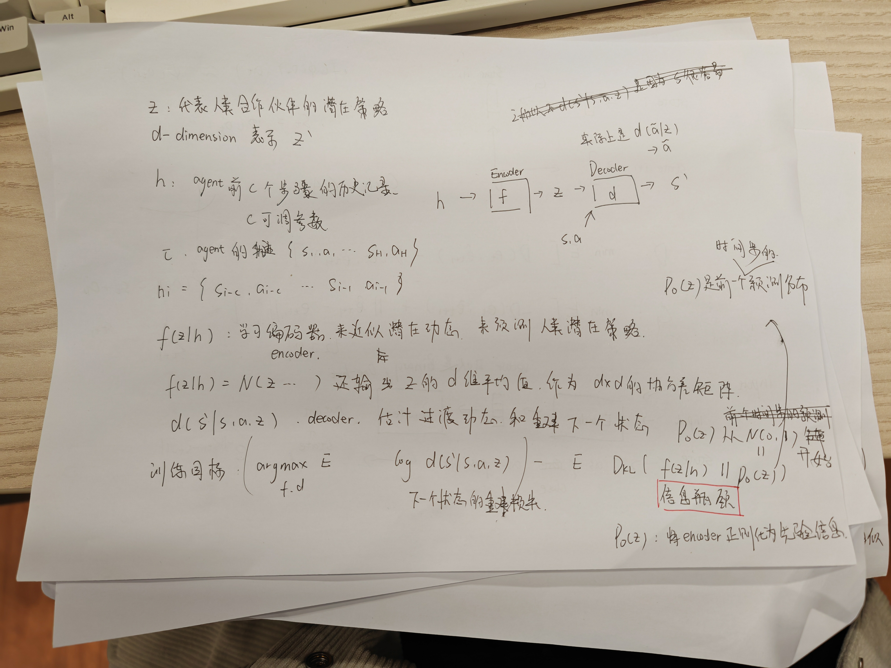
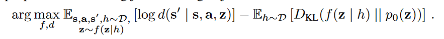

Learning to Influence Human Behavior with Offline Reinforcement Learning

本篇论文采用CQL进行Offline RL的训练
##### 唯一的创新点是：在CQL算法中Q函数的输入由s a 变成 s a z
z就是这篇论文最大的创新

$hi = {si-c,ai-c .... si-1,ai-1}$ ：它就是训练数据在i的前c个步骤的历史数据

$z$: 代表人类的潜在策略，不会直接表现在agent轨迹中的策略

$f(z|h)$: Encoder编码器，输入h即前面c个步骤的轨迹，输出这些轨迹所蕴含的潜在策略

$d(s`|s,a,z)$: Decoder解码器，通过s a z估计下一个状态

##### 其实就是采用Auto-Encoder的模型，输入是h输出是s·，然后z就是中间变量，只不过Decoder输出时多加了s和a。
##### 由于训练数据都是专家数据，因此把z命名为人类的潜在策略

下面就是Auto-Encoder的目标函数。前半部分表示重建损失，后半部分叫做信息瓶颈，就是为了位数前一个z和后一个z之间的距离不要太大。

##### CQL：几乎原封不动，就是对Q的输入添加一个z

##### 注意：其实Decoder在实际情况下有所变化，参考这篇论文的附件A。 实际的Decoder是 $d(a|z)$
