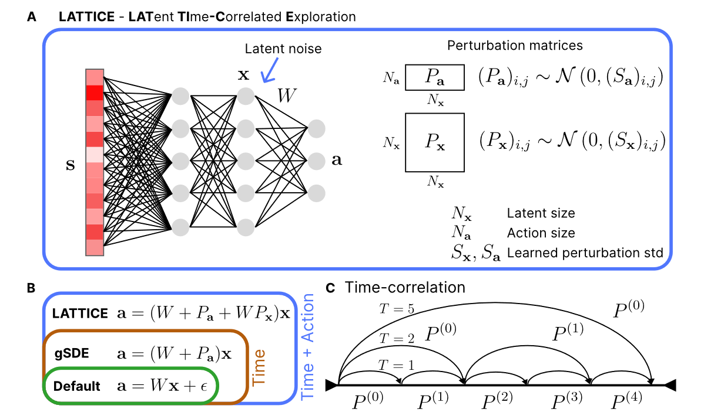
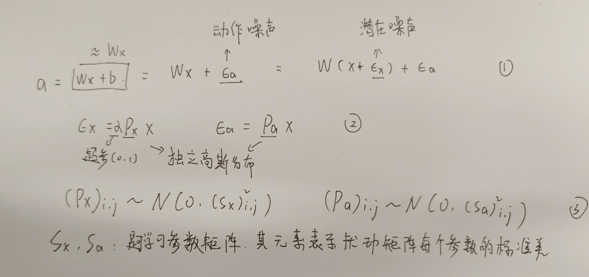
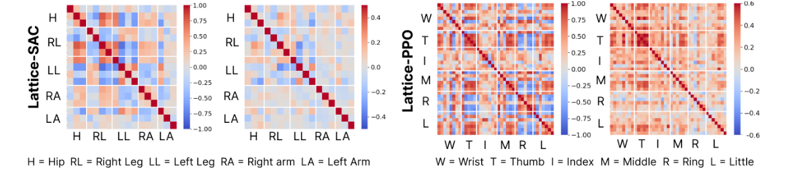

04-Latent Exploration for Reinforcement Learning

总结：这篇论文本质上还是采用对网络添加噪声增加模型的探索能力，作者将其运用在机器人控制领域。

#### 噪声的添加：
- 1. L的噪声添加在模型的最后一层。
- 2. 一共包含两个噪声，一个是Pa一个是Px。即动作噪声和潜在噪声。
- 3. 噪声的详细说明：
    - 1. 由于是在最后一层添加噪声，因此它的输出就是a，如①所示。
    - 2. 两个噪声的计算方式如②所示。
    - 3. Pa和Px是从Sa和Sx中采用的。
    - 4. Sa和Sx是可学习的参数矩阵。
- 4. 在各种限制下，两个参数干扰矩阵最终会被训练出的情况。

#### 参数矩阵Sa和Sx的限制：
- 协方差矩阵是正半定的,为了防止协方差矩阵的奇异性，我们向其对角项添加一个小的正正则化值。
- 我们引入两个裁剪参数来限制每个潜在噪声分量方差的最小值和最大值，以避免过度扰动和收敛到确定性策略。

这使得噪声幅度成为独立于策略网络的可学习参数。
