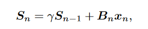
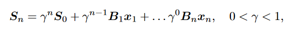
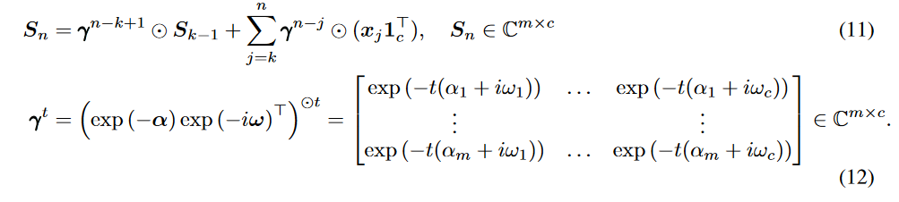
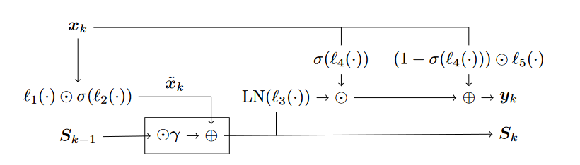

05-Reinforcement Learning with Fast and Forgetful Memory

总结：这篇论文设计了一个叫FFM的类似RNN的结构。它主要用来预测环境的上下文。

##### FFM设计结构：
- 设计理念：
    - FFM想替代的是RNN，因此需要提供一种记忆模式。如下图所示，γ是遗忘率，Bn是新记忆内容的比例。
    
    
- 结构组成：Aggregator、Cell
    - Aggregator：其中Sn就是上图的内容。但是此时的γ并不是简单的（0，1），而是一种巧妙的计算方式。γ的选择影响着模型对时间序列数据的处理方式，通过合适的γ值，模型可以学习到合适的衰减率和上下文长度
    
    - Cell：下图方框中是Aggregator。l是Linear层，σ是激活函数，LN是归一化层。最终输出y和S。
    y和S的解释见下图。
    
    
- FFM的用处：见代码。猜测应该是利用y和S进行辅助决策。

归纳先验是 FFM 取得成功的关键，它限制了优化空间，并提供了并行性结构。与许多记忆模型不同的是，FFM 是可解释的，甚至可以根据有关单个任务的先验知识提供调整机会。FFM 为现有的循环 RL 算法提供了低工程成本的 "即插即用 "升级，只需更改一行代码，就能提高部分可观测无模型 RL 的模型效率和回报。

#### 这篇论文的Related Work章节，介绍了很多有关RL算法使用RNN的例子

#### 在Background章节，介绍了有关心理学上记忆的计算方式

#### 这篇论文将时序任务的计算，成功归纳为一种可并行计算的任务