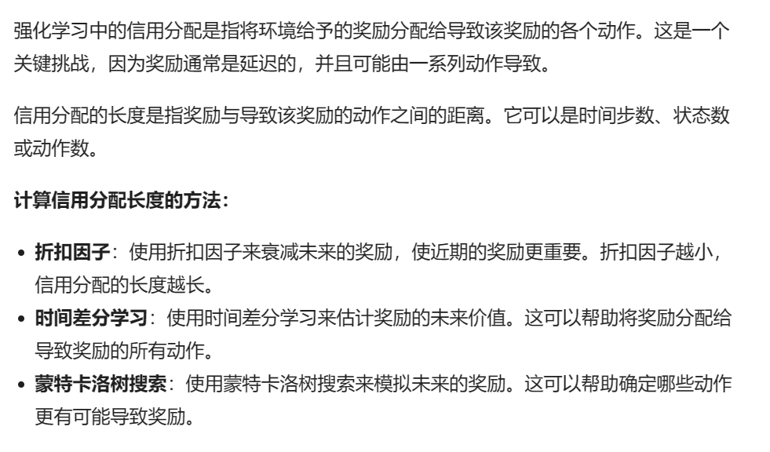
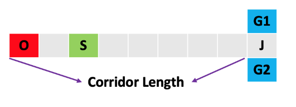
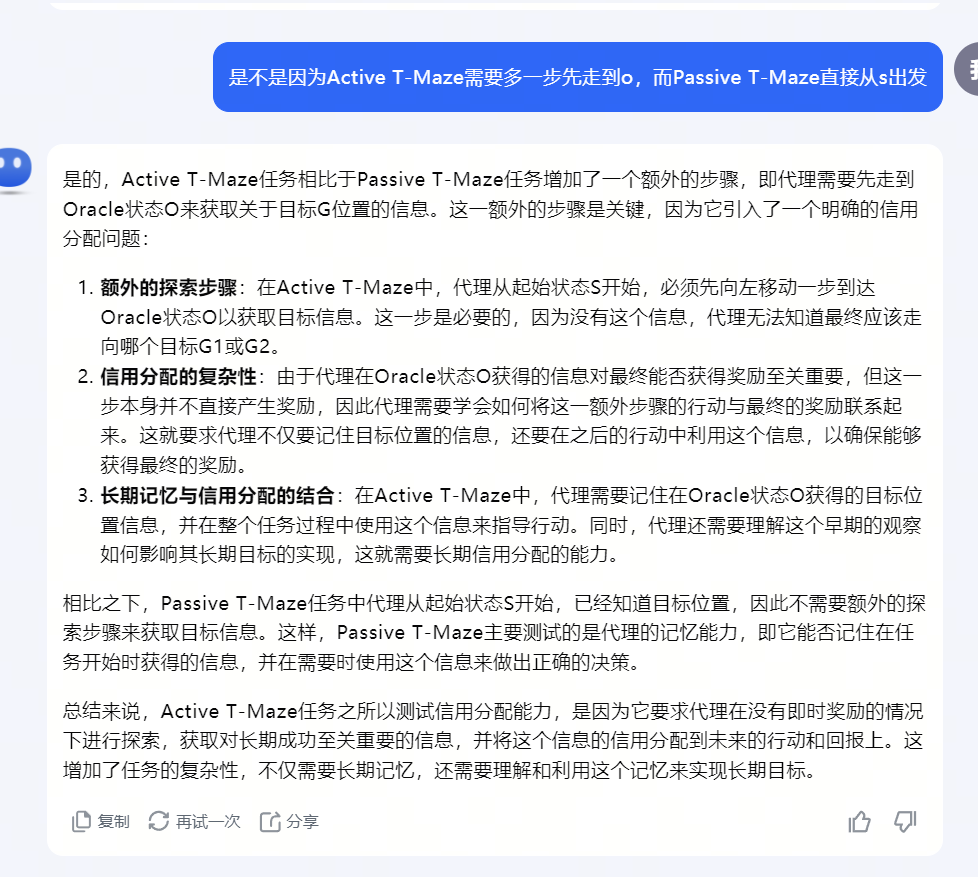

06-When Do Transformers Shine in RL? Decoupling Memory from Credit Assignment

总结：强化学习中，Transformer有较好的效果。这种效果，是因为它学习了有效的记忆，还是因为它们执行了有效的信用分配？不得而知。这篇论文发现Transformers可以增强RL算法的记忆能力（memory capability），但并未改善长期信用分配（credit assignment）。

名词解释：
- 信用分配（credit assignment）：每次得到的奖励，可能是由前面的动作所影响的。信用分配是指该次奖励由哪些动作影响，以及这些动作的影响程度。详细如下图，最直观的信用分配算法就是折扣因子。

##### 实验环境：
- 要求Agent从S点出发，到达O点，然后到达G12点。
- S是起始点，O点由包含目标G12点的信息。
- 想要获得满分，就需要从S走到O，然后模型要记住O点内的信息，一旦离开O点，模型就无法继续获得目标G12点的信息。
- ###### 因此在Agent离开O点之后是否还能够成功到达G点，就考验模型的记忆能力。

##### 实验结果：
- Transformer可以增强强化学习算法的记忆能力，能够处理需要记忆1500步前观测的任务
- 然而，Transformer并未改善长期信用分配能力
- 相比于LSTM，Transformer能够改善信用分配
- Key-to-Door任务中，当信用分配长度为250时，Transformer和LSTM代理均难以解决任务

##### 信用分配长度设置建议：
- 如稀疏奖励的MDP环境中，信用分配长度可能需要很长，因为需要考虑长期的奖励分配情况。然而，在其他任务中，如密集奖励的环境中，信用分配长度可能相对较短，因为奖励反馈更为即时。

##### 两个游戏，如何测试出Transformer是否具有记忆能力和信用分配能力

