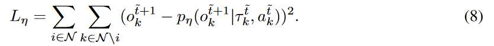

07-Two Heads are Better Than One: A Simple Exploration Framework for Efficient Multi-Agent Reinforcement Learning

结论：这篇文章在MARL的探索领域采用了两种方法，COIN方法结合了基于影响力和好奇心的探索策略。

##### 核心算法：影响力、好奇心
- 影响力：下图为计算影响的算法。
    - 整体上可以描述为，智能体i的动作对智能体k的影响。
    - 公式第一项的理解：在t时刻，动作ai、ak和当前的序列环境对新环境o的转移概率。
    - 公式第二项的理解：在t时刻，动作ak和当前的序列环境对新环境o的转移概率。
    - 整体理解：第一项减第二项就说明动作智能体a的动作ai对智能体k的影响程度。
    - 公式7和8是更新的损失函数公式。
    - 如公式10 所示。将影响力添加到价值函数Q中。

- 好奇心：
    - fo和fs：代表预测函数，根据历史状态信息t和动作a的预测下一个观测状态。
    - 用真实的下一个状态减去预测状态，值越大表明好奇心越大。
    - 公式9是更新的损失函数公式。这是为了让函数f预测得越来越准。当假设f能够完全预测准的时候，执行了新的动作后出现了超出预测的状态，这时就产生了奖励。
    - 如公式13所示，将好奇心奖励添加到TD算法中。

##### 整体算法：

##### 其他点：
- 可以量化每个代理对其他代理的影响

- 基于影响力的探索能够让多智能体产生能多的丰富动作。而基于联合学习的智能体，在正常情况下会，它们学习的动作会趋同。

- 论文4.1节，有很多关于MARL互信息的内容。

- 在附件A3中，提及了很多有关影响力和好奇心的探索论文。