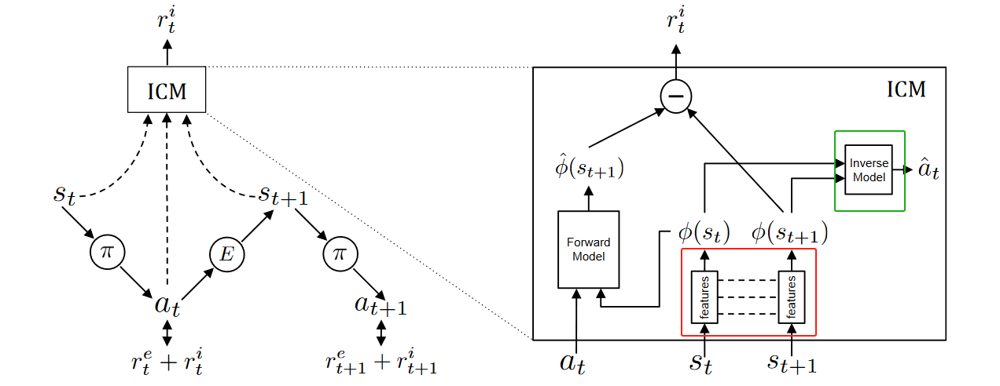
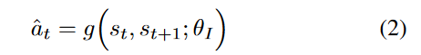
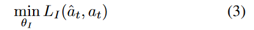
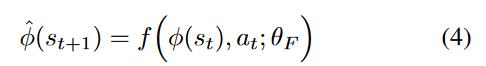
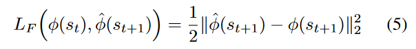
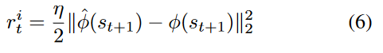
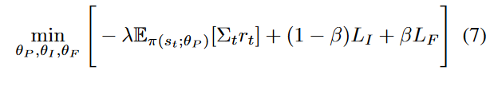

08-Curiosity-driven Exploration by Self-supervised Prediction

结论：该论文提出一种探索机制，通过向奖励函数添加一种内在奖励，从而提高模型的探索能力。

#### Intrinsic Curiosity Module (ICM) 内在好奇心奖励模型详细设计：
- 如下图所示，ICM需要接收三个输入，输出一个内在好奇心奖励。

- 好奇心的定义：
    - 学习一个模型F，假设它能够根据当前的St和At来预测下一个St+1
    - 好奇心就是真实的St+1和预测值St+1之间的差异
    - 差异越大，说明当前执行的动作A成功让Agent探索新的环境
- 算法设计：
    - 首先是提取特征，红色框类似Auto-Encoder架构的Encoder，绿色框类似Decoder。
    - 如2和3式所示。输入时St和St+1，预测输出是At。
    - 损失函数就是3式。
    - 通过这样的设计，φ(st)和φ(st+1)就是st和st+1的特征。
    
    
    - 然后就是前向模型Forward Model。
    - 如公式4所示，它输入at和φ(st)，然后输出φ(st+1) hat
    - 通过损失函数公式5，尽量让φ(st+1) hat和φ(st+1)尽量接近。
    - 通过这样的训练，Forward Model就能够学会，根据at和φ(st)来预测φ(st+1)
    
    
- 奖励函数设计：
    - 内在好奇心奖励函数：含义就是预测状态的和真实的状态之间的差距。
    
    - 总奖励设计：外在奖励就是正常的Reward + 内在好奇心奖励

- 优化函数/Loss：
    - 第一项：最大化奖励，包括外部和内部
    - 第二项和第三项：让ICM内部的模块能够有效工作。就是公式3和公式5.
    

