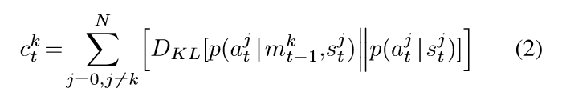

09-Social Influence as Intrinsic Motivation for Multi-Agent Deep Reinforcement Learning

总结：在MARL环境中，这篇论文设计出一种机制，使两个智能体k和j之间，能够让k的行为对j产经影响，从而实现MARL的更好效果。

##### 这篇论文一共介绍了三种机制，实现mutual information MI

##### Basic Social Influence：
- 新的奖励变为：，分别表示外在奖励和内在奖励，内在奖励就是因果影响奖励。
- 因果影响奖励如公式1所示。
- 这个奖励是给k的，它表示的是k的动作ak对j的影响。
- 设计解读：stj就是在t步的j所拿到的状态
    - 右边表示：在stj情况下，j采纳atj的概率
    - 左边表示：在stj和atk的情况下，j采纳atj的概率
    - 整体：就是在加入atk的情况下，即j智能体在看到k智能体在t步时的动作后，j所产生的动作和原来的动作相比，差距大不大，采用KL散度进行度量。
    - 含义：如果这个值的大小说明了k的动作对j决策影响的大小。
    - 优化目标：希望因果影响奖励越大越好。也就是让智能体之间的动作，都尽量去相互协调，互相考虑其他智能体的情况。
- 其他：通过论文的介绍，在4.0节，这个概率函数p，应该时通过Monte-Carlo estimate而来的，而不是神经网络训练而来。
- 实验结果：4.1节

##### Influential Communication：
- 前面这种方法，促进了智能体动作的协同，每个智能体都想让自己的动作既能够获得多的外在奖励，也能够影响其他智能体。
- 第二种方法，将这种机制运用在智能体通信当中。系统通过影响力奖励，在帮助智能体之间的通信。
- 架构分析：
    - 下图是通信的架构。mt表示在步骤t时刻，所有智能体想要通信信息的集合。
    - 现在将agent网络的输出变为两头。并且利用LSTM输出通信信息。
    - 上半部分是正常输出策略价值函数和策略。下半部分输出信息价值函数和通信策略。
    - 动作策略的更新只考虑环境奖励。信息策略的更新既考虑了环境奖励，也考虑了影响力奖励。

- 通信的影响力奖励： 分析与第一种类似。就是j的动作，受到k信息的影响程度。优化目标是越大越好。

- 结果分析：5.1：大家分析的信息越来越有用。

##### Modeling Other Agents MOA：
- 与前两个方法相比，提出MOA的原因是为了实现每个代理的独立训练。之前只能先做出k的动作才能计算出对j的影响，因此这是有先后关系的。并且j需要知道k的动作，这无法实现每个智能体的单独训练。
- MOA的训练使用观察到的动作轨迹和交叉熵损失。
- MOA内部自己训练一个代理(就是绿色部分)，这个代理就是替代之前的j。
- MOA输出的是动作概率。即如图所示，对于at+1的预测
- 使用其内部MOA预测at+1，从而计算出k对其他代理的影响
- 通俗易懂的讲：
    - 现在k无法与其他智能体互动。而公式1中的p却是得通过其他智能体算出来。
    - 因此，在第三个方法中，直接设计一个叫MOA得东西，让这个东西作为智能体。成功训练的它能够模型智能体的动作
    - 因此在方法三中，用MOA的输出来计算公式1。

在Related work中介绍了很多有关MARL内在奖励的方法。
