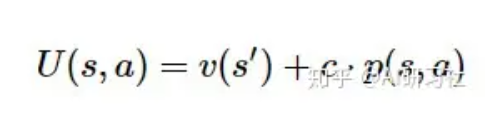

10-Mastering Atari, Go, Chess and Shogi by Planning with a Learned Model

总结：将MCTS算法运用在DRL之中。帮助DRL决策。

##### 准备工作：
- 表示函数：将观察obervation序列，输入h，然后输出state。
- 预测函数：输入state，输出它的策略和value。
- 动态函数：输入上一个state和当前的action，输出下一个state和reward。

##### 算法：

##### 如上图所示，算法分为A：MCTS搜索、B：执行、C：训练
- A：MCTS搜索
    - 圆圈表示树节点，对应环境状态；线表示从一个状态到下一个状态的动作；根节点为当前环境状态，即围棋面板状态。后续章节我们会详细介绍预测和动力学函数。
    - 模拟：从树的根节点出发（图顶部的淡蓝色圆圈），即环境或游戏的当前位置。在每个节点（状态s），使用评分函数U(s,a)比较不同的动作a，并选择最优动作。MuZero中使用的评分函数是将先前的估计p(s,a)与v(s')的值结合起来。即：
    
    - 模拟沿着树向下进行，直到尚未扩展的叶子。尚未扩展的结点，可以理解为这个state之前还未出现在搜索树当中。
    - 扩展：一旦节点达到估计量值后，将其标记为“扩展”，意味着可以将子级添加到节点，以便进行更深入的搜索。在MuZero中，扩展阈值为1，即每个节点在首次评估后都会立即扩展。在进行更深入的搜索之前，较高的扩展阈值可用于收集更可靠的统计信息。
    - 反向传播：最后，将神经网络的值估计传播回搜索树，每个节点都在其下保存所有值估计的连续均值，这使得UCB公式可以随着时间的推移做出越来越准确的决策，从而确保MCTS收敛到最优动作。
- B：执行
    
- C：训练
   
   - loss:
   
   

