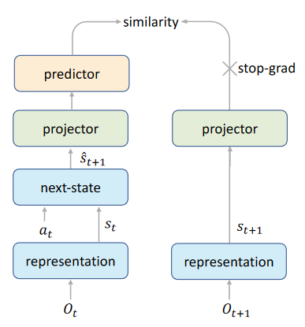

11-Mastering Atari Games with Limited Data

总结：这篇文章是基于10改进而来，一共做了三点改进。

##### 改进：
- Self-Supervised Consistency Loss 
    - 一共输入两个相邻的o，最终让这两个o的输出越接近越好。
    - 增加对环境状态的转变。主要改进了预测函数

- End-To-End Prediction of the Value Prefix
    - 详细见下图
    
    - 简单来说就是：以前是通过预测函数算出来的未来奖励。然后相加。现在的方法是用LSTM直接算法未来k的奖励。
    
- Model-Based Off-Policy Correction
    - 之前计算奖励，是从replay buffer中算出来的。里面的数据比较旧
    
    - 现在我们是基于模型的方法，因此可以用模型的来想象在线体验，算出奖励。
    - 在l前面的奖励，依然用旧数据，在第l个奖励，采用环境模型算出来。
    
    

