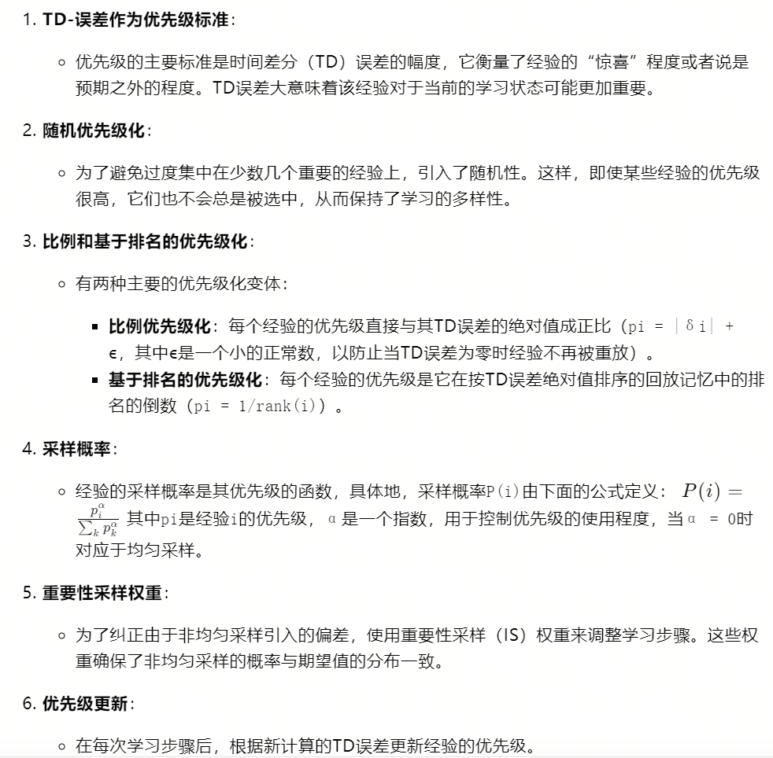
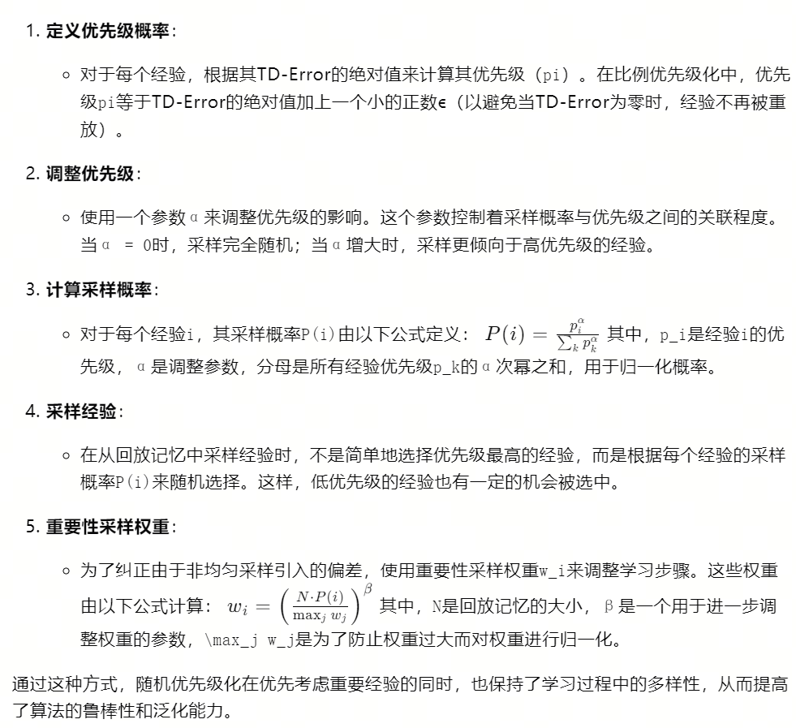
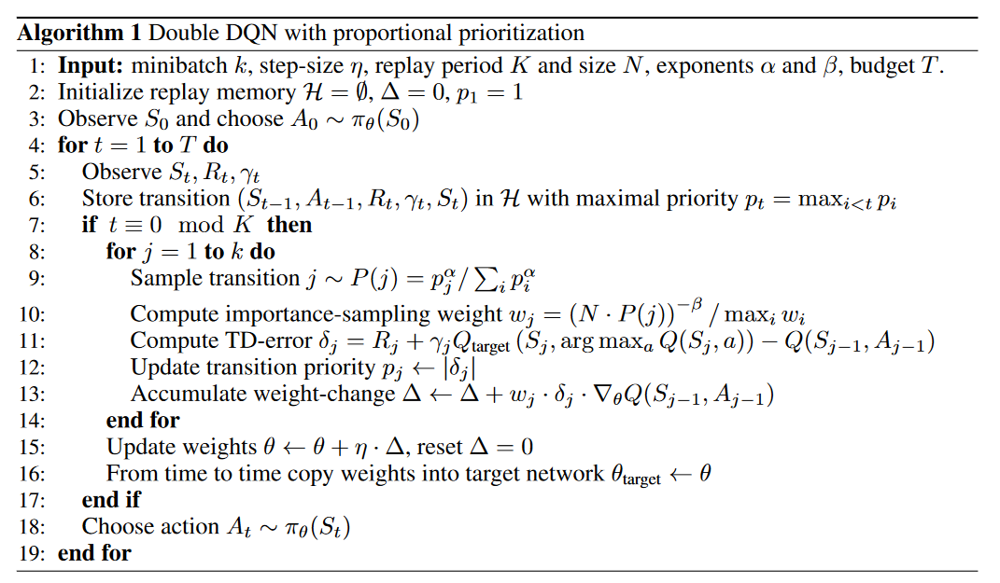

总结：提出了六种计算优先级的方法：

- TD-Error：3.2节
    - 采用训练过程中的TD-Error值确定优先级
    - 缺点：这种贪婪的TD优先级，容易导致学习过程中的多样性丧失和过拟合

- 随即优先级：STOCHASTIC PRIORITIZATION 3.3节
    - 随机优先级化通过引入随机性来平衡经验的采样，确保所有经验都有机会被重放，即使它们的TD-Error不是很高
    - 具体做法：
    

- 算法流程：

