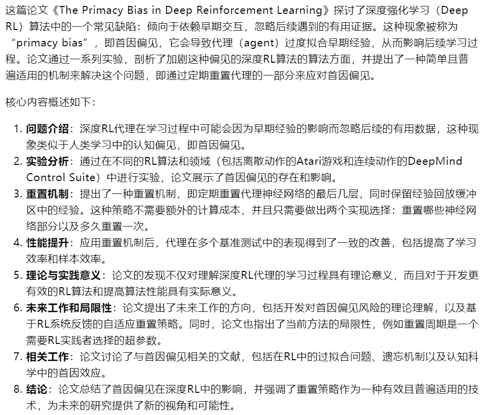
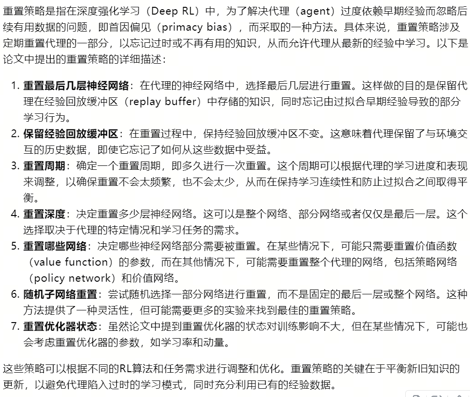
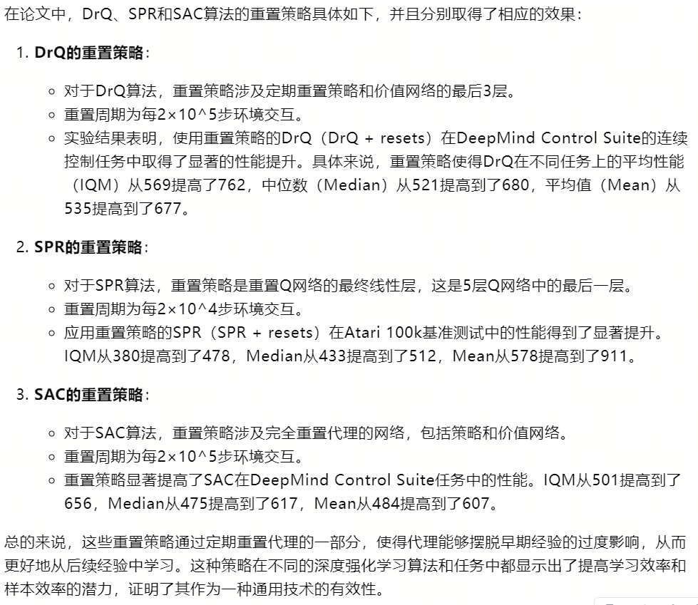

15-The Primacy Bias in Deep Reinforcement Learning

总结：在训练过程中，重置Agent的部分或者全部参数，缓解RL算法的过拟合和局部最优问题

- 概述：

- 重置策略：

- 重置策略例子：

- 重置过后的一些问题：
    - 性能变差：这时候的数据到底才不采用、是否需要进行一段时间的Offline RL训练
    - 重置后Agent的动作是否要考虑重置前Agent的动作，是否要采用某种权重
    - 个人想法：利用Simple Finetuning中的参数初始化的方法，来重置Agent的参数

