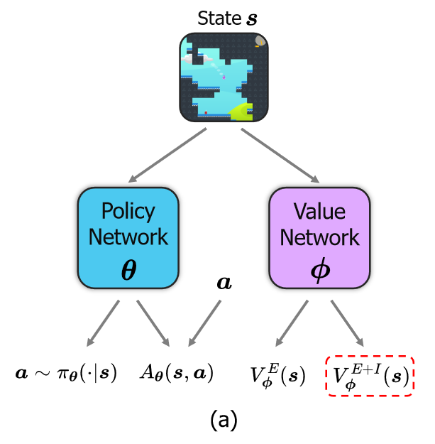
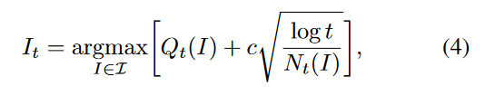
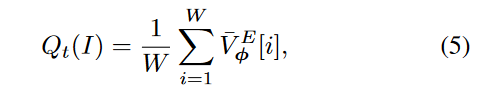
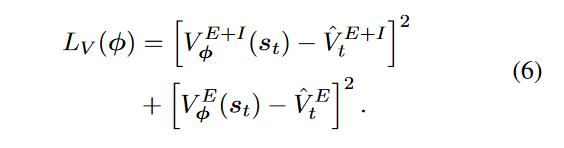
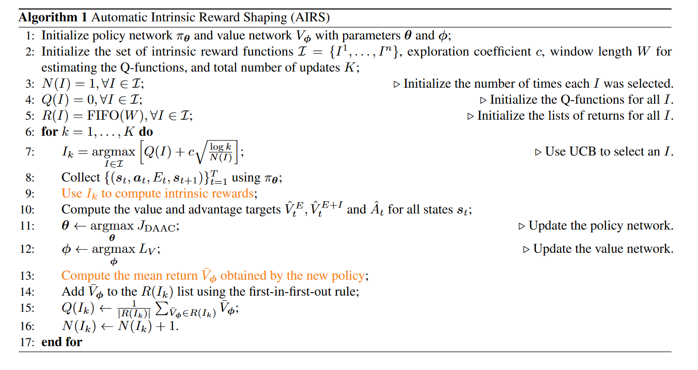
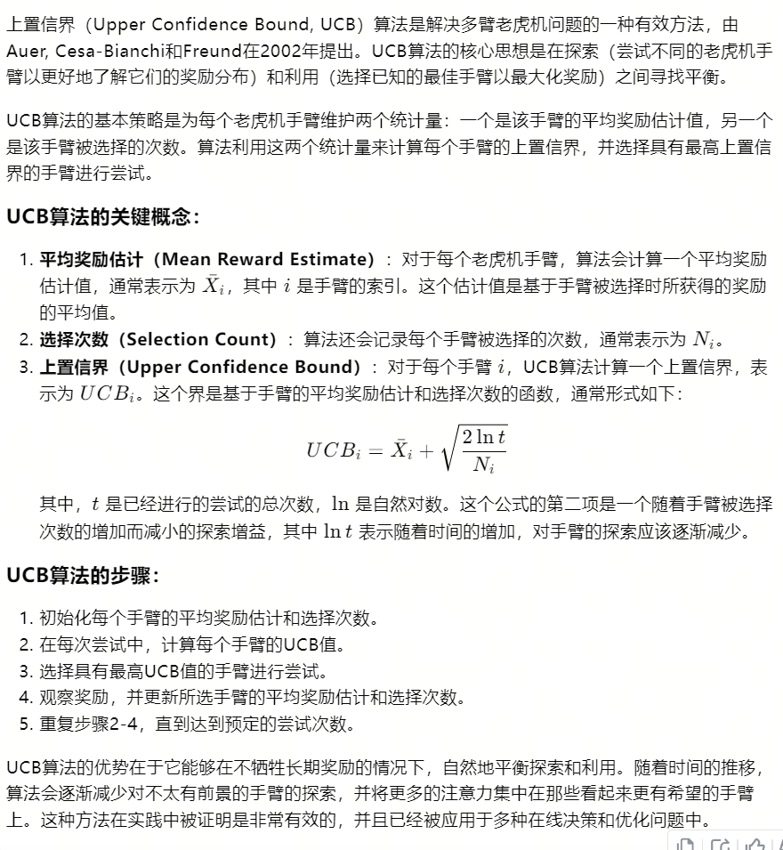

16-Automatic Intrinsic Reward Shaping for Exploration in Deep Reinforcement Learning

总结：目前有很多内在奖励的方法，这篇文章提出一种方法，一个RL算法中可以包括多种内在奖励，它通过某种算法，计算出每次训练应该采取哪种内在奖励

- 对于目前内在奖励的看法： 背景
    - 该框架通过智能地提供高质量的内在奖励来提高RL代理的探索和泛化能力。我们的重要见解是，不同的任务和学习阶段可能受益于不同的内在奖励函数。例如，在学习的早期阶段，积极的探索可以使智能体在短时间内获得大量的判别经验。为此，简单的想法是设计一个内在奖励函数来奖励重大的状态变化。但在学习后期，过多的探索是不必要的，可能会扰乱学习的策略，保持适当的探索即可。

- 算法模型：分为策略和价值
    - 策略：一共有两个输出
        - 1、输出策略动作
        - 2、输出优势函数，可以用于PPO中
    - 价值：两个输出
        - Ve：外在奖励
        - Ve+i：外在奖励加内在奖励的和

- 如何挑选内在奖励算法：采用多臂老虎机中的UCB算法（详见这篇笔记的最后部分）
    - 公式4是计算奖励最大的内在奖励算法
        - Qi，是t这个内在奖励的预估值，具体由公式5算出来
        - Ni，是该t算法被选中的次数
        - t，是总选择次数
    - 公式6是值函数如何更新的loss
    
    
    

- 整体算法流程：

- UCB算法与多臂老虎机：
