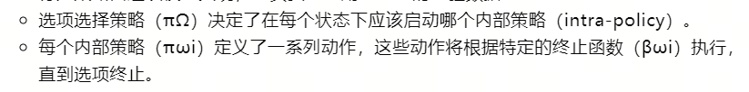
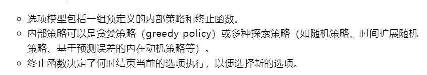
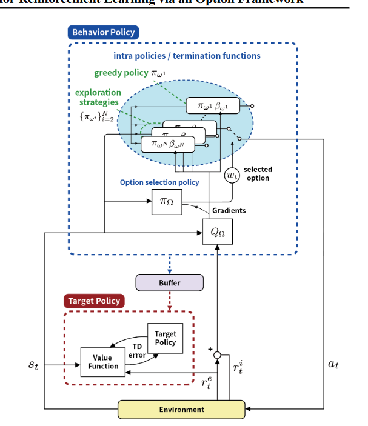
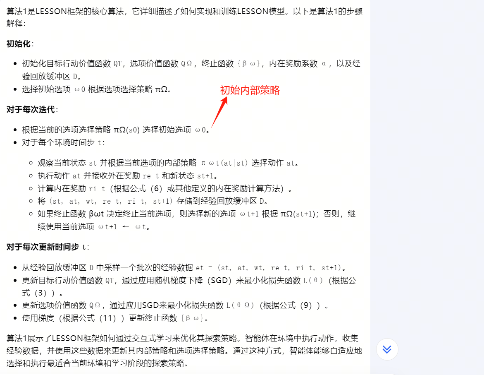
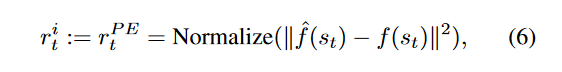
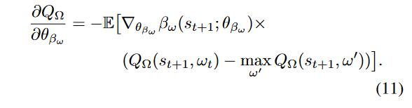
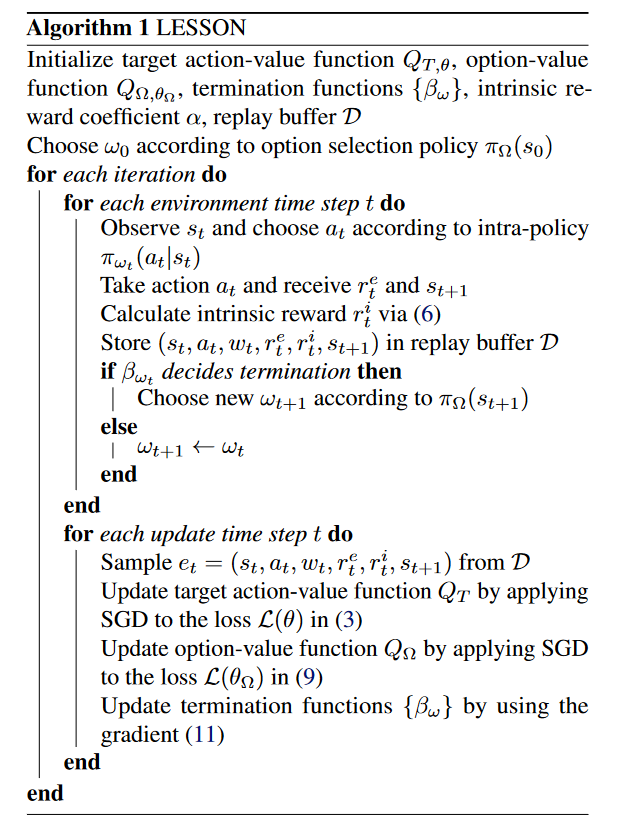
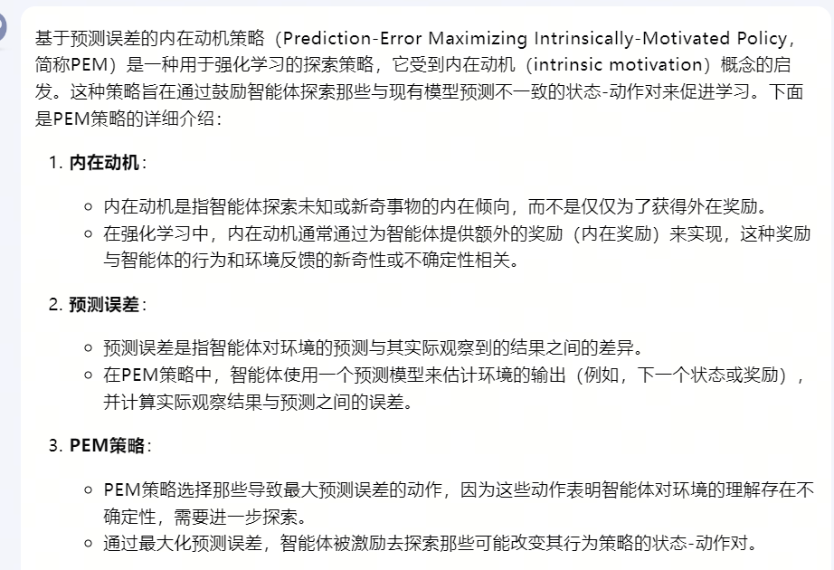
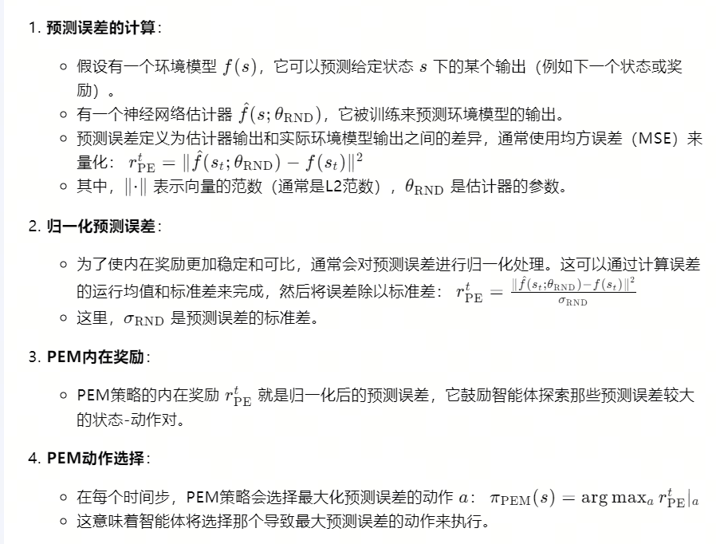

17-LESSON: Learning to Integrate Exploration Strategies for Reinforcement Learning via an Option Framework

总结：该方法一共分内外两个部分。外层有一个策略Ω选择到底用哪一个决策策略Π生成动作，内层还有各一个算法，用于选择Π内的动作。

- 为什么需要选择：背景
    - 最有效的探索策略因任务和学习阶段而异。我们使集成策略在给定任务的训练阶段从探索-利用权衡的背景下自适应地选择最有效的组件探索策略。这里的关键挑战是我们不知道哪个组件策略在训练的每个阶段最有效，但需要随着时间的推移学习这种自适应选择。所提出的统一探索方法通过选项框架实现了这一目标，针对广泛使用的无模型离策略强化学习的动作价值方法。

- 整体架构图：
    - 蓝色框内有很多内部策略，本次与环境交互的策略，由选项选择策略决定
    
    - 在内部策略里面，策略会生成动作，到底选择哪个动作，由选择模型决定。
        - 选择模型可以有很多方法：例如下面图片的第二行。这篇论文选择的是最后一种，基于预测误差的内在动机策略（详见笔记的后面部分）。
        - 终止函数，在与环境交互完一次之后，是否还继续采用当前的内部策略，由终止函数确定，如果确定终止，就重新选择一个内部策略。
    

- 算法流程：
    - 一共有两个Q函数，一个用来评估外部选择策略、一个用来评估内部策略。
    - 详细解读：
    
    - 公式6，内在奖励RND 
    - 公式9，终止函数的目标函数：

- 基于预测误差的内在动机策略（PEM）：
    
    

