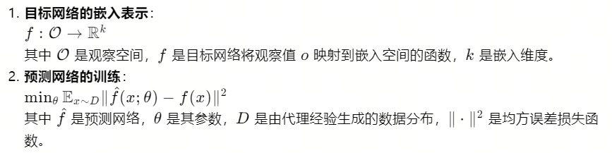
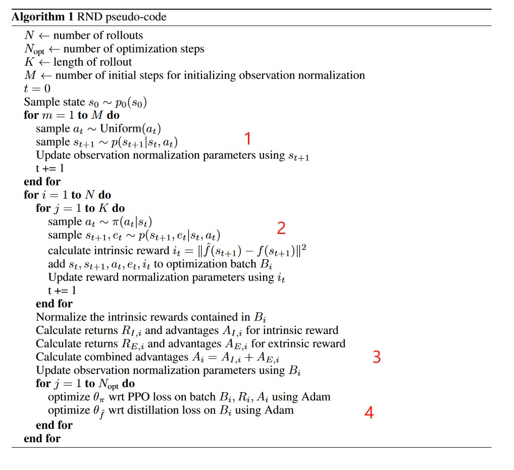
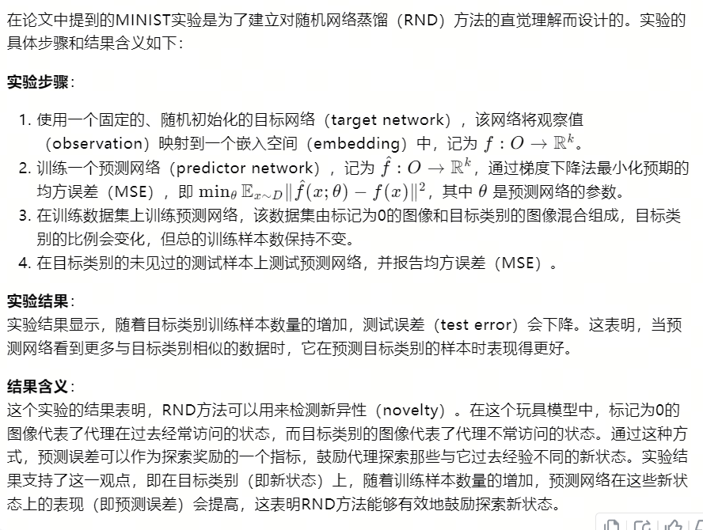
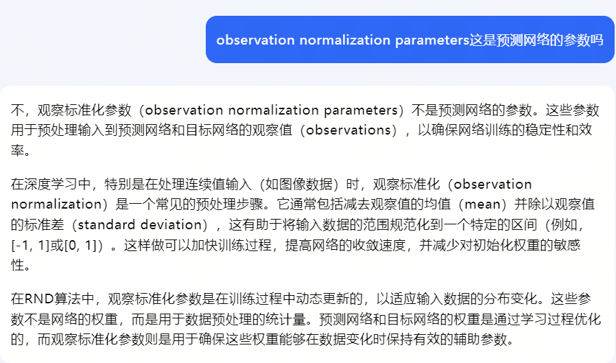
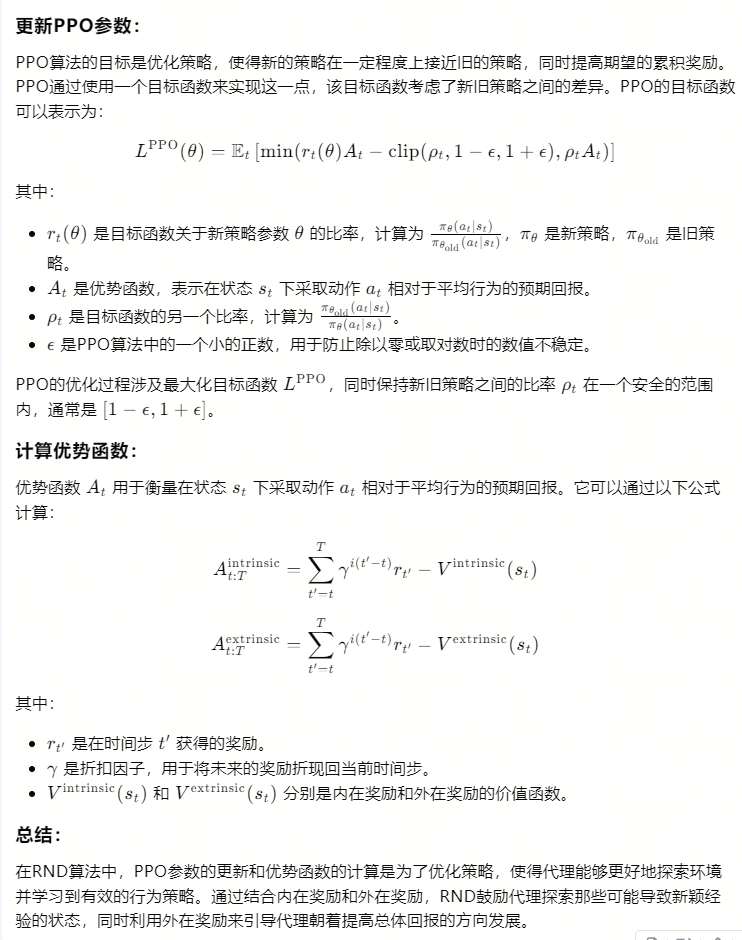
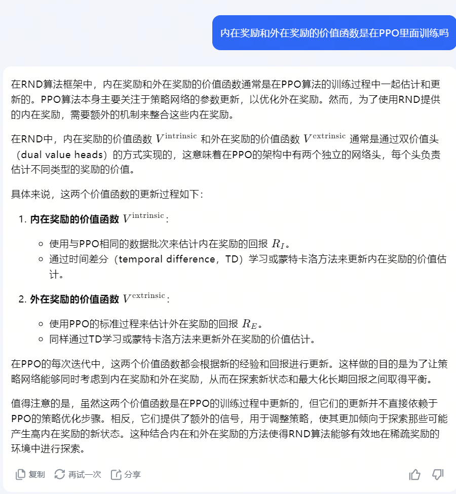

18-EXPLORATION BY RANDOM NETWORK DISTILLATION   ICLR 2019

总结：提出一种内在奖励的探索机制，并且结合外在奖励。内在奖励是指：遇到不常见状态s出现就给出大的内在奖励，反之小的内在奖励。

- 背景：
    - 在笔记08中，Intrinsic Curiosity Module (ICM)提出一种内在奖励的机制，它是训练了一个根据st预测st+1的预测模型，然后计算真实st+1与预测模型输出的误差，然后根据这个误差来计算内在奖励。由于预测模型是神经网络，存在误差，并且这种方法并没有形象地表达不常出现这个意思。因此该方法地奖励，主要集中于判断下一个状态是否常见来给出奖励。

- 内在奖励设计：
    - 如下图，首先初始化一个f，这个f的参数初始化后就固定了，不会再改变
    - f^是预测网络，需要训练，他的输入是当前状态
    - 2里面的公式就是优化目标，也是最终的内在奖励函数，希望f^的输出和f尽量接近
    - 含义：就是对于看过的状态s，f^会尽量让它的输出接近f，这样下次再看到s时，内在奖励会变小。对于没看过的s，也就是没经历过均方差计算的s，它们之间的误差会比较大，因此内在奖励也大。
    - 证明上面这个理论正确（笔记1.1）

- 算法流程
    - 算法的第一个for循环，主要用来计算当前预测网络和目标网络的观察值，方便后续内在奖励的归一化（详见笔记1.2）
    - 第二个for循环，用来收集训练数据和内在奖励，并且更新标准化参数（1.2）
    - 第三个forr循环  
        - 首先更具标准化参数，归一化Batch数据中的内在奖励
        - 计算两个优势函数和总优势函数（1.3）
        - 更新标准化参数
    - 第四个for循环：训练PPO（1.3），更新预测函数

- 1.1 证明预测网络对于常见到的s误差会小，遇到不常见的预测误差会大

- 1.2 第一个for循环，Update reward normalization parameters，标准化参数

- 优势函数的计算和更新PPO算法具体步骤：

