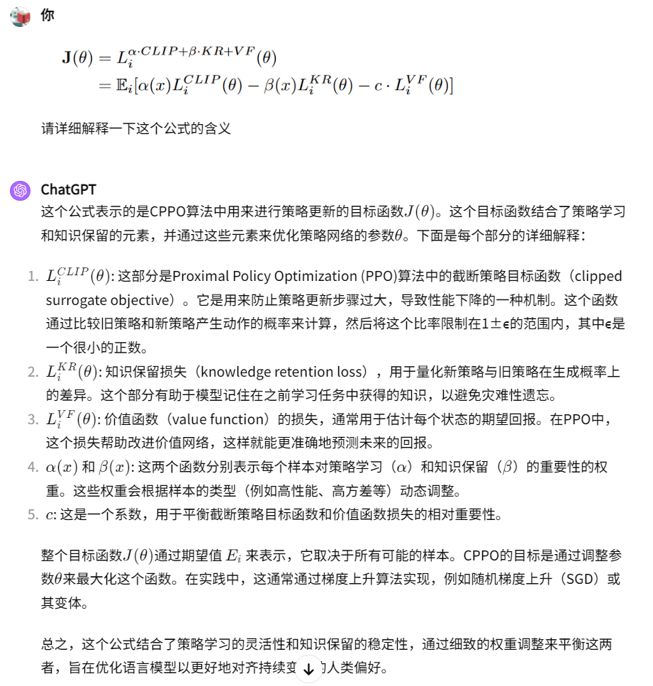
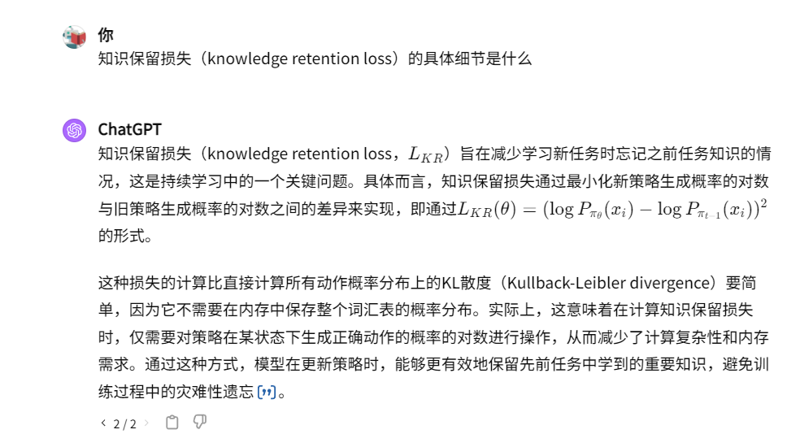
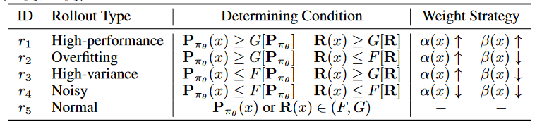
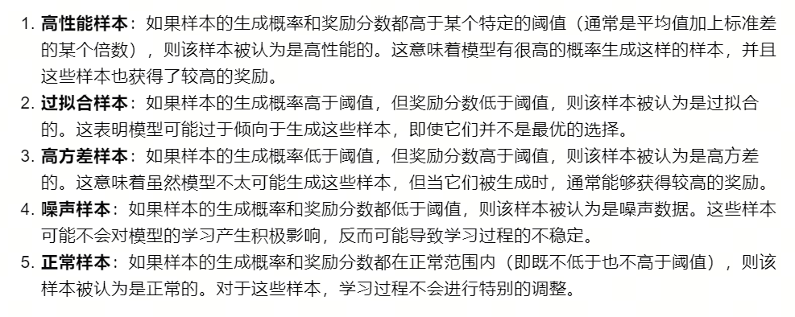
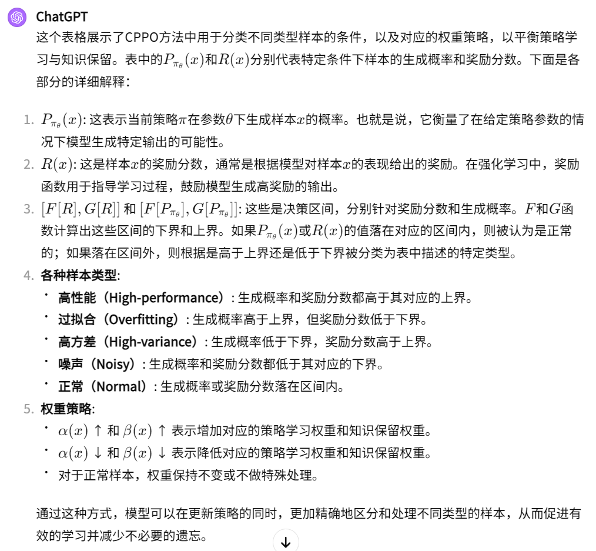

19-CPPO: CONTINUAL LEARNING FOR REINFORCEMENT LEARNING WITH HUMAN FEEDBACK

总结：这篇论文采用PPO。设计了策略学习权重α和知识保留权重β，用来调整模型训练时学习新知识的能力和调整模型是否忘记之前的知识

##### 核心思想：
- CPPO方法旨在解决强化学习中的一个核心问题：如何在不断变化的环境中持续学习新任务，同时保留并有效地利用之前任务中学到的知识。具体来说，CPPO试图解决以下几个问题：

    - 持续学习的挑战：在现实世界中，任务和环境经常会发生变化，模型需要能够持续适应这些变化，而不是从头开始学习每个新任务。

    - 知识保留与新知识获取的平衡：传统的强化学习方法在面对新任务时可能会遗忘旧任务的知识（即灾难性遗忘），CPPO旨在在获取新知识的同时保留对旧任务的知识和理解。

    - 计算效率：重新训练大型语言模型（如深度强化学习中的策略模型）通常需要大量的计算资源。CPPO通过样本加权和知识保留机制，减少了完全重新训练的需求，提高了学习过程的效率。

##### 损失函数：
- 重点关注两个权重 α 和 β
- 
- CLIP 和 VF 都是正常PPO拥有的，KR 是需要重点关注的。Px：这表示当前策略 π 在参数 θ 下生成样本 x 的概率

##### 权重 α 和 β 调整策略：
- 将数据一共分为了五类：

- 对表格和各种符号的解释：

##### Related Work 部分包含了很多有关持续学习的例子

