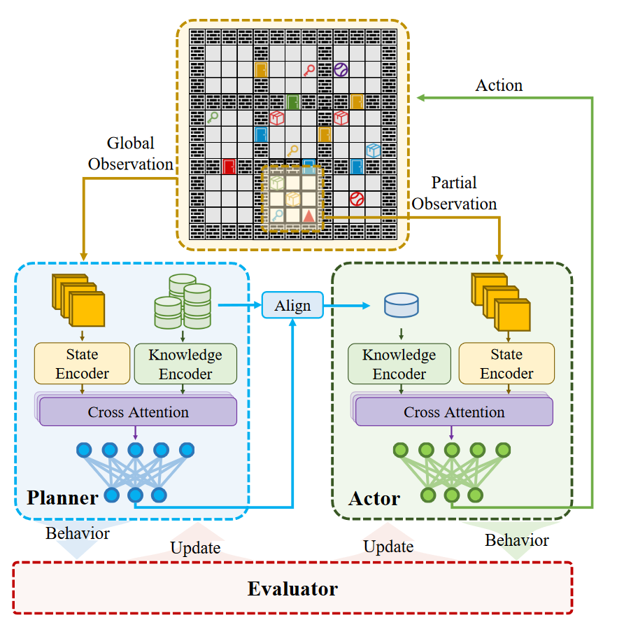
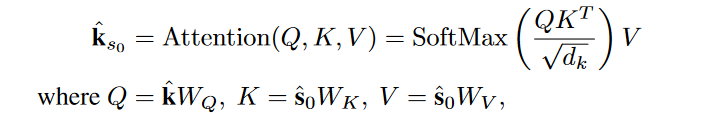
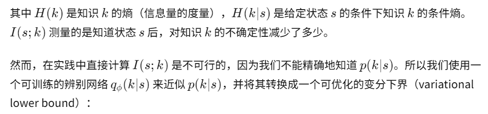
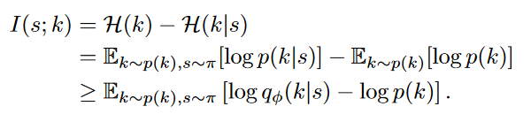
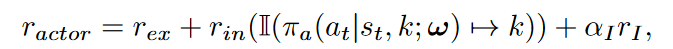
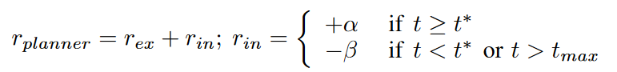
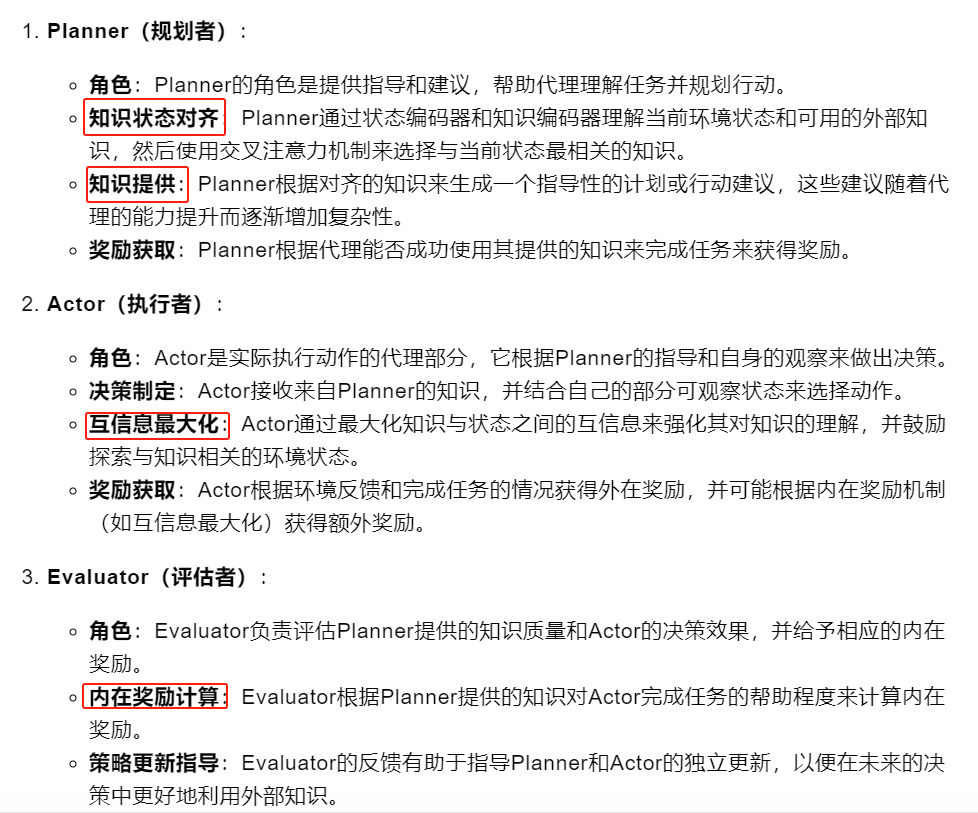

20-PAE: REINFORCEMENT LEARNING FROM EXTERNAL KNOWLEDGE FOR EFFICIENT EXPLORATION

总结：旨在通过从外部知识中学习来提高人工智能在探索环境时的效率

##### 方法一共分为三个部分：Planner（规划者）、Actor（执行者）、Evaluator（评估者）
- 根据上图：
    - Planner：有两个输入，状态和知识编码器。详见4.1节
        - 状态编码器提取有用信息。知识编码器是预训练的语言模型，用来将自然语言描述转换为向量。
        - 交叉注意力机制：Q是知识、K和V是状态。
             - 在这两个集合之间建立联系，找出哪些知识元素与当前的状态最为相关。通过交叉注意力机制，Planner计算状态嵌入和知识嵌入之间的对齐。这一步骤使Planner能够识别和关注与当前状态最相关和有用的知识。
        - 知识选择：交叉注意力机制的输出是一组上下文向量，这些向量代表了知识集合中与当前环境状态最相关的部分。这个输出接下来通过一个策略网络（可能包括一个线性层和一个softmax层），将每个知识项的相关性转换为一个概率分布。
        
    - Actor：输入：部分可观测状态和Planner选择的知识。详见4.2节
        - 经过与Planner一样的两个编码器进行决策
        - Actor中有一个互信息：
            - Actor被鼓励探索与给定知识紧密相关的环境状态
            - Actor在执行动作时会收到这个额外的奖励，从而在训练过程中调整其策略，使得与知识相关的状态访问得到增强。
            - 函数解释：在看到局部状态时候知识k的出现概率和没看到时候k的出现概率。
            
            
    - Evaluator：提供奖励。详见4.3节
        
        

### 整体方法：Planner根据整体信息和知识库，通过交叉注意力选择出本轮要的知识；Actor根据部分信息以及Planner选择的知识，进行决策；Evaluator负责计算机奖励。

##### Related Work 中介绍了一些将外部知识嵌入策略的方法