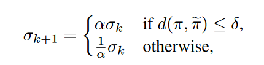

01-PARAMETER SPACE NOISE FOR EXPLORATION

这篇论文主要介绍了一种名为参数空间噪声的探索方法，该方法比动作空间噪声更有效。

参数空间噪声：直接向参数添加噪声

动作空间噪声：该文采用的是 e-greedy 的方式

##### 参数空间噪声的计算方式：
σ表示噪声，α表示权重，在附件C.1中设置为1.01
通过图片可知：当策略和噪声策略差距较小时，会适当增加噪声，反之减小噪声

##### 其他细节：
1. 如果参数空间噪声与一点动作空间噪声相结合，其性能会更好（我们在参数空间噪声实验中使用 = 0.01 的 e-greedy 行为策略）。完整的实验细节在 A.1 节中描述

2. 使用参数空间噪声时，学习进度通常会更快开始。

3. 参数归一化有效

4. 在代理需要根据当前状态选择不同的最佳操作的情况下，参数空间噪声可能效果较差，因为策略的权重随机化不太可能产生这种行为。参数空间并不能保证最佳探索

##### 拓展阅读：
Marc G Bellemare, Sriram Srinivasan, Georg Ostrovski, Tom Schaul, David Saxton, and Remi Munos. Unifying count-based exploration and intrinsic motivation. In Advances in Neural Information Processing Systems 29 (NIPS), pp. 1471–1479, 2016.