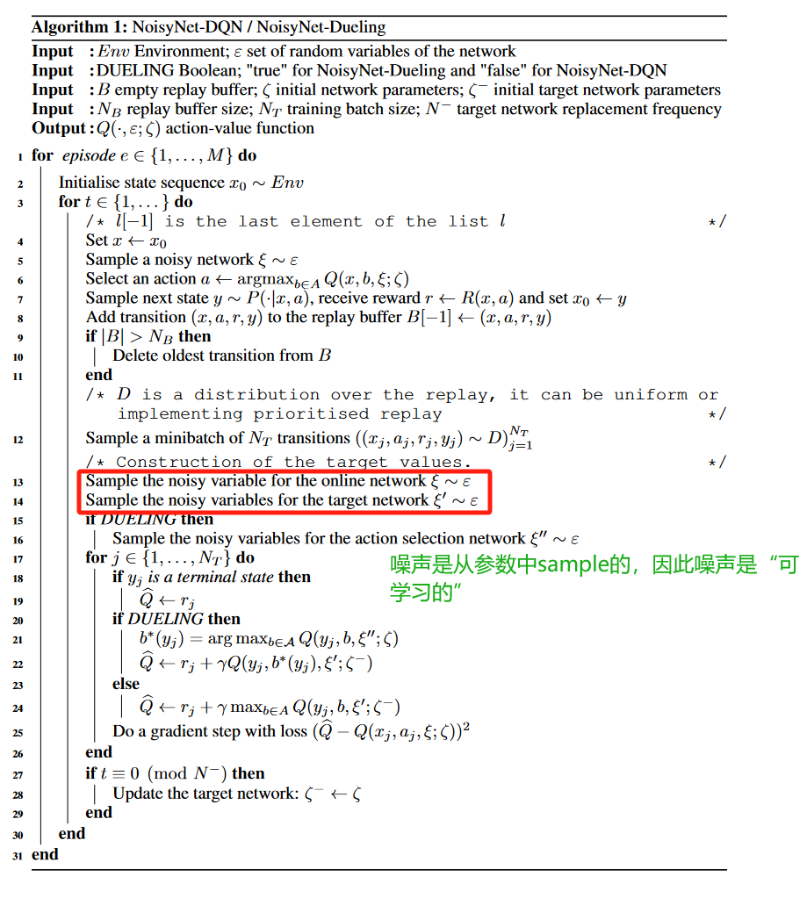
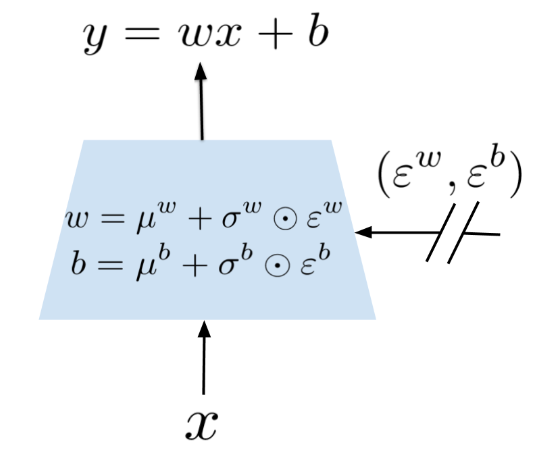
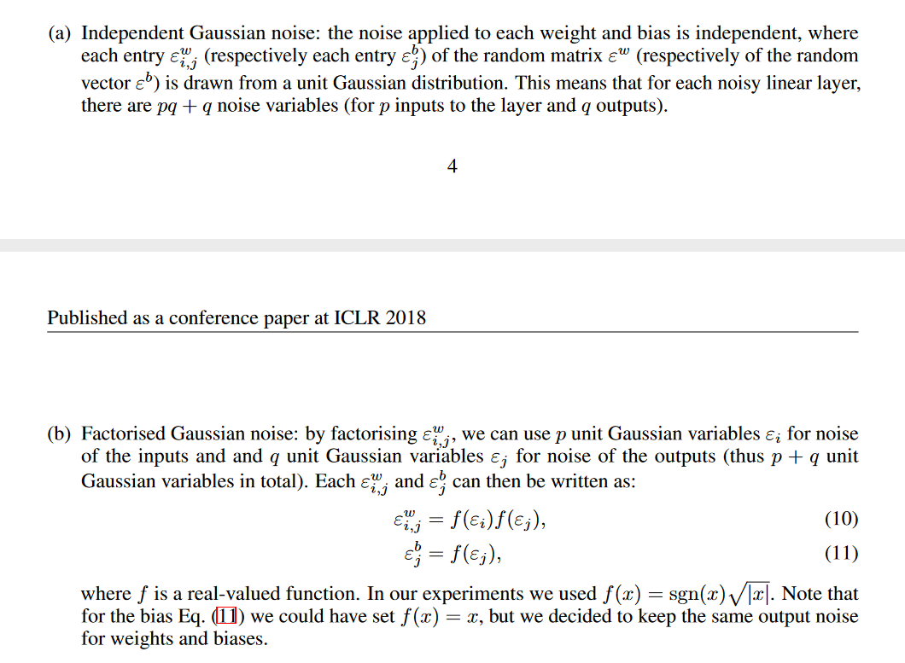

03- NOISY NETWORKS FOR EXPLORATION

总结：这篇论文提出了一种噪声网络，并取得了较好效果。

##### 添加噪声的方法：
1、将原本的 $y = wx + b$ 进行拓展。μ和σ均是可学习的参数，ε是噪声。
2、ε是从当前的参数中采样出来的。
3、 噪声一共分为两类。第一种称为独立噪声，ε的所有参数是全部需要单独生成的。第二种称为因式分解噪声，它并不需要全部生产所有噪声，减小了计算开销。（详细见原文第三节的第二张截图的内容）
4、噪声网络并不是只添加单单一层，而是很多层，甚至可以全部是噪声网络。
##### 噪声可学习的原因：

###### 5、对于σ，它是可学习的参数，因此智能体可能会学出一种将σ设为0的策略。在文章的4.2节中分析了σ值的变化。通过跟踪训练过程发现，σ的值并不会被学习为0.

##### 实验对比：与没有噪声网络、依赖于原始探索方法（ε-greedy和熵奖励）的基线进行了比较

##### 独立噪声和因式分解噪声的比较：使用因式分解噪声不会导致 A3C 性能出现任何显着下降。相反，它似乎在提高中位数分数和加快学习过程方面具有积极的作用。

##### NoisyNet的另一个优点是，注入网络的噪声量由 RL 算法自动调整。

