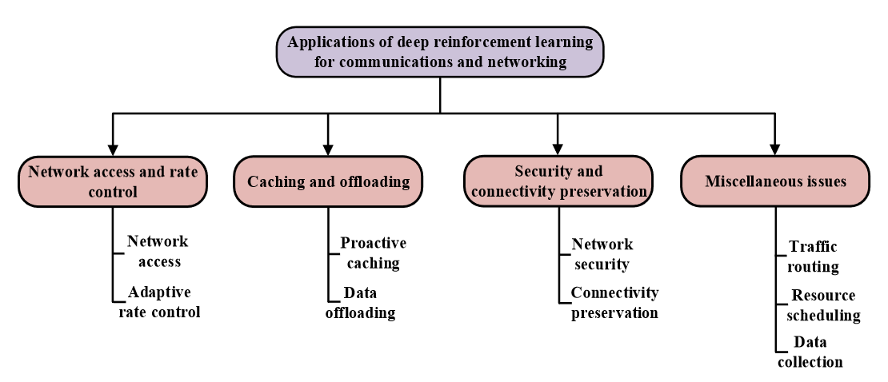
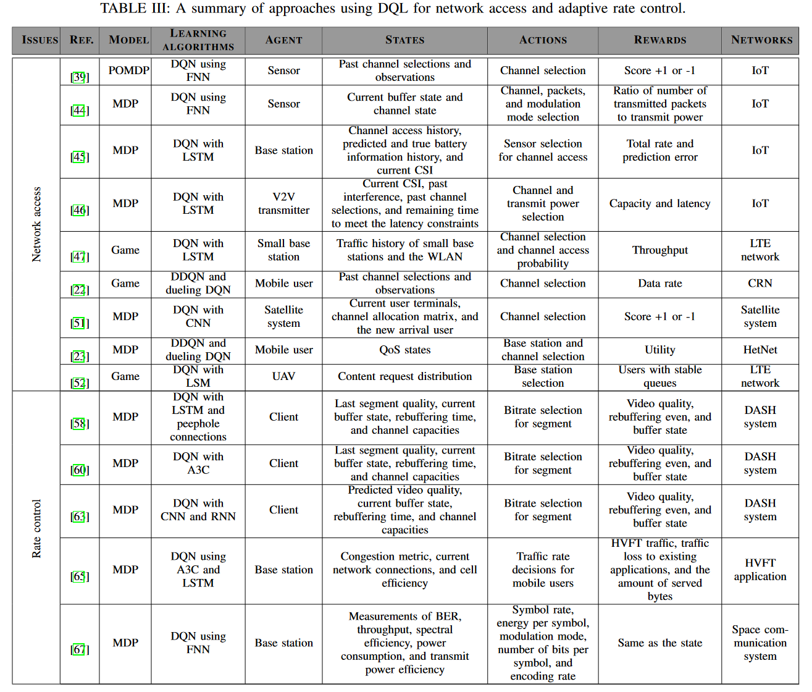

总结：网络访问、数据速率控制、无线缓存、数据卸载、网络安全、连接保持、流量路由，以及数据收集
第三节回顾了 DRL 在动态网络访问和自适应数据速率控制中的应用。
第四节 DRL 用于无线缓存和数据卸载的 DRL。
第五节介绍了网络安全和连接维护的 DRL 相关工作。
第六节考虑如何使用 DRL 来处理通信和网络中的其他问题。
第七节 重要挑战、悬而未决的问题和未来的研究

##### 具体论文应用：
- [9] 中给出了无线网络机器学习的综述

- 第三节：
    - Network Access：使用DQL解决网络中的频谱接入和用户关联问题。
        - [39]的作者提出了一种基于物联网DQL的传感器动态信道访问方案。动作是选择通道、奖励是1和-1、DQN 的输入是传感器的状态，它是过去时隙中动作和观察的组合
        - [43]中提出了一种自适应DQL方案，该方案评估每个时期当前策略的累积奖励。当奖励减少给定阈值时，DQN 会重新训练以找到新的好策略。
        - 考虑多传感器场景，[44] 中的作者使用 DQL 解决了联合通道选择和数据包转发问题。该模型如图 5 所示，其中一个传感器作为中继将从其相邻传感器接收到的数据包转发到接收器。该操作是选择一组通道、通道上传输的数据包数量以及调制模式。
        - [45] 研究了支持能量收集的物联网系统中的通道访问问题。采用LSTM预测
        - [22] 中的作者解决了共享 K 个信道的多个用户的动态频谱接入问题。在某个时隙，用户选择具有一定尝试概率的信道或选择根本不发送。状态是用户操作的历史及其局部观察，用户的策略是从历史到尝试概率的映射。用户的问题是在时隙上找到策略向量，即策略，以最大化用户的预期累积折扣数据速率。
        - 考虑新用户的到来。 [51] 中的作者解决了多波束卫星系统中新到达用户的信道分配问题。多波束卫星系统生成细分为多个波束的地理足迹，为地面用户终端（UT）提供服务。
        - [23]中的作者考虑了由多个用户和BS（包括宏基站和毫微微基站）组成的HetNet。 BS共享一组正交信道，用户随机位于网络中。每个用户的问题是选择一个BS和一个信道以最大化其数据速率，同时保证用户的信号干扰加噪声比(SINR)高于最低服务质量(QoS)要求。
    - Adaptive Rate Control
        - DASH [58]的作者采用DQL来解决这个问题。与[45]类似，LSTM网络的输入是客户端的状态，输出包括与客户端可能的动作相对应的Q值。为了提高标准 LSTM 的性能，在 LSTM 网络中添加了窥孔连接。
        - [63] 中的作者建议使用视频质量预测网络。预测网络使用 CNN 和 RNN 从原始视频片段中提取有用的特征。然后，预测网络的输出，即预测的视频质量，被用作[60]中提出的DQL的输入之一。
        - HVFT 应用程序使用蜂窝网络来传输物联网流量。 HVFT应用具有大量的业务量，并且HVFT应用中的业务调度，例如数据速率控制是必要的。一种常见的方法是为每种流量类型分配静态优先级，然后根据其优先级进行流量调度。然而，这种方法并不能适应新的流量类别。因此，应使用 DQL 等学习方法来提供[65]中提出的自适应速率控制机制。

- 第四节：CACHING AND OFFLOADING
    - Wireless Proactive Caching
        - QoS-Aware Caching
            - 内容流行度是解决内容缓存问题的关键因素。由于内容数量庞大且受欢迎程度随时间变化，DQL 是解决高维状态和动作空间问题的一种有吸引力的策略。 [70] 中的作者提出了一种 DQL 方案来提高缓存性能。对于每个请求，BS作为代理做出是否将当前请求的内容存储在缓存中的决定。如果保留新内容，则BS确定将替换哪些本地内容。状态是缓存内容和当前请求内容的特征空间。特征空间由特定短期、中期和长期内每个内容的请求总数组成。有两种类型的动作：（i）查找一对内容并交换两个内容的缓存状态，以及（ii）保持内容的缓存状态不变。 BS的目标是最大化长期缓存命中率，即奖励
            -  [73]通过深度学习方法研究了缓存内容的放置或替换的优化。优化算法预先经过DNN训练，然后用于实时缓存或以最小延迟进行调度。
            - [74] 中的作者提出了一种最佳缓存策略来了解缓存过期时间，即生存时间 (TTL)，以动态更改内容交付网络中的请求。