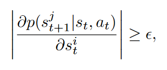
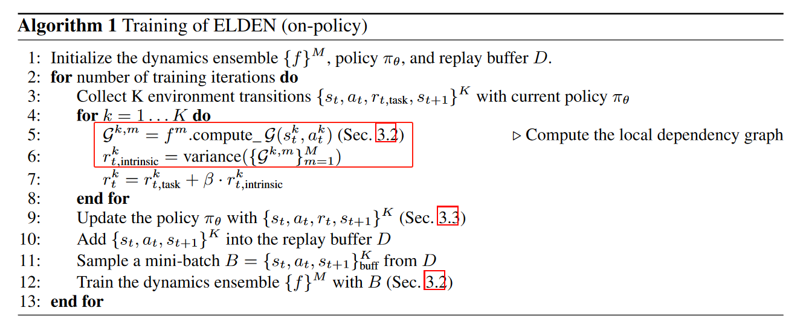
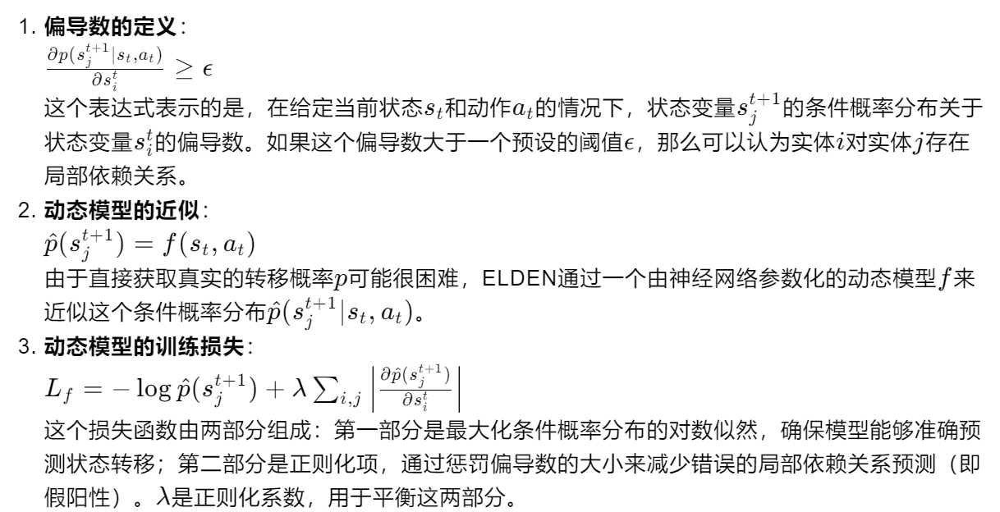

05-ELDEN  Exploration via Local Dependencies

总结：对一个任务，将其划分为不同的实体，然后通过这个实体的状态计算出这些实体之间的依赖关系，通过计算这些依赖的方差来给出当前的内在奖励。

实体：比如一个做饭的任务，实体可以是：锅、食材、手臂等

##### 方法：
- 这篇论文主要定义一种内在奖励方法 
- 在算法流程图中不难得出，它多定义了一个图G和一个内在奖励函数
    - 图G：表示实体之间的依赖关系
        - 图的大小，也就是宽高，是我们自己定义一个任务中实体的多少
        - 图的边，就是实体之间的依赖关系
        - 依赖关系：实体i的st对实体j的st+1的影响
            - 计算方式：整体函数对i实体st的偏导
            - 含义：如果偏导数大于一个预设的阈值ϵ，则认为实体j在下一个时间步的值局部依赖于实体i的当前值
            
    - 内在奖励函数的计算：图G依赖值之间的方差。方差越大，表示模型对于依赖关系的预测不确定性越高。使用方差作为内在奖励的指标。方差越大，内在奖励越高，激励智能体探索那些模型预测不确定的状态。

##### 概率函数p：
- 将神经网络 f 来替代概率函数 p
- f的损失函数见下图。
    - 第一项是正常的损失，第二项是惩罚项，通过惩罚偏导数的大小来减少错误的局部依赖关系预测（即假阳性）。

