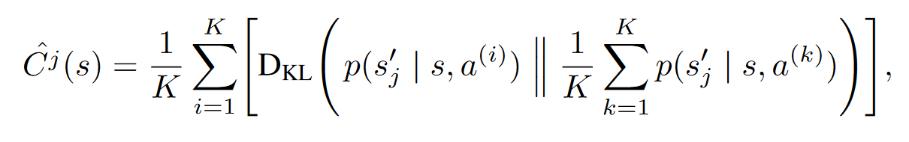
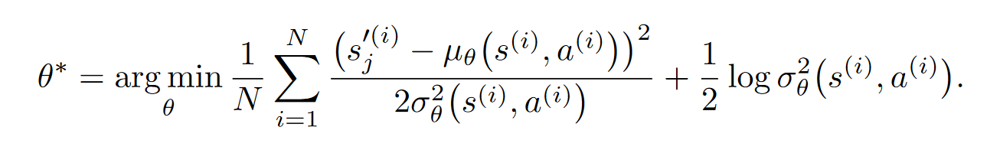
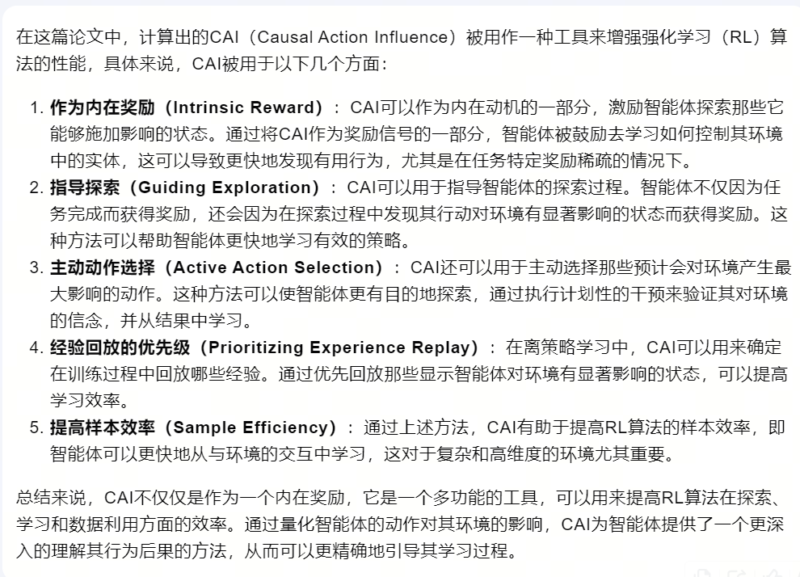
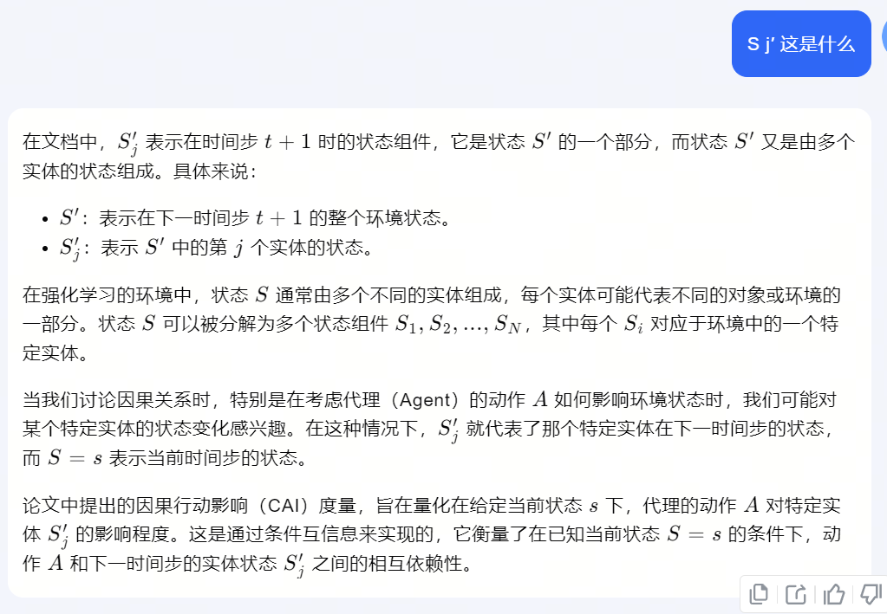
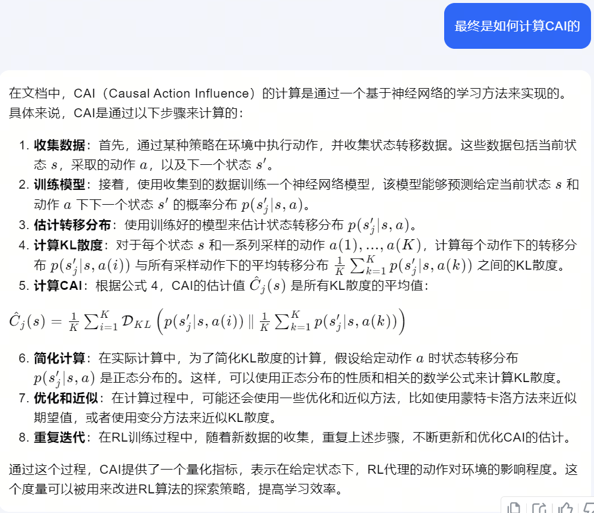
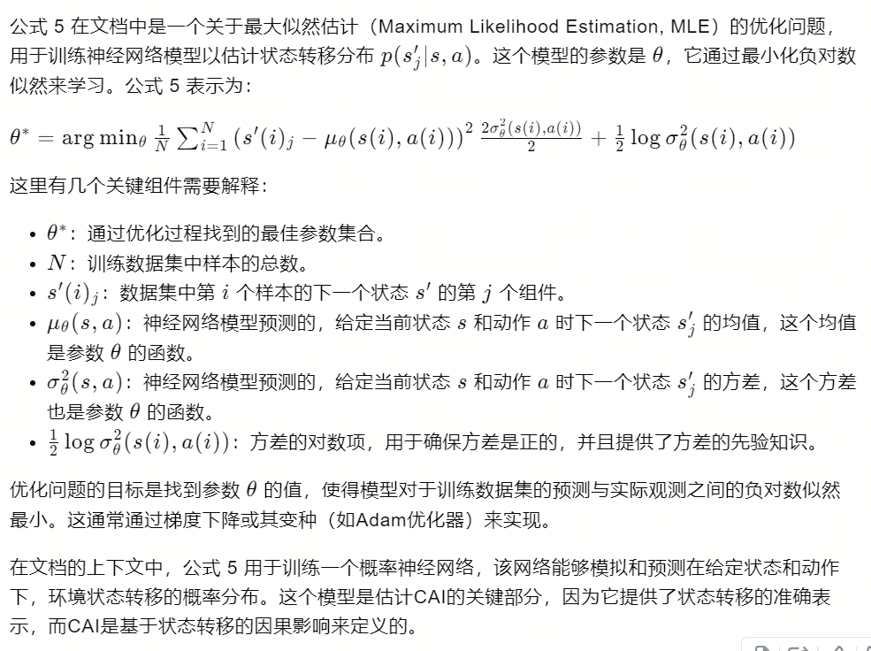

06-Causal influence detection for improving efficiency in reinforcement learning.

总结：设计一种机制因果行动影响（Causal Action Influence, CAI），计算出动作a对下一个状态的局部的影响。

##### 方法：
- 计算动作ai对下一个状态的局部影响：（详见2）
    - Sj撇：下一个状态局部实体j的状态（详见1）
    - KL散度右边：计算在s和所有动作a下，sj的生成概率。
        - 现实含义：所有a对sj影响均值
    - KL散度左边：计算特定ai对sj的影响
    - 整体理解：
        - 比较这两种影响的含义就是看Ai对Sj的影响是否显著
    - p：采用神经网络替代
        - 训练采用（s，a，sj）进行监督训练
        - 损失函数下面第二张图（详见3）
    
    

##### CAI的应用

##### 1. Si撇：

##### 2. CAI的计算

##### 3. p 损失函数的详细解释：
