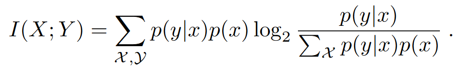
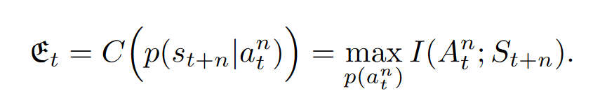
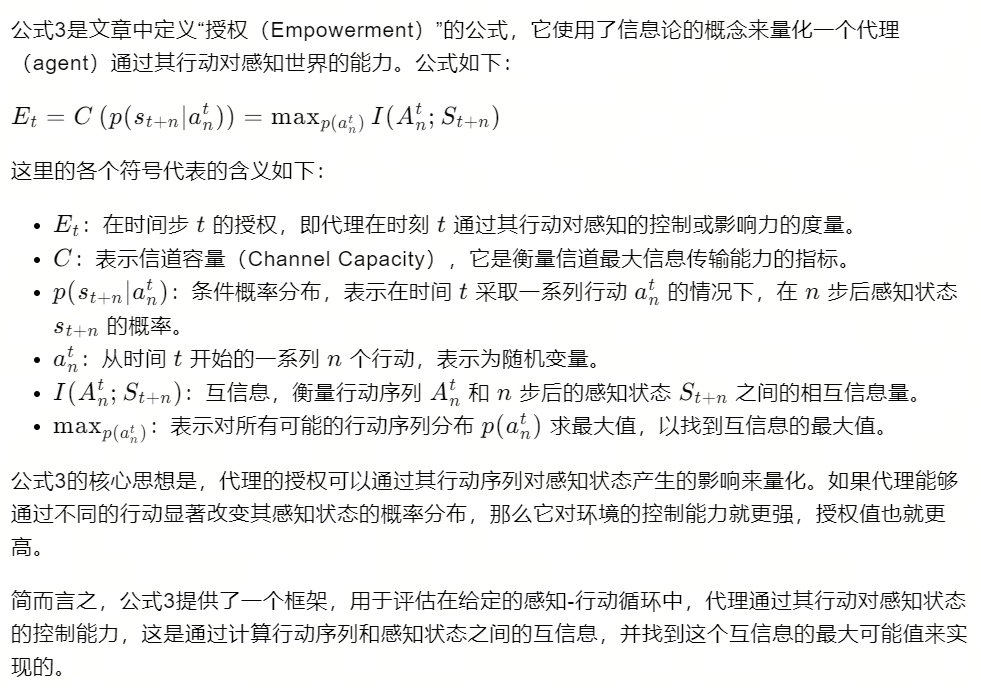

07-Empowerment a universal agent-centric measure of control

总结：采用互信息的方法，计算智能体对环境的控制能力，采用内在奖励进行

##### 互信息：
- 含义：公式如下图，衡量像个随机变量之间的相互依赖性/一个变量包含另一个变量多少信息

##### 将互信息用在强化学习中：
- 公式含义：计算动作a对状态s的互信息，即计算s中包含了对手a的信息。
- 真实含义：动作对状态的影响
- 值得含义：
    - 当互信息为0时：表示a和s之间无关，也就是智能体无法控制s
    - 互信当息越大时：表示智能体拥有的控制能力越大

