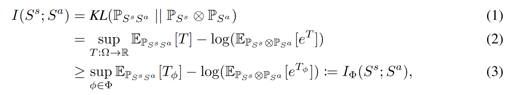
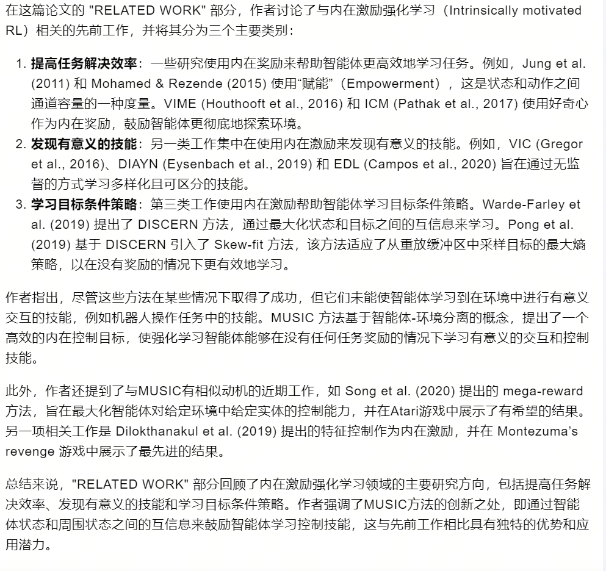

08-Mutual information state intrinsic control.

总结：设计一种互信息的内在奖励机制(MUSIC)。主要计算智能体状态和环境状态之间的互信息。MUSIC 鼓励智能体与环境中感兴趣的部分进行交互，并学会控制它。

##### 方法实现：
- 首先把State划分为两部分
    - Sa：智能体的状态，例如机器人的关节角度、手臂位置等
    - Ss：环境状态
- 主要计算Sa和Ss之间的互信息：
    - 如公式一所示：
        - 左边是两个状态的联合概率分布
        - 右边是两个状态的独立分布乘积
        - 要是两个状态是完全独立的话，那么两边的概率是相等的，所以互信息为0
        - 如果两个状态是存在相关性的，那么它的联合概率就会发生改变，那么互信息就会变大
    - 公式二和三是具体计算互信息的方式，由于 P 太难计算
    - 公式三是采用论文 MINE 设计的。它是是个神经网络的估计器。

##### 实验细节：
- 在机器人抓球的例子中，当机器人碰到球，球因为手臂的作用产生运动时，这时候互信息变大，说明两者之间存在潜在影响。

##### 论文的 Related Work：
 