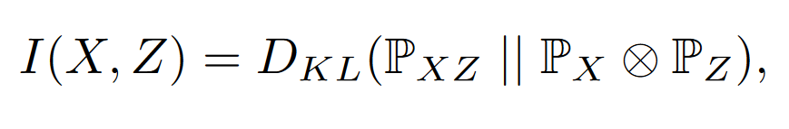
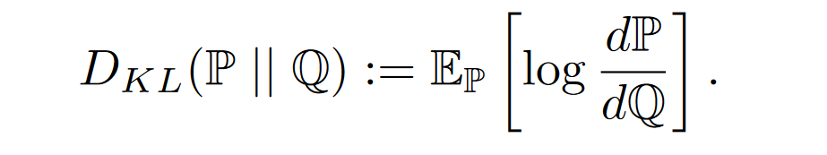
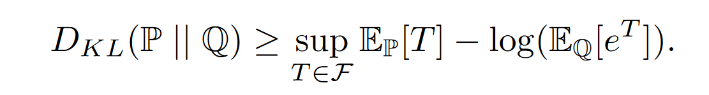
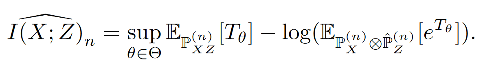
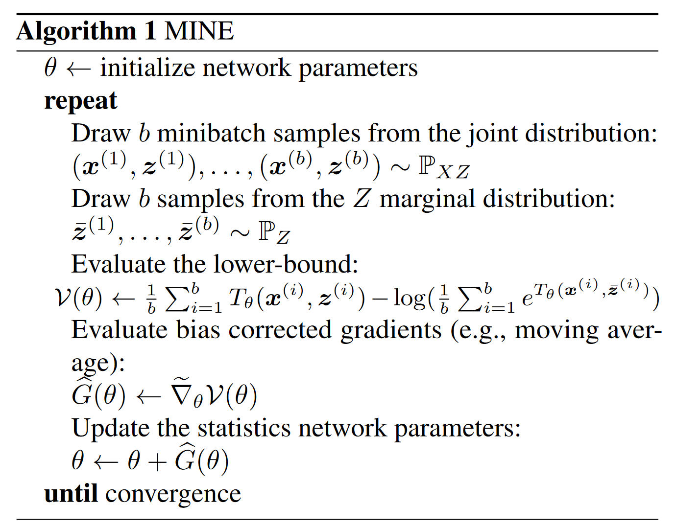
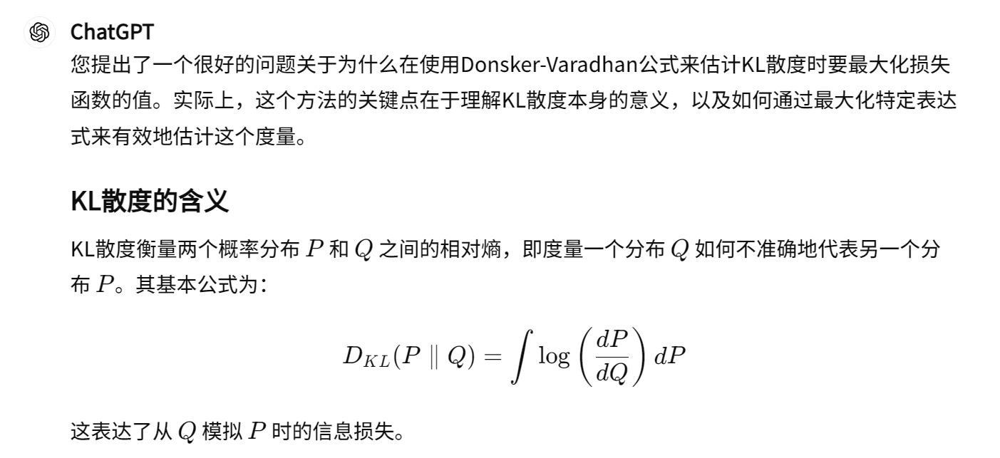
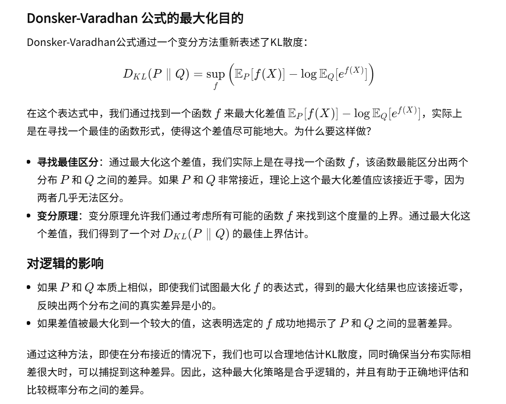

09-Mine mutual information neural estimation

总结: 这篇论文主要是为了支撑08论文。他设计出一种方法，能够把计算两个KL散度的过程，变成训练一个神经网络。

##### 核心方法：
- 互信息和KL散度的计算：

- 利用Donsker-Varadhan 来表示KL散度：

- 将 T 变化为一个神经网络，称为互信息神经估计器 MINE

- 训练流程
    - 注意点：采用梯度上升[1]

##### [1] 为什么采用梯度上升：

##### [2] 这篇论文提供很多有关KL散度其他计算的论文