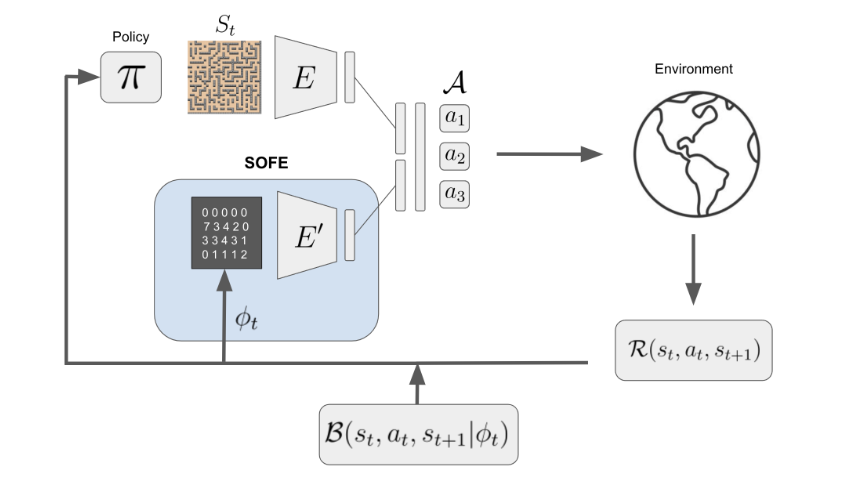
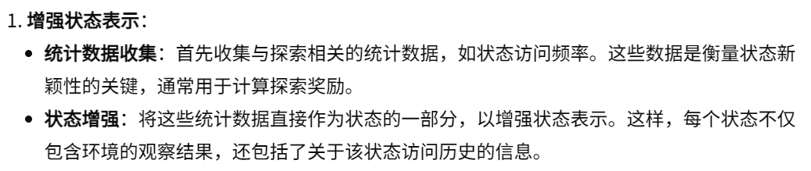
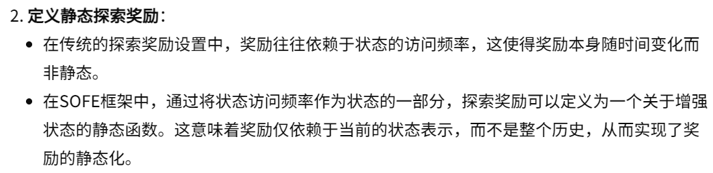
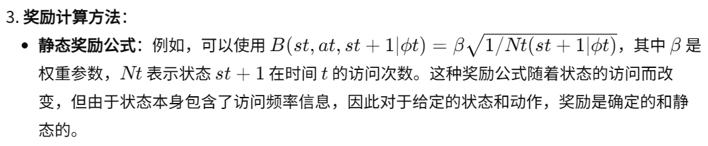
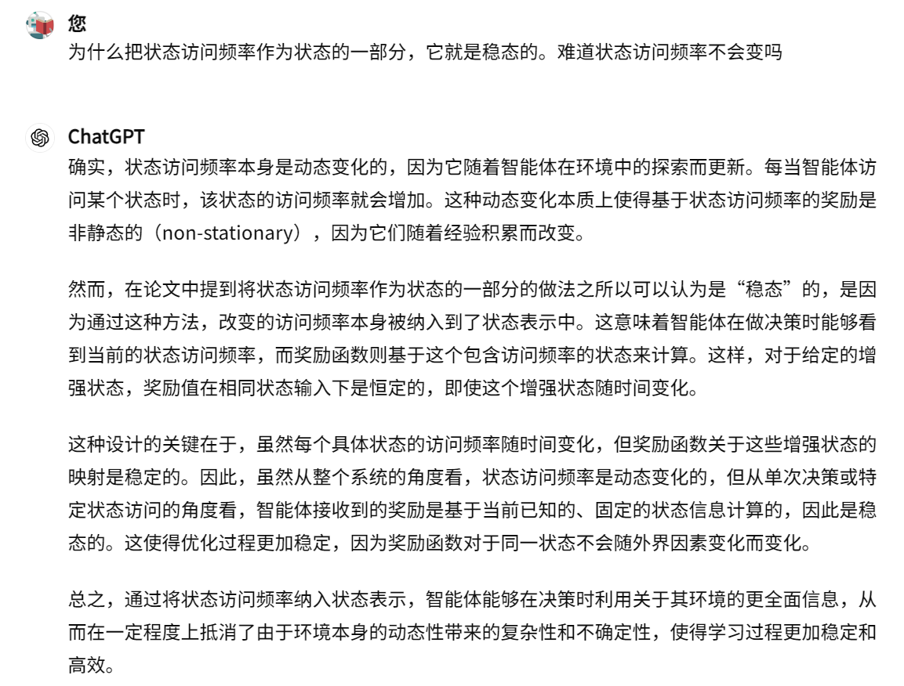

10-Improving Intrinsic Exploration by Creating Stationary Objectives

总结：这篇论文将访问频率加入到状态当中，仅此而已

##### 核心方法：
- 把访问频率加入到状态当中
    - 蓝色框内的灰色图片 φt 就是状态访问频率，通过某种变换E`，把它加到状态 St 中
- 这样做的好处：
    - 之前的计数内在奖励。智能体只能知道最终的计数奖励，但是缺看不到访问频率。这个方法将访问频率加入到状态中，这样智能体就可以看到访问频率了。

##### 细节：
- 增强状态表示：

- 定义静态探索奖励

- 奖励计算方法：

- 为什么访问频率在嵌入状态后就是静态的
