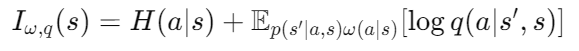
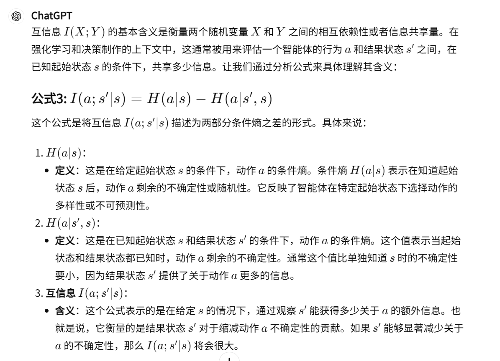

11-Variational information maximisation for intrinsically motivated reinforcement learning.

总结：区别于其他内在奖励方法，该方法 VIM 并没有直接添加内在奖励值。而是在计算互信息是，采用梯度上升的方法直接优化策略函数

#### 核心方法
- VIM 方法计算的互信息并不是计算内在奖励，而是要在最大化互信息的时候优化策略函数。
- 首先互信息的计算公式：熵形式，详见1

- 通过变换，将互信息转化为一个优化问题：详见2

- 在优化函数中，最终优化的不是 q 函数，而是 w 函数。

- q 函数的训练：

#### 1. 互信息---到---熵计算的推导：

#### 2. 本文互信息最终优化函数

#### 3. 本文互信息的含义：
- 解释第三点为什么互信息能够变大：
    - H 是计算熵。如果s`能够减少 a 的不确定性。那么这个概率函数的熵就会变小

