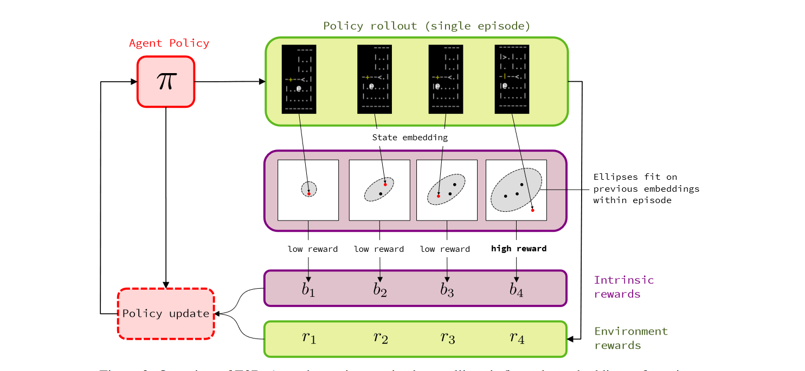
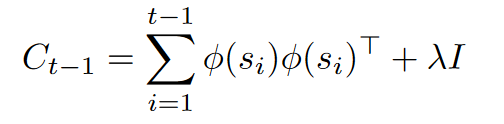
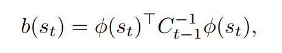
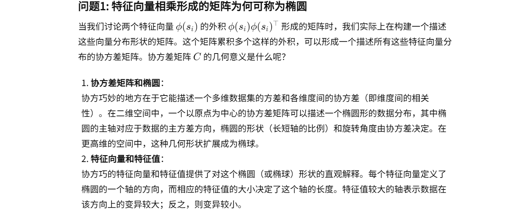
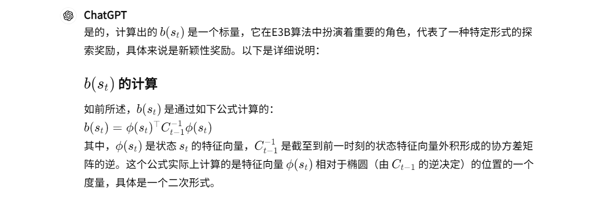
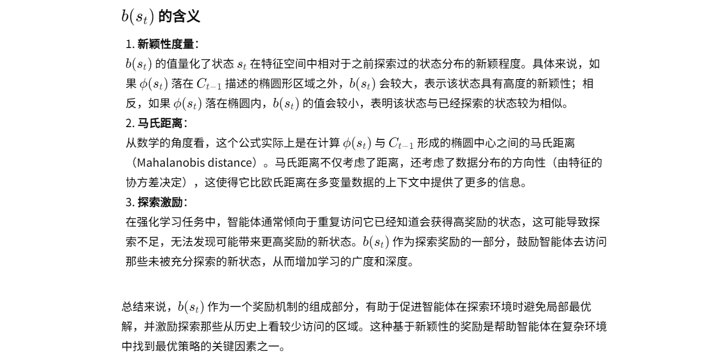
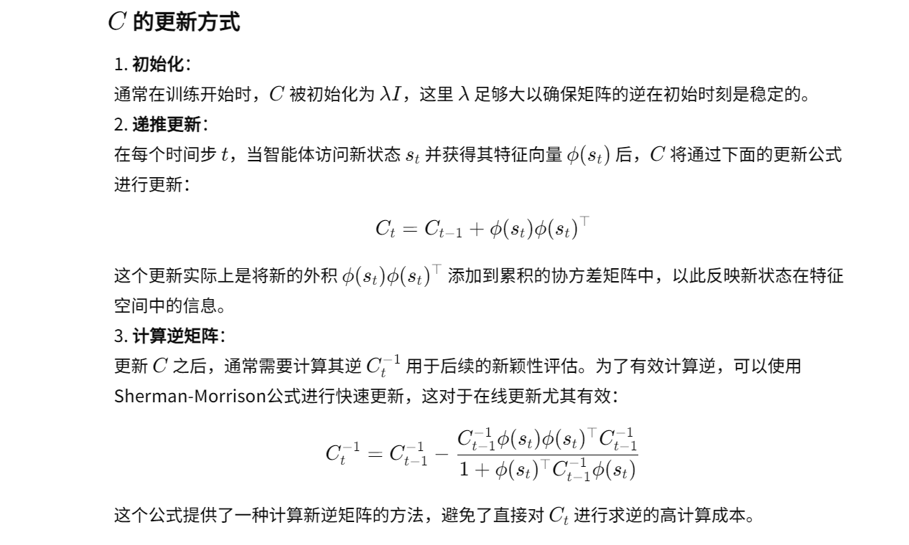

12-Exploration via elliptical episodic bonuses

总结：这篇文章提出一种计数的内在奖励探索方案。但是我认为这种奖励并不是基于计数的，而是判断新状态相对于老状态是否新颖。

##### 核心方法：
- 核心思想：
    - 通过计算下一个状态是否在一个椭圆中，判断这个状态的新颖性
        - 如果在椭圆中，则奖励较低；如果不在，则奖励较高
    - 如图：b4 就是一种比较高的奖励
    
- 奖励的计算：
    - 椭圆：详细解释见 1
        - 两个特征向量的乘积，加上一个单位矩阵。
        - φ(si)：φ 是特征提取函数，和 ICM 里面的算法是一样的。
        
    - 奖励 b 的计算：详细解释见 2
    

##### 1. 两个特征向量相乘所形成矩阵 C 的含义

##### 2. 奖励 b 的详细解释

##### 3. C 的更新方式：

#### 在第三节中介绍了一些基于计数的探索方法