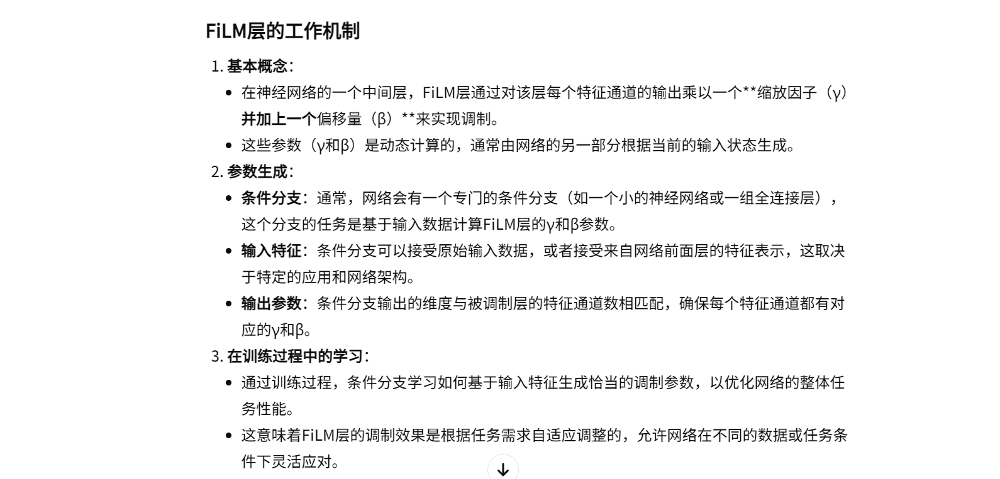

13-Anti-Exploration by Random Network Distillation

总结：在Offline RL中，不希望出现OOD问题。对于RND来说，更够检测到OOD，因此将RND提供的奖励加上负号，希望智能体不要去看太新的状态和动作。文章通过在RND中引入FiLM调制，有效地提升了离线RL中抗探索功能，减少OOD动作。

##### 核心方法：
- 在 RND 网络中添加 FiLM 模块：

##### 有关FiLM的介绍：

##### FiLM 所解决的问题：

##### 算法流程：

#### 信息融合方法：Multiplicative Interactions（乘法交互）
- 论文第二节一共提到了三种方法：Gating、Bilinear、FiLM

