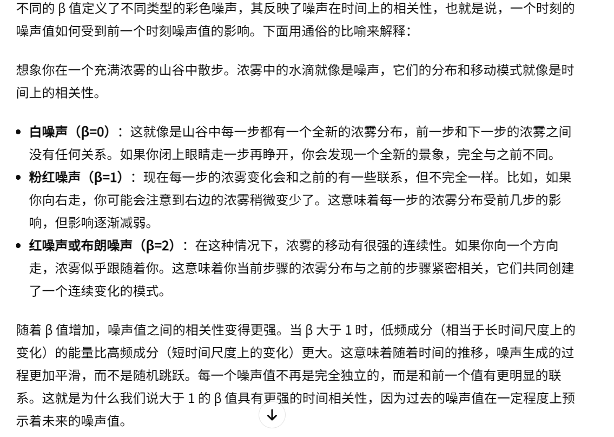
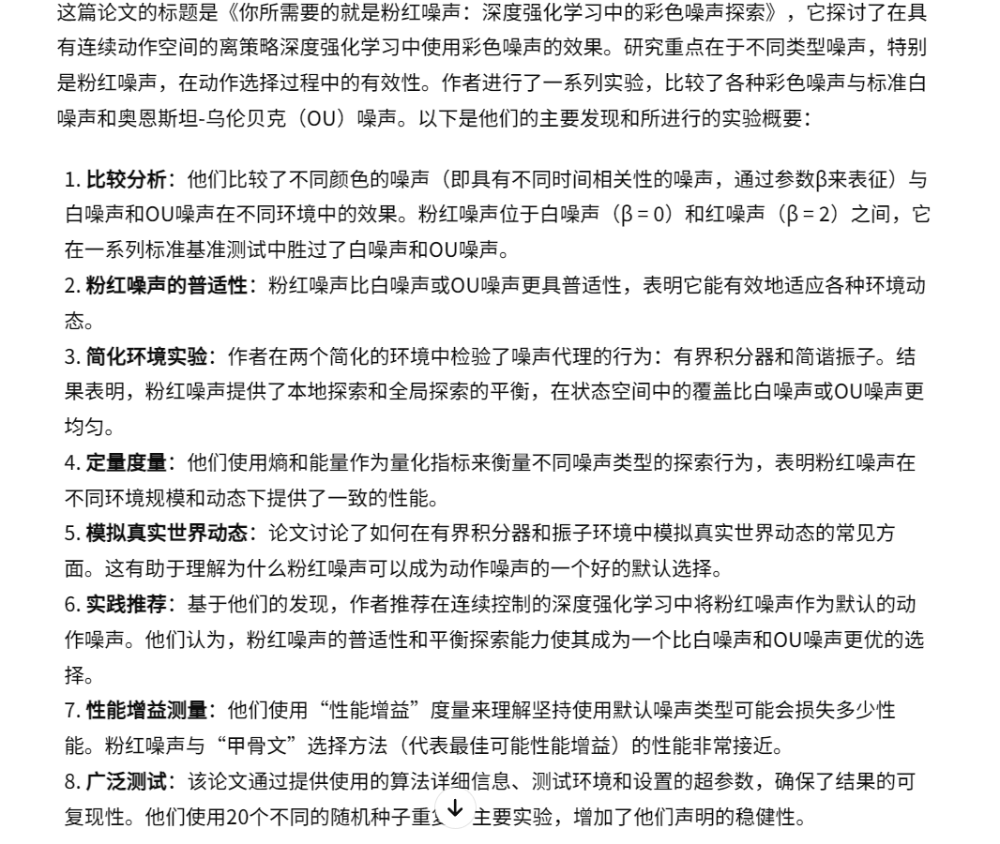

15-Pink Noise Is All You Need  Colored Noise Exploration in Deep Reinforcement Learning

总结：在连续动作空间，粉色噪声(β=1)在多个场景下明显优于其他噪声

##### 不同噪声的现实含义：

##### 论文总结：

##### 粉红噪声几乎不会影响在不同场景下的性能，可以作为默认噪声

##### 采用多臂赌博机的方法挑选噪声，效果和默认粉红噪声相似，还是推荐实验默认粉红噪声