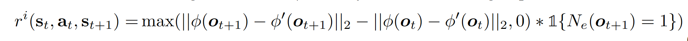
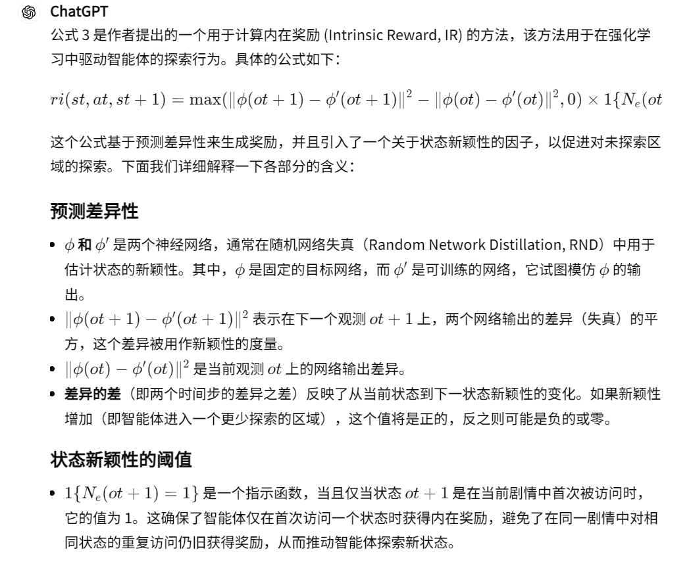
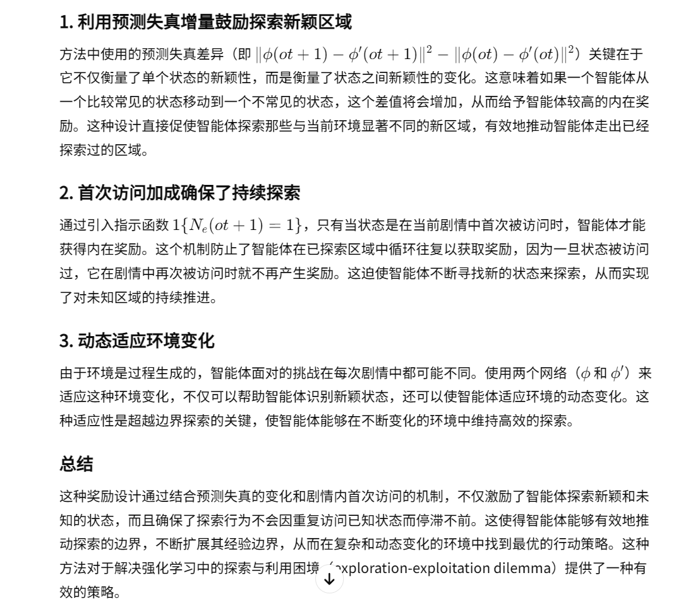

16-BeBold  Exploration beyond the boundary of explored regions

总结：这篇文章提出一种稀疏的内在奖励方法，只对初次访问的状态给予内在奖励

##### 核心方法：
- 内在奖励设计：
    - 后半部分：只对第一次出现的状态给予内在奖励， Ne(o) = 1
    - 前半部分：
        - 后半部分：对于前半部分如果计算值为负数，则奖励为 0
        - 前半部分：采用 RND 的思想，只不过分成了讲个部分，详见 1

##### 1.内在奖励的详细解释

##### 超越边界探索的能力：克服徘徊困境

##### 这篇论文的其他关键信息：
- 目前一些内在奖励的困境：徘徊：比如说一个环境中有多条走廊，智能体可能会先利用完第一条走廊的全部内在奖励之后，才回去探索另外一条走廊。
- 产生负奖励并不是一个好注意，因此需要 max(i_r, 0)
- 智能体只有在一次情节中第一次访问状态 s 时才会获得奖励
- IR 有很多启发式方法，包括访问计数、好奇心和状态差异