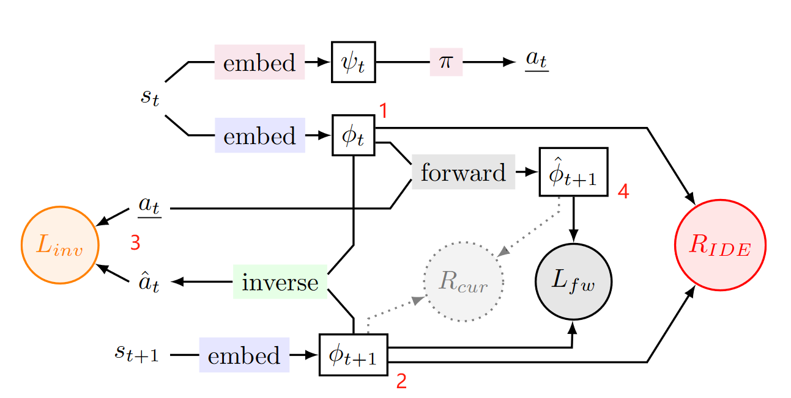
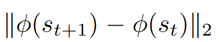
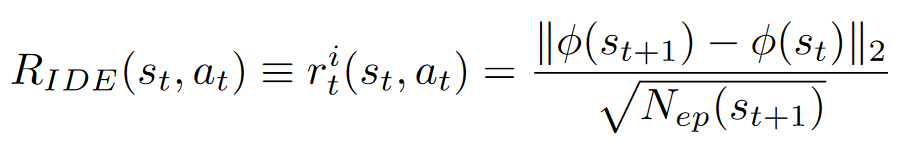
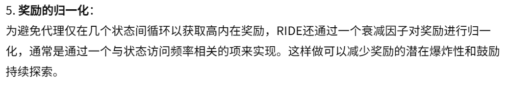
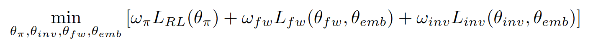
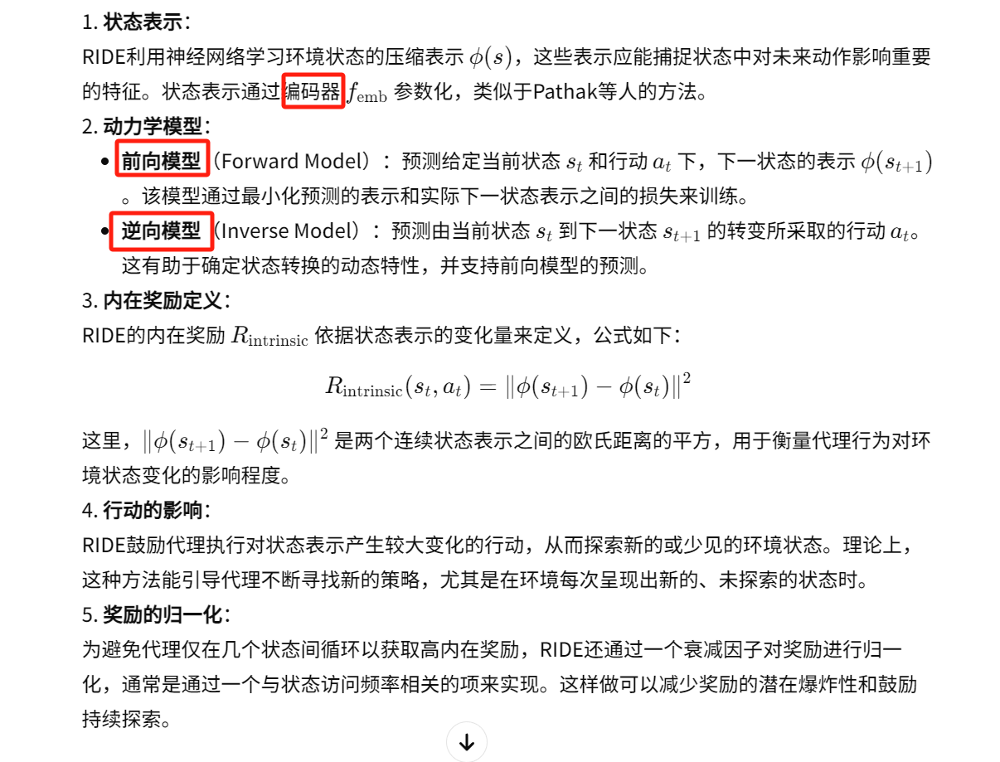
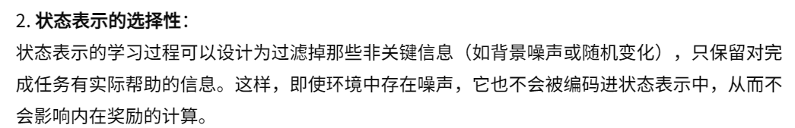

17-Ride Rewarding impact-driven exploration for procedurallygenerated environments

总结：这篇论文设计了一个内在奖励函数，主要完成对预测的 St+1 和真实的 St 之间的差距。和 ICM 不同的是，RIDE 的方法主要关注现在和未来的区别，而 ICM 是关注未来和预测未来的区别。并且 RIDE 对奖励做了归一化。

##### 核心方法：
- 如下图和 1 所示：
    - 想要计算出RIDE的内在奖励需要训练三个模型：
        - 逆向模型、编码器：通过 1 和 2 逆向模型需要推算出 3，让模型看到前后两帧状态推测出动作，这个预测动作和真实动作越接近越好，进而训练出编码器 embed 和 逆向模型
        - 前向模型(预测器)：1 和 3 输入到 forward 中，生成下一个状态的预测，这个预测的t+1需要和真实的 2 越接近越好，因此又训练了预测器。

- 内在奖励的定义：量化动作对环境变化的影响

- 奖励归一化：通过访问频率来限制

- 损失函数：
    - 第一项是策略、第二项是前向模型、第三项是逆向模型

##### 1. RIDE 计算内在奖励需要训练的三个模型：

##### 2. 需要特征表示 embed 的好处：

