18-Adversarially guided actor-critic

总结：这篇论文在Actor-Critic架构下提出了一种内在奖励方案。设置一个 对手 角色。它会模仿策略的行为，希望和策略的动作越接近越好。但是策略希望它的动作和 对手 越远越好。内在奖励就是策略和 对手 之间的距离。主观想法：对抗形式的内在奖励通过激励agent采取对手难以预测的行动，自然而然地引导agent探索那些较少访问或未知的状态空间。(这个奖励函数设计的好处 详见[3])
源码：https://github.com/yfletberliac/adversarially-guided-actor-critic

##### 核心方法：
- 围绕 对手和策略越接近越好 和 策略和对手越远越好 两个目标设计损失函数 (在[2]中有解读)
    - 定义两者之间的举例：KL散度
    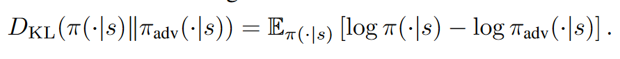
    - 整体损失函数：
    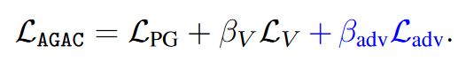
    - 对手和策略越接近越好：
        - Ladv损失：梯度下降，越小越好
        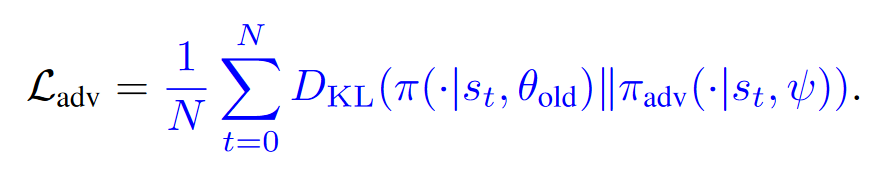
    - 策略和对手越远越好：
        - Lpg：策略损失；由于Lpg加了负号，因此希望 A 优势函数越大越好。如果策略输出的动作和adv的差值越大，则优势函数越大。（这不是最终版本的策略损失函数，详见[1]） 
        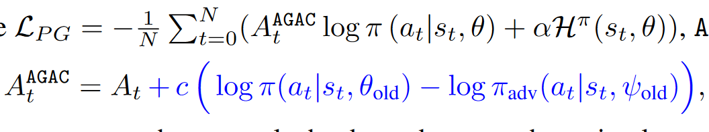
    - 正常更新Critic价值函数 V ：
    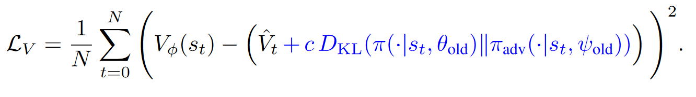

##### [1] 策略损失函数
- 主要需要改进的地方在于优势函数 A 的计算
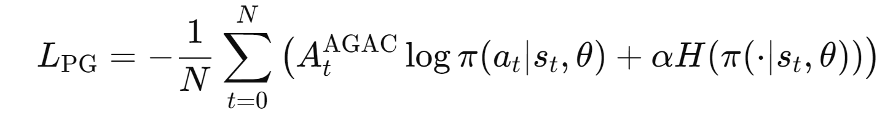
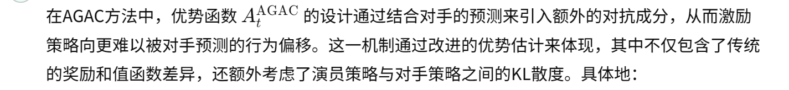
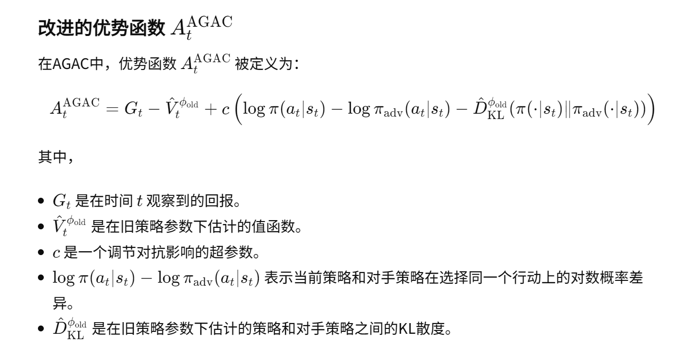
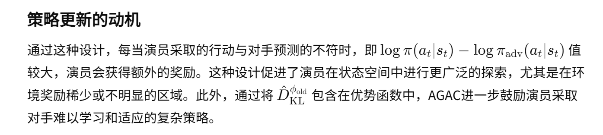
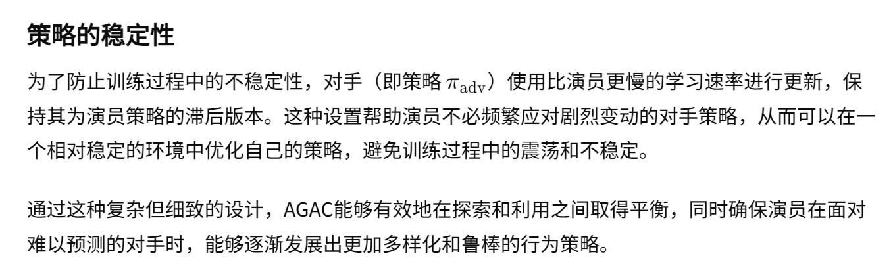

##### [2] 解释 损失函数如何实现控制 策略和对手的远近
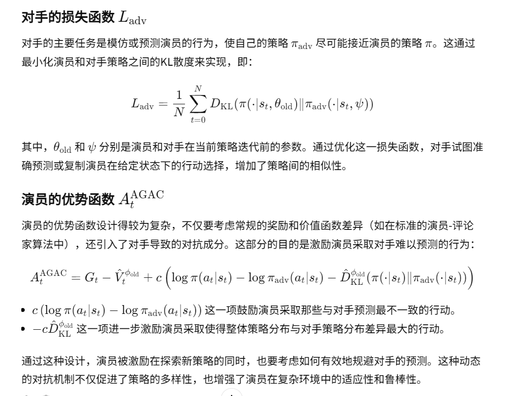

##### [3] 优势：
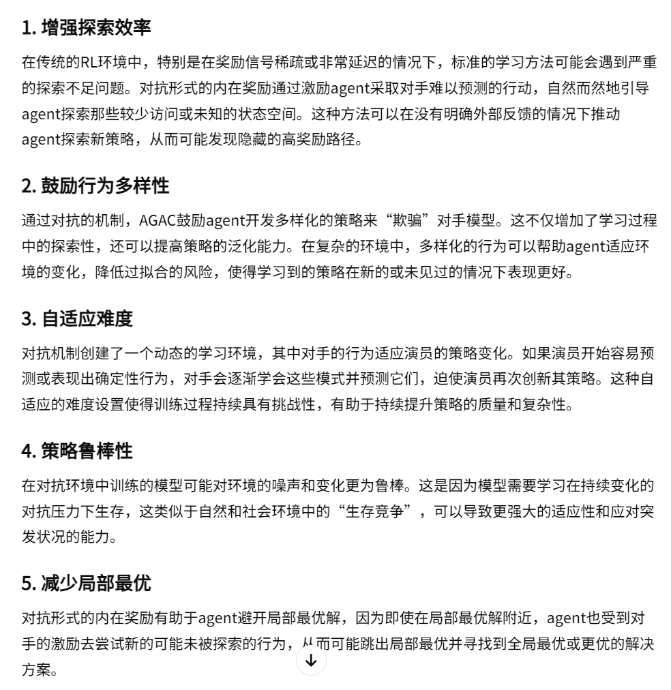