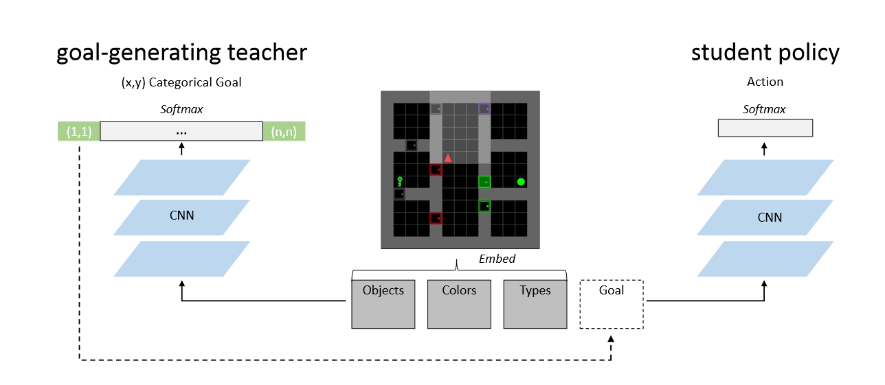
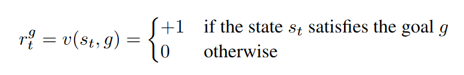
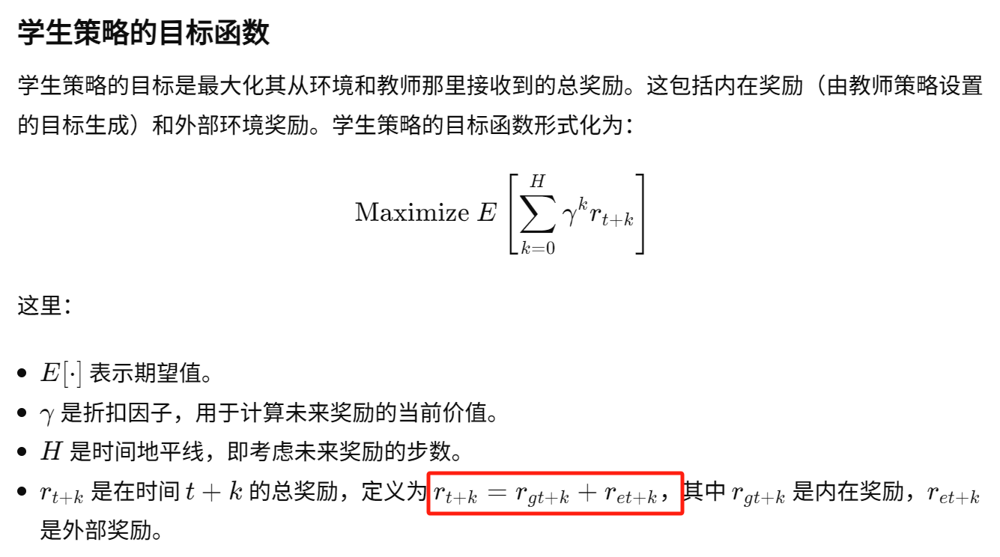
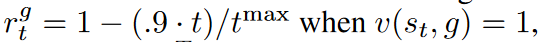
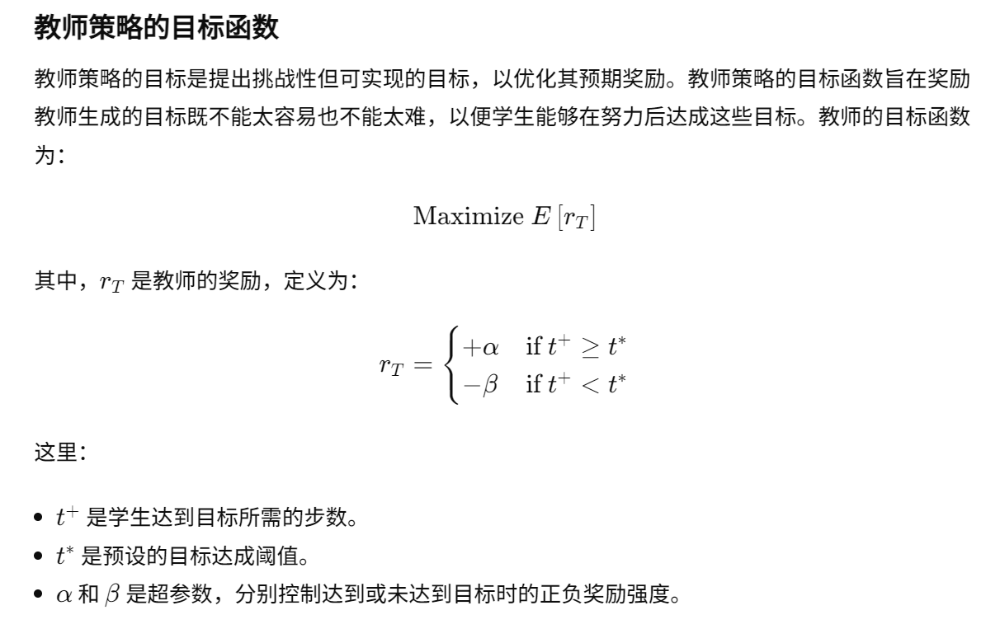
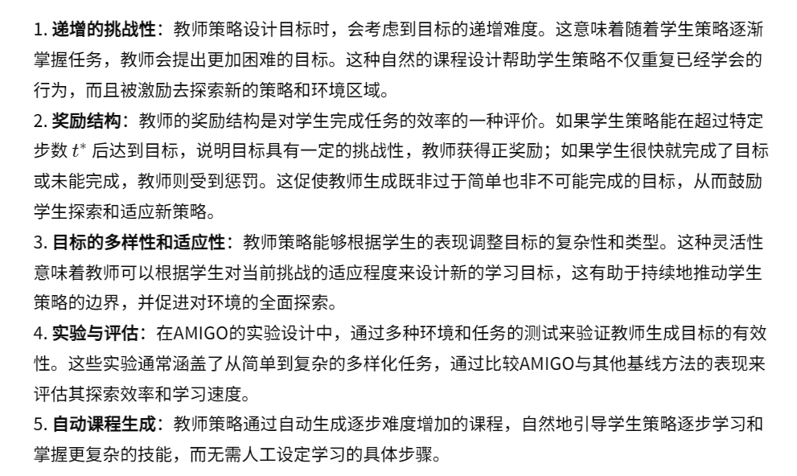
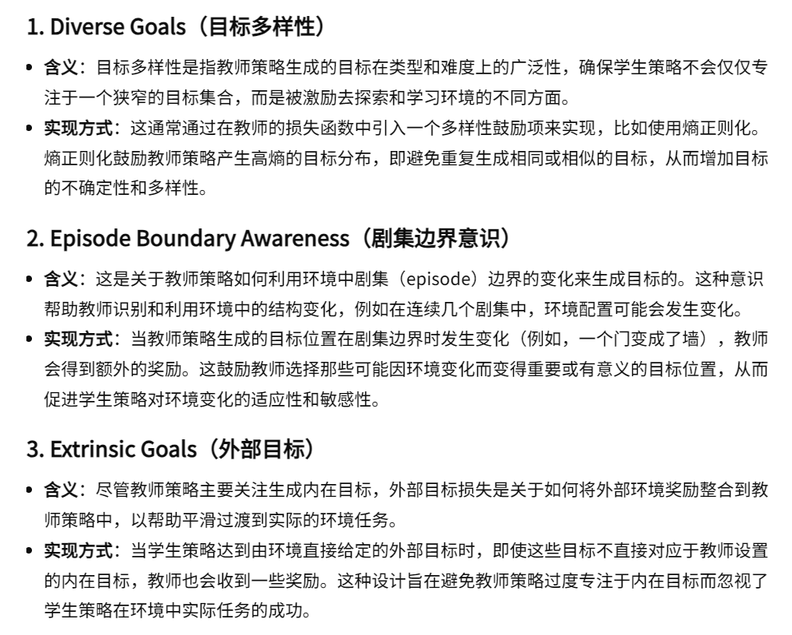

19-Learning with amigo Adversarially motivated intrinsic goals

总结：这篇论文将RL架构设计为学生和老师两个角色。学生就是之前的策略，而老师为学生提供额外的目标。学生如果完成了老师的目标则会获得一定的奖励，老师要根据学生的完成情况指定合理但有难度的目标。

代码仓库：https://github.com/tesatory/hsp

##### 核心思想： 学生 和 老师
- 整体：AMIGO包括两个子系统，一个目标生成的教师策略和一个目标条件的学生策略。教师策略在每个环节的开始生成一个目标，并在学生达到该目标时重新设定新目标。学生策略则基于当前目标执行动作以达到该目标
- 图解：左边为教师，右边为学生(策略)
    - 教师生成一个坐标，添加到学生得到的状态中，学生根据状态的中的坐标，如果它成果到达坐标点，就能够获得奖励。老师也会根据学生的完成情况获得一个奖励。
    - 老师给学生的不一定必须是坐标，也可以是语义向量或者其他东西，这篇文章给的是坐标。

- 学生
    - 如下所示，学生的奖励包含外部奖励和内在奖励。内在奖励就是看学生是否完成了老师的给的目标。
    - 函数 v 就是判断学生是否满足老师的目标
    
    
    - - 文中：
- 老师：
    - 下图所示的就是老师的优化目标函数。
    - 它的奖励根据学生完成的步数 t+ 来判断。
        - t* 就是阈值。它是一个超参，用来限制老师布置目标的难易。
        - 动态调整 t* ：每当学生连续十次以超过 t* 的步骤成功达到内在目标时，阈值 t* 就会增加 1
        - 文中：α = 0.7 and β = 0.3
    

##### 解答一：老师的奖励中不包含最大化外部奖励，如何确保教师设置的目标是有帮助智能体探索

##### 有关老师的优化：通过增加一些损失函数，有增强老师的职责

