20-RANK THE EPISODES: A SIMPLE APPROACH FOR EXPLORATION IN PROCEDURALLY-GENERATED ENVIRONMENTS

总结：这篇论文提出一种如何从情景剧集中学习有用的信息的方法。情景剧集就是 Episode ，一回合游戏的全部动作状态对。它对 Episode 数据进行打分和排序，并放入一个缓冲区中。然后智能体对缓冲区中的数据进行模仿学习。缓冲区的数据会不断更新，分数低的会被删除。

代码仓库：https://github.com/daochenzha/rapid

##### 核心方法：全局分数、局部分数
- 整体：它一共对 Episode 有三个分数：全局分数、局部分数、外部奖励
- 局部分数：衡量的是在一个 Episode 内，各个状态的新颖性
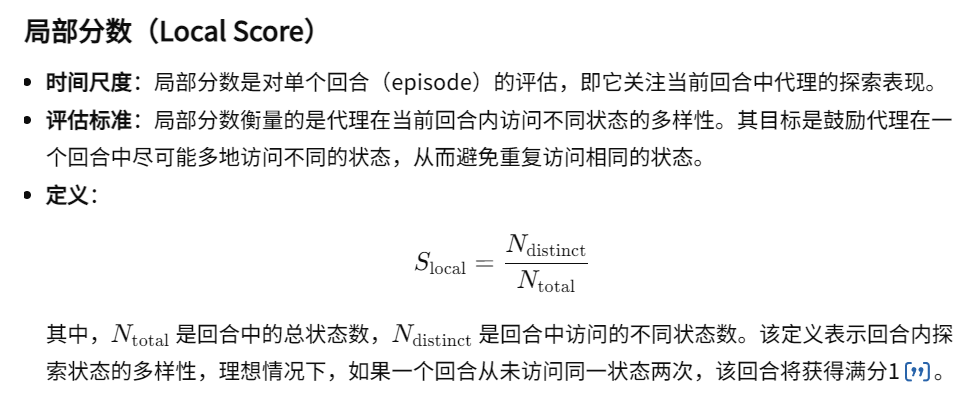
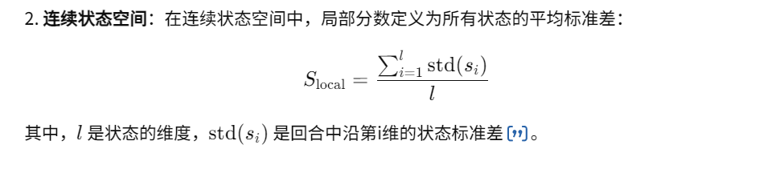
- 全局分数：会考虑全部 Episode 情况
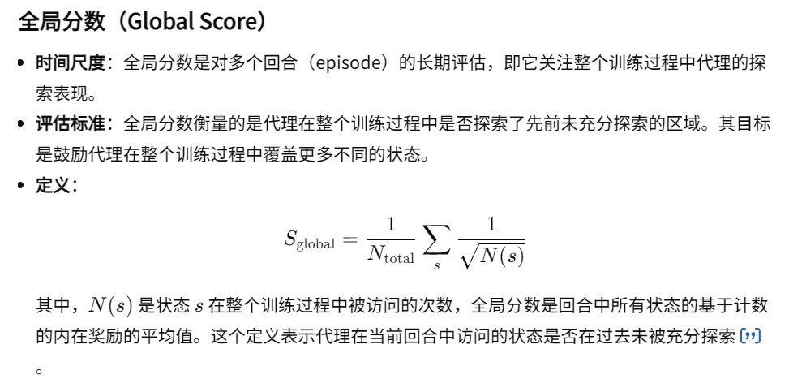
- 总奖励：
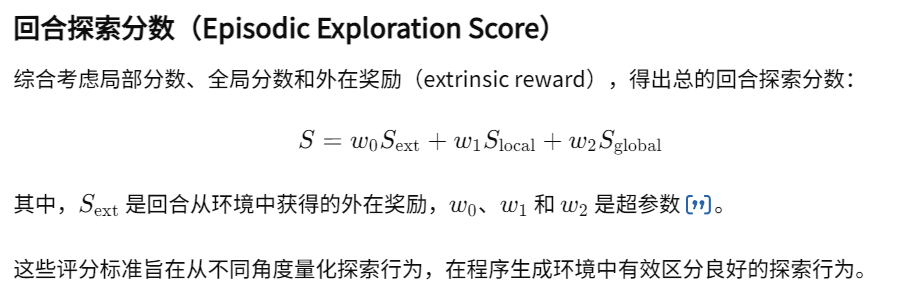
- 算法流程：
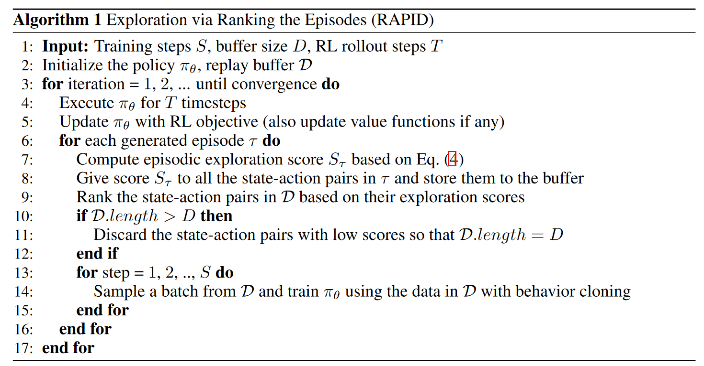
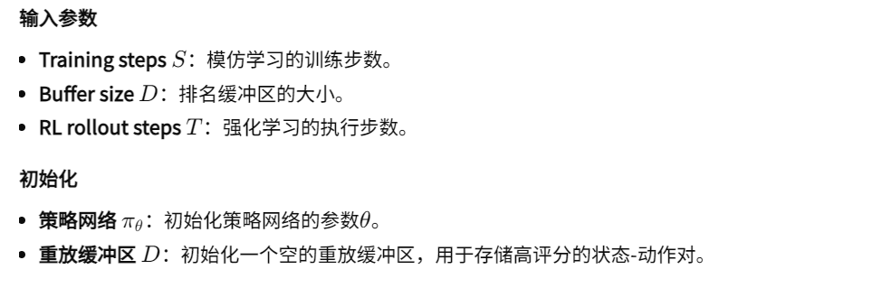
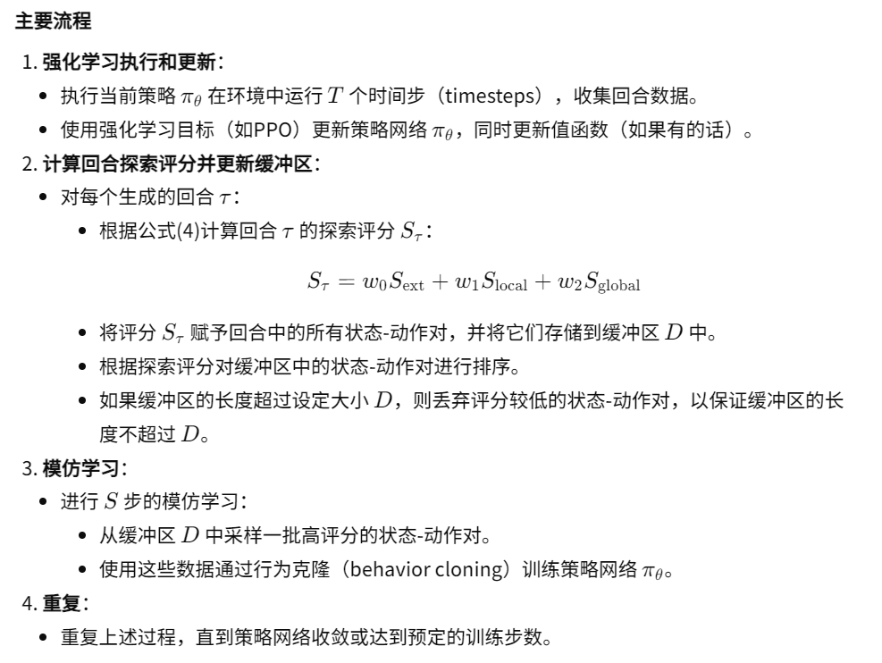

##### 模仿学习-行为克隆：
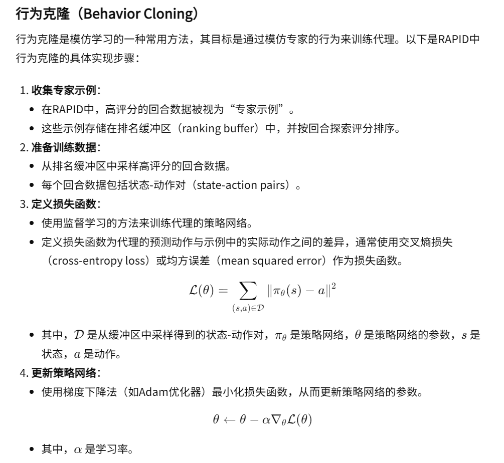

##### 有关实验的问答：
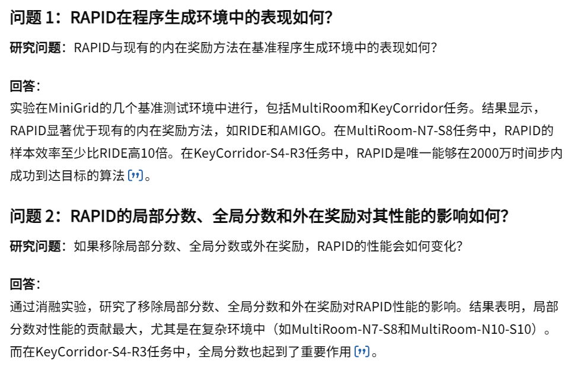
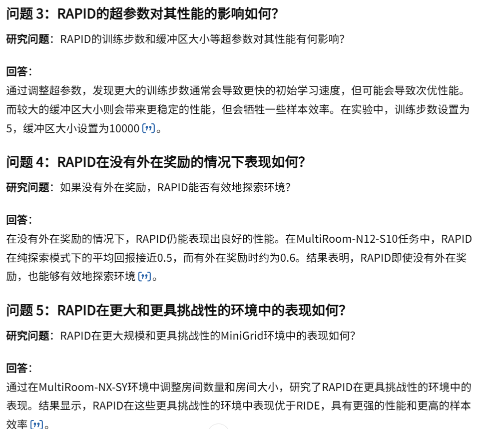
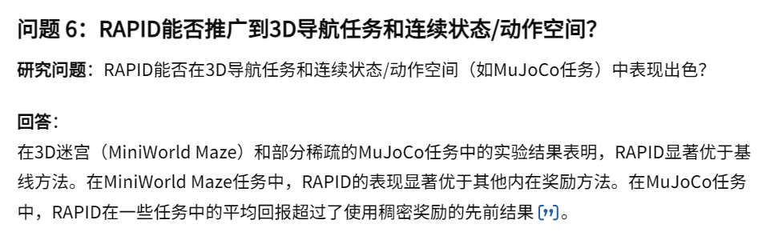

##### 在无限状态空间的局限和解决方法：
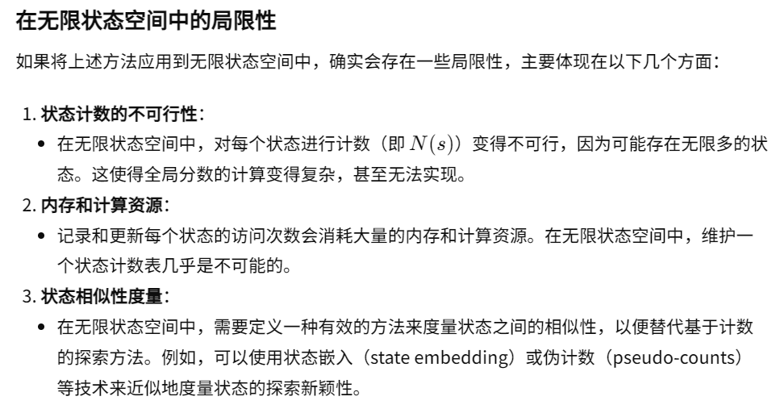
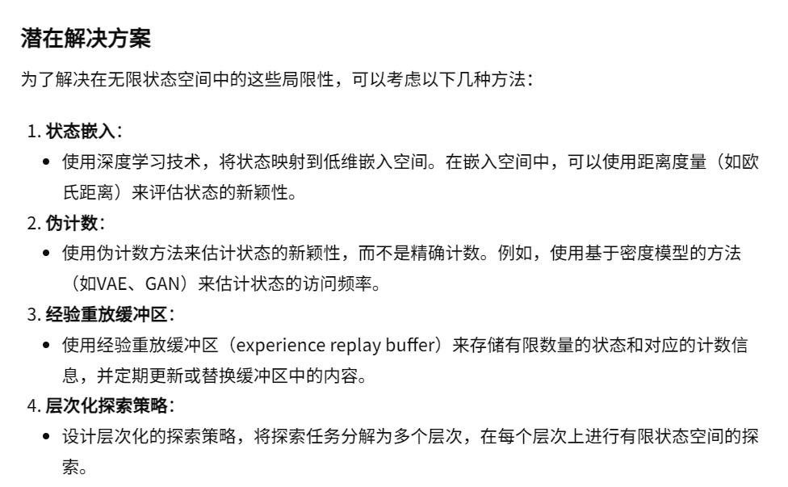