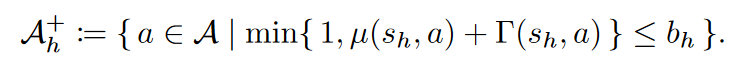
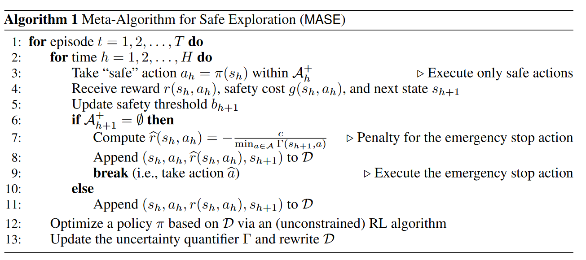
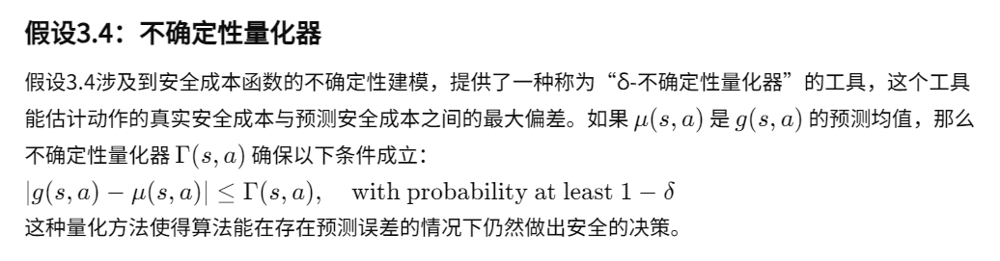
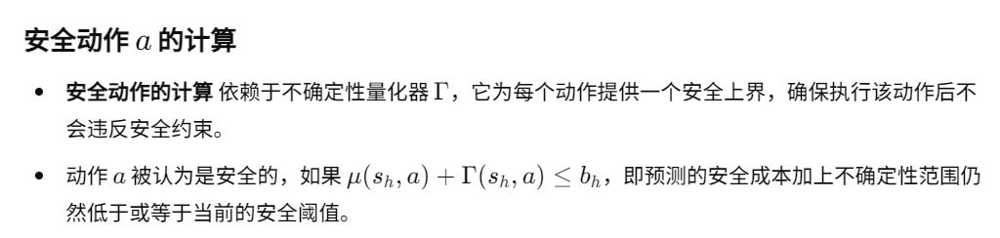

01-Safe Exploration in Reinforcement Learning  A Generalized Formulation and Algorithms

总结：设计了一系列机制，限制智能体的动作，以确保智能体的动作是安全的。比如在医疗系统中，不希望智能体在训练和实际中做出不安全的动作。

##### 核心算法：
- 3：如何选择安全的动作：u是对成本函数g的预测函数，Γ是不确定性量化器，供了一个实际可操作的量化不确定性的方法。b是风险的门限。
    - 含义：风险成本预测 + 一种不确定值 应该比门限还小。（详见1）

- g是风险函数，就是对状态动作对进行评估风险/成本。通常是根据专家知识进行提前设定的
- 如果目前安全的动作集为空，那么应该初始化环境，该次Episode结束。并且会带一个惩罚7。
    - 在不确定性Γ越大的时候，训练早期，如果出现没有安全动作可执行的情况，惩罚较小
    - 在不确定性Γ越小的时候，训练后期，如果还出现这种情况，惩罚比较大

##### 1. 不确定性量化器：

