02-Scheduled intrinsic drive  A hierarchical take on intrinsically motivated exploration.

总结：这篇论文实现一种内在奖励和一种分层调度训练策略。内在奖励：f为后继表示 (SR) ，即表示在当前策略下，后续状态的折扣和。内在奖励：f(s)-f(st+1) 。调度策略：一共有两个策略函数，一个是最大化外在奖励、一个最大化内在奖励。由策略调度函数选择本次训练要更新的策略。文中显示，作者认为随机选择是最好的策略。

##### 核心方法实现：继承特征控制（SFC）、分层代理调度内在驱动（SID）
- 继承特征控制（SFC）：后继表示 (SR) 、内在奖励计算
    - 后继表示 (SR) ：特征嵌入函数：可以理解为是特征映射函数，在论文的附件B中介绍它是一参数固定的东西。
    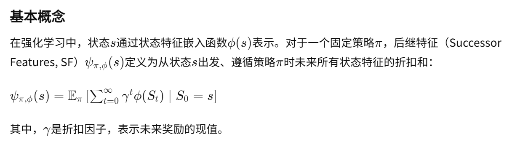
    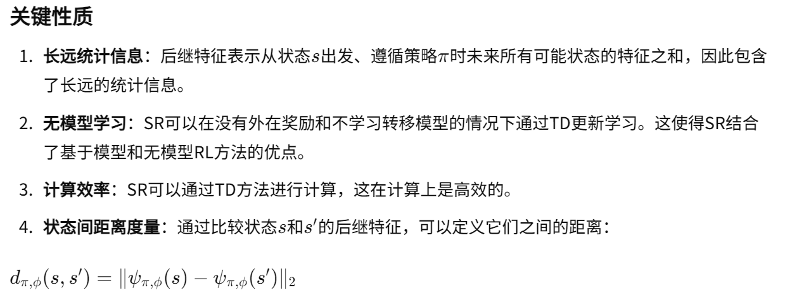
    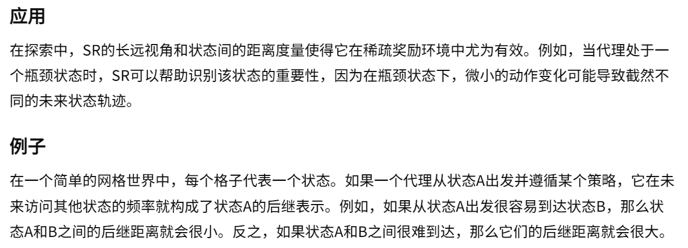
    - 训练后继特征：
    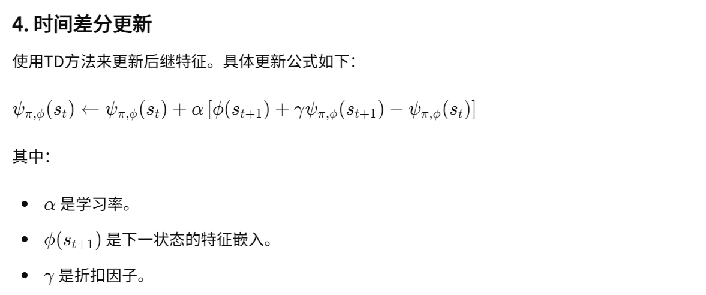
    - 内在奖励的定义：
    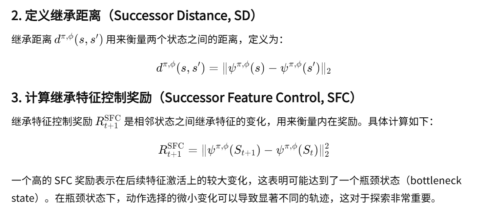
    - 内在奖励的直观理解详见 [1]
- 分层代理调度内在驱动（SID）：论文中说，随机调度效果最好
    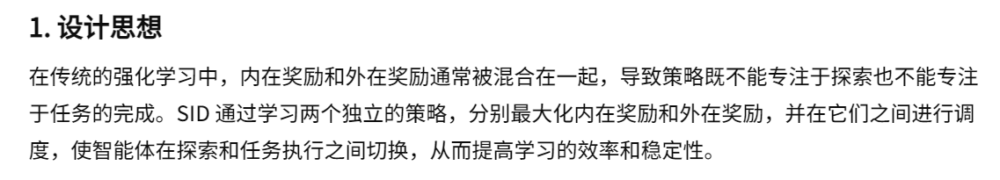
    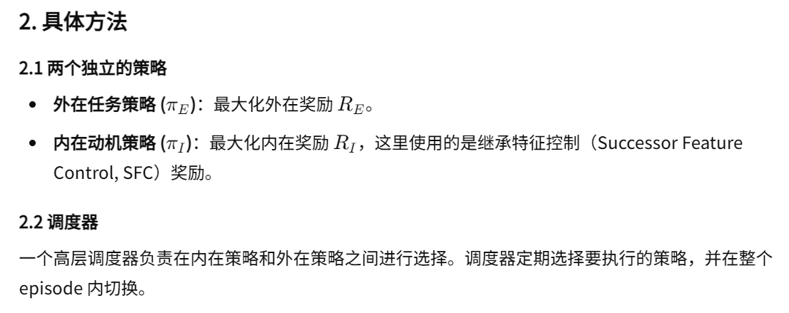
- 整体算法流程：
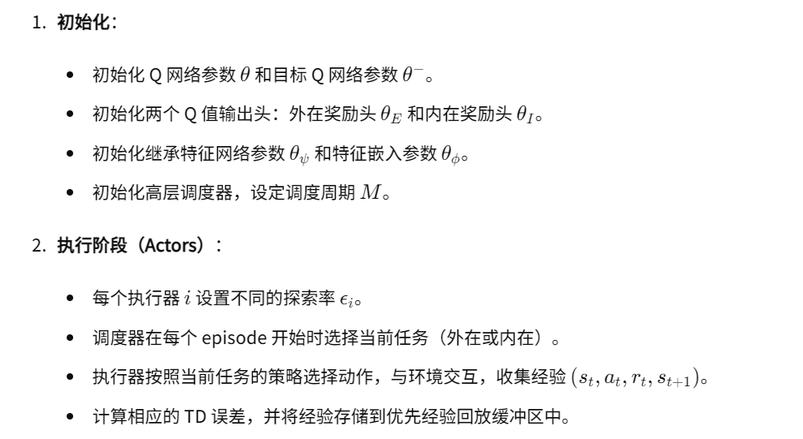
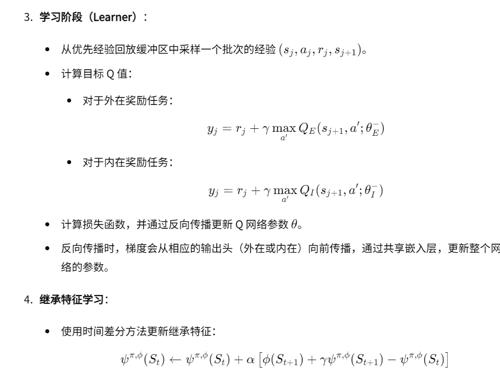
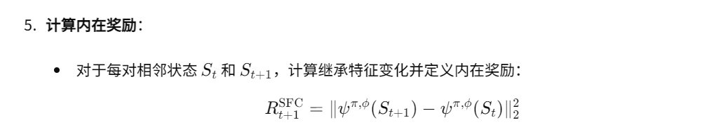

##### [1] 内在奖励的直观理解：
- 图一：每个格子的值就是表示这个格子到 X 的继承距离，也就是距离。
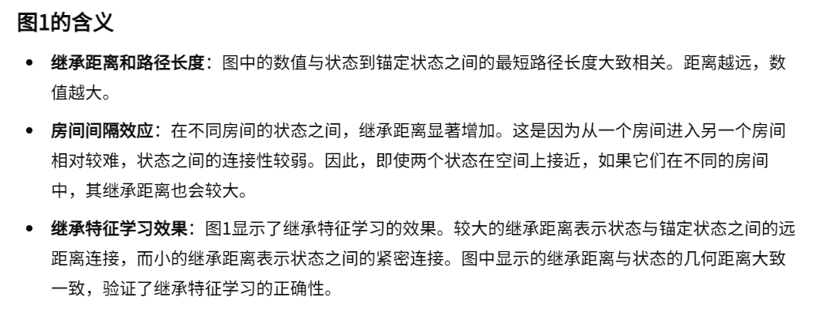
- 图二：值越大说明这个地方的差值越大，说明奖励越高
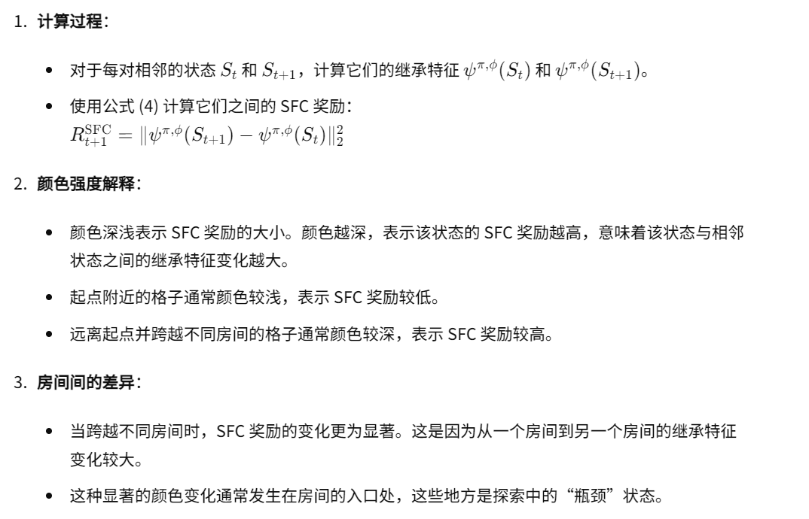
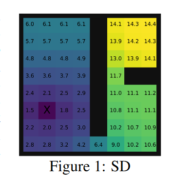 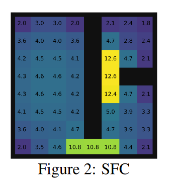

##### [2] 补充模型结构：
- 首先算法采样的RL模型是Ape-X DQN。它是一种分布式的学习算法，从下图上半部分可以看出，有N个Actor进行数据收集。并且有个schedule_i的调度器在选择用外部奖励还是内部奖励。
- 对于图片的尾部，其实并不是一个模型拆分成两部分，将其分成最大化内外奖励模型。而是一个Q网络最终输出两个Q头，每个头代表的Q值分别是外内奖励。并且他们除了最后一部分头参数不共享外，主体的参数是共享的。每次更新，不管是内还是外更新，都会更新主体参数。
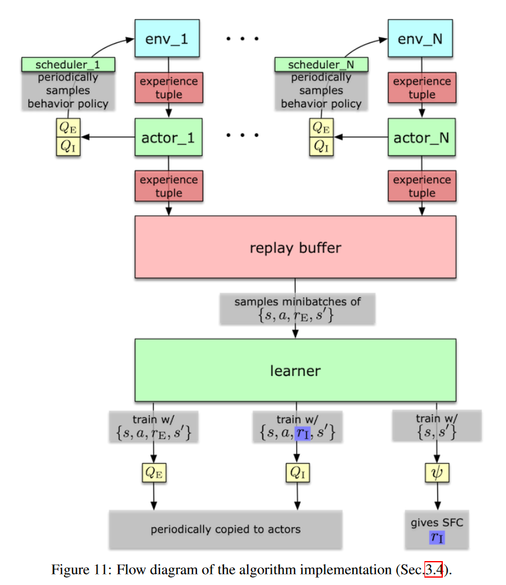

##### 论文的回放缓冲区设计：
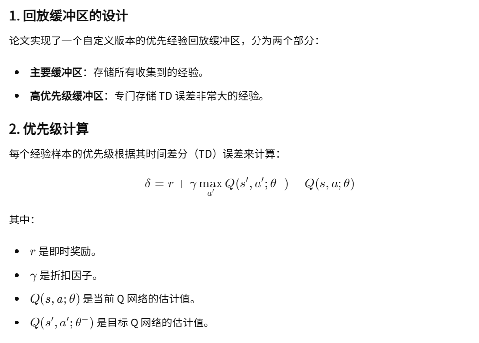
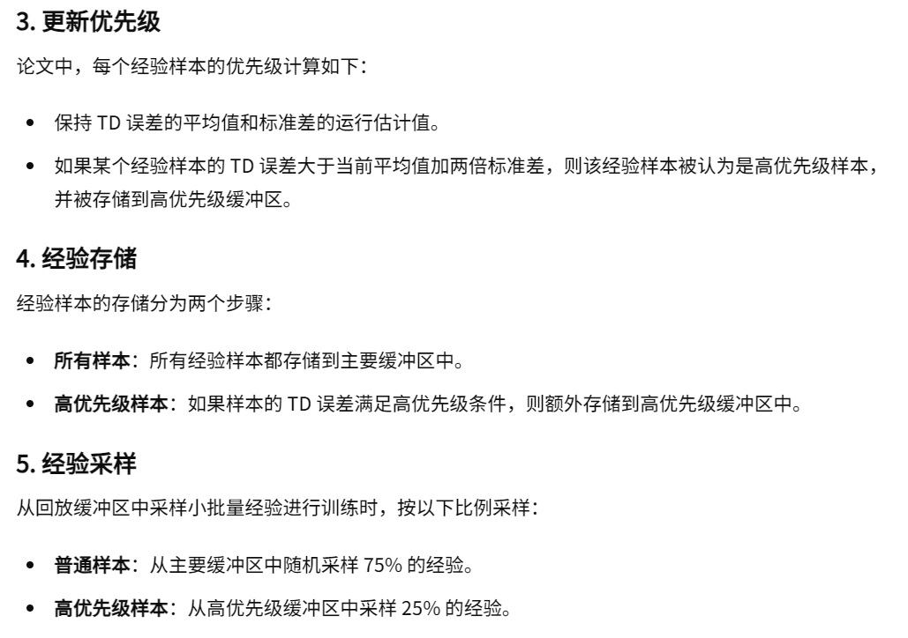