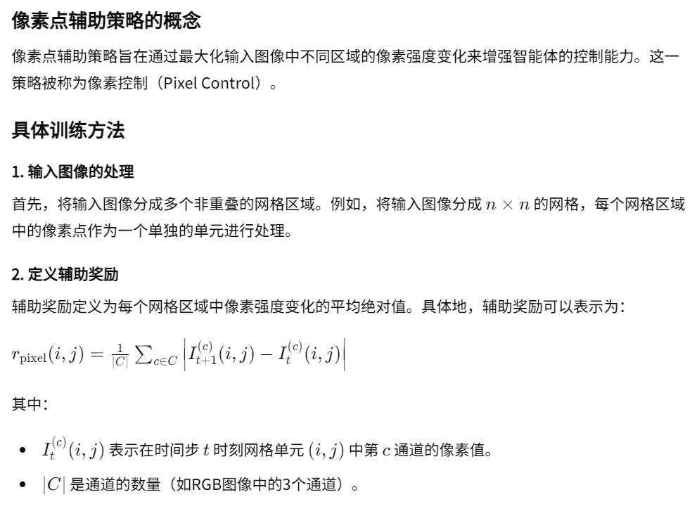
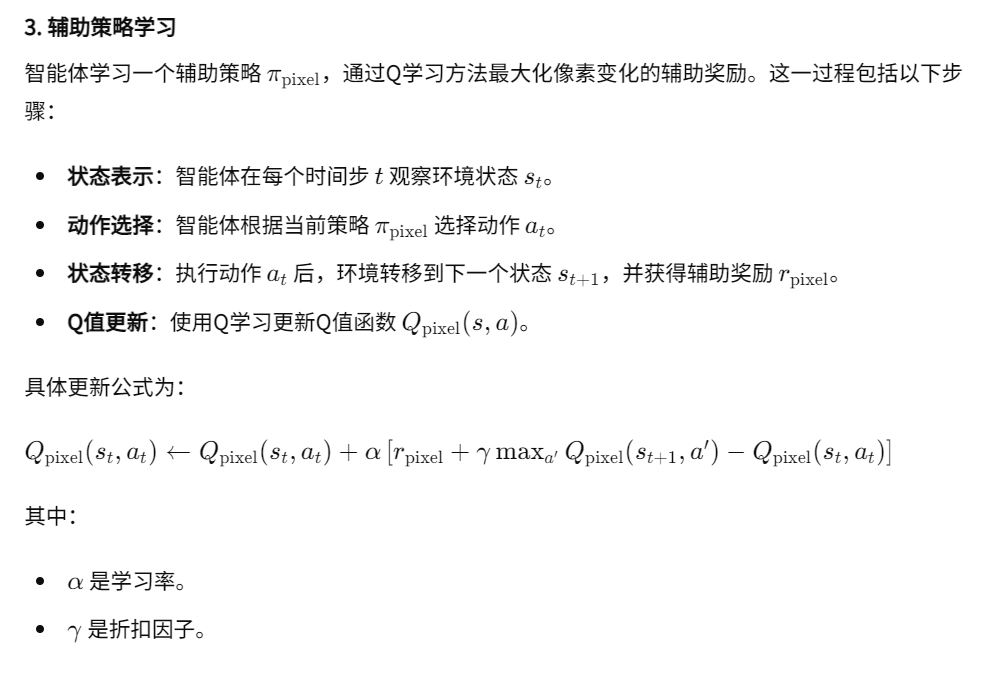
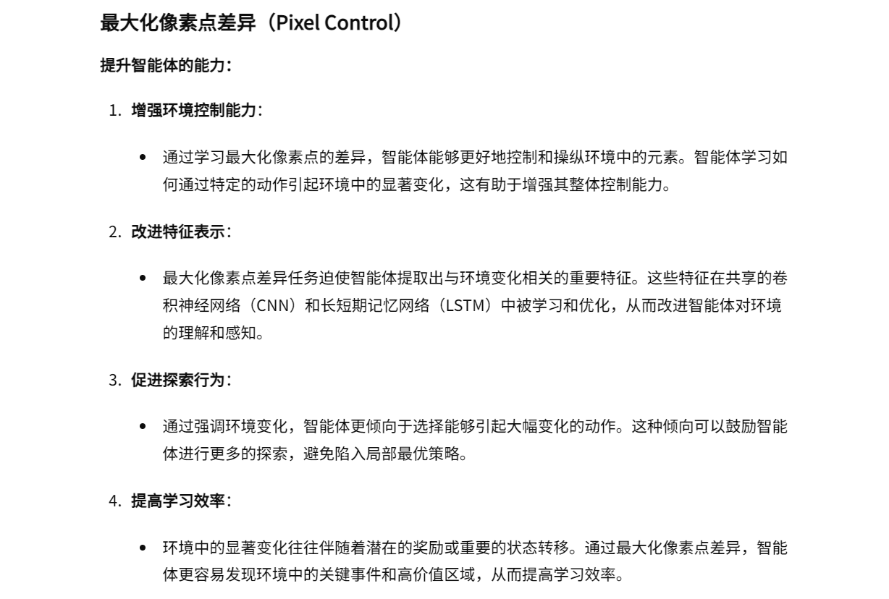
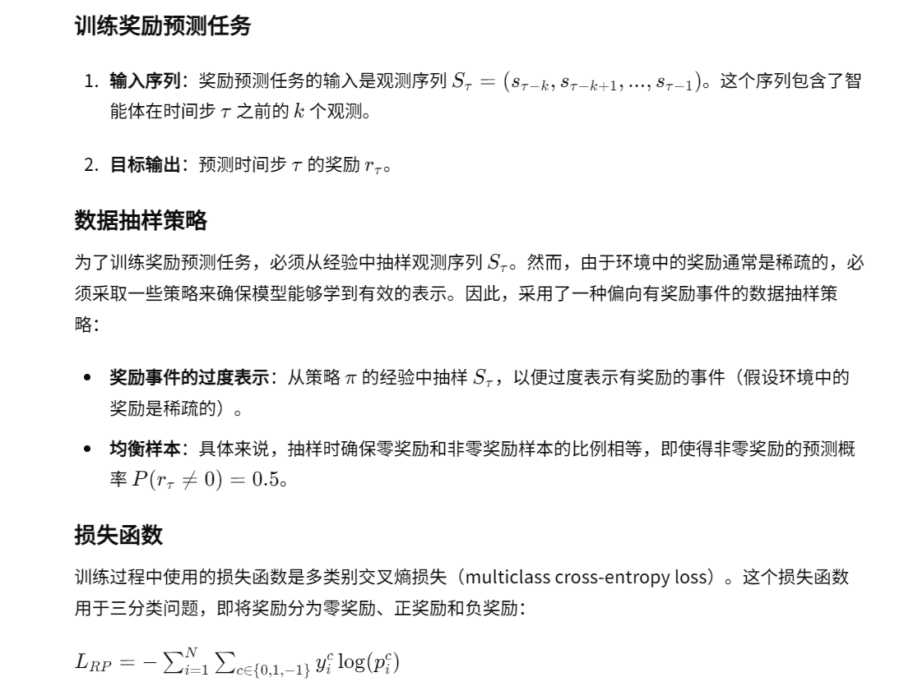
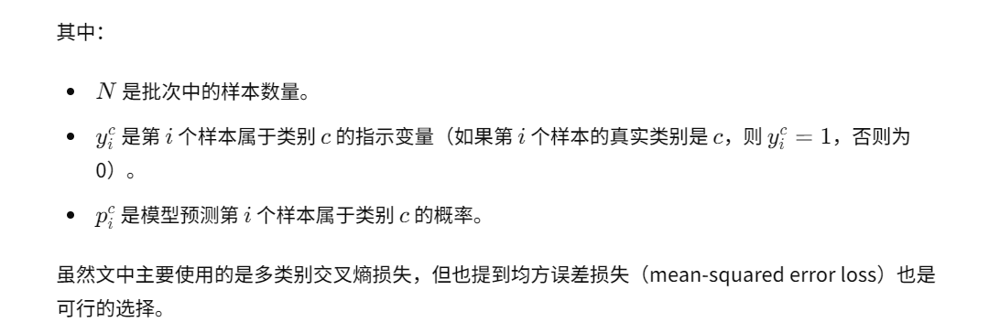
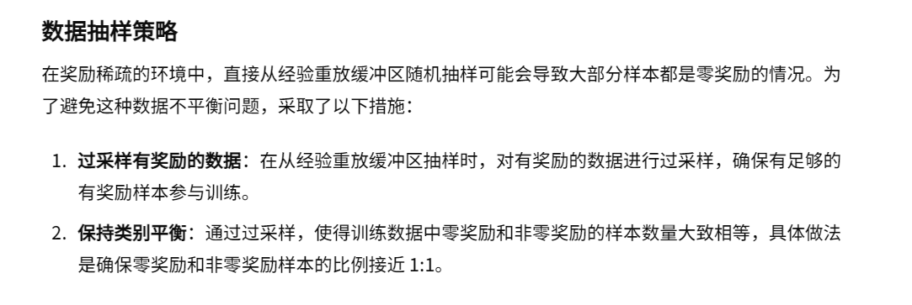
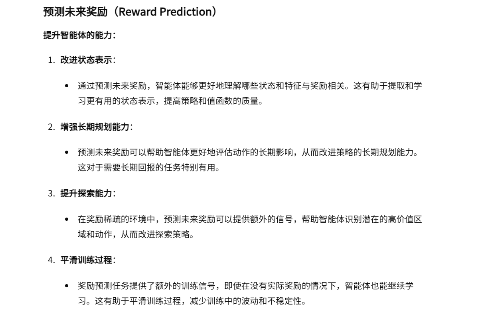

03-Reinforcement learning with unsupervised auxiliary tasks

总结：这篇文章设计了多个辅助任务，这些任务包括最大化像素点差别的像素控制任务和预测未来奖励的奖励预测任务。虽然这些辅助任务不直接生成外在奖励或直接更新主任务的策略，它们通过单独学习新的策略来实现各自的目标。这些新策略的前半部分参数与主任务的策略共享。共享参数的目的是通过改进特征表示，让智能体获得更多的潜在信息，从而间接提升主任务策略的学习效果和表现。这种设计方法有效地利用了无监督的辅助任务来增强智能体在稀疏奖励环境中的表现。

##### 核心方法：最大化像素点差异、预测未来奖励
- 最大化像素点差异：
    - 实现方法：
    
    
    - 好处：
    
- 预测未来奖励：
    - 实现方法：
    
    
    - 注意：为了让奖励类别更加均衡，会更多的采样有奖励的数据
        - 经验缓冲区会划分为两个子集：零奖励和非零奖励
    
    - 好处：
    
