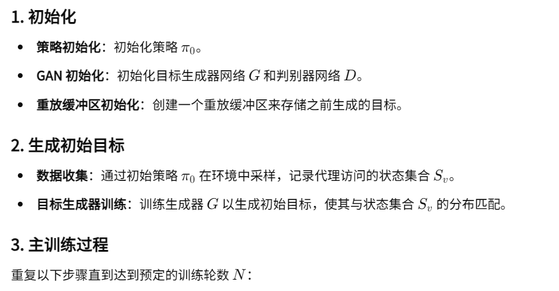
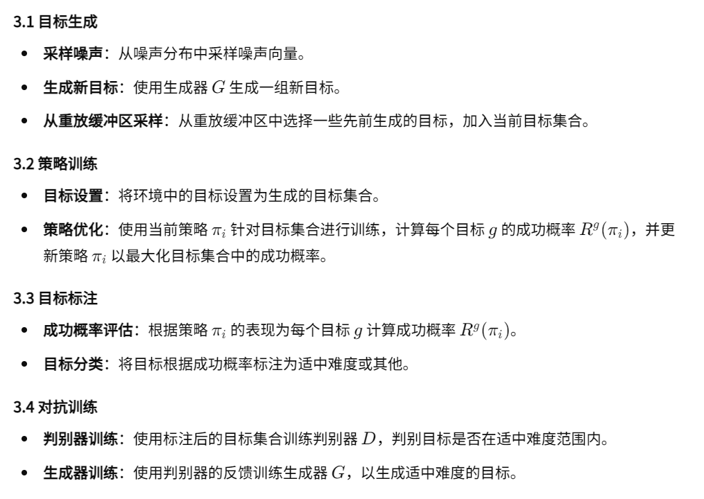
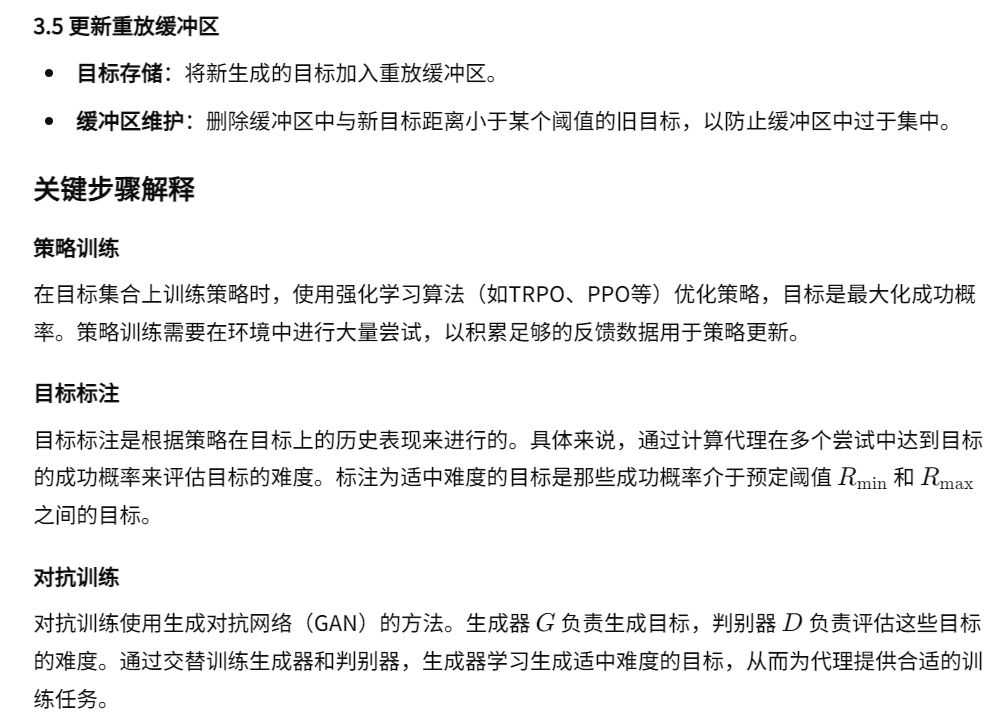
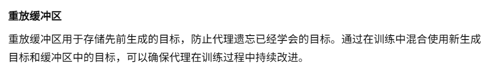
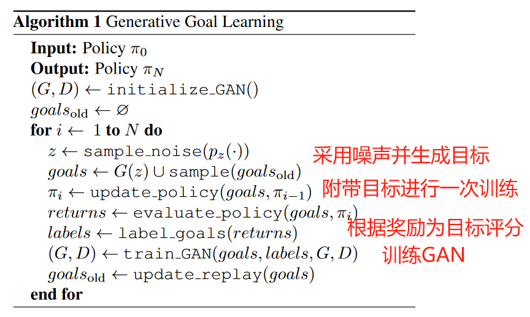
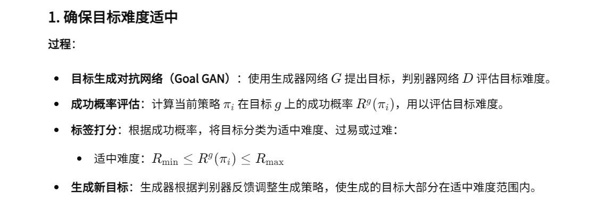
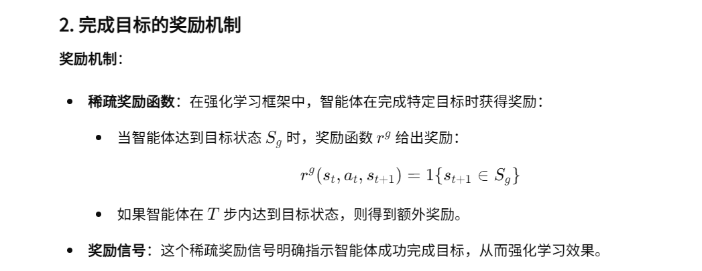
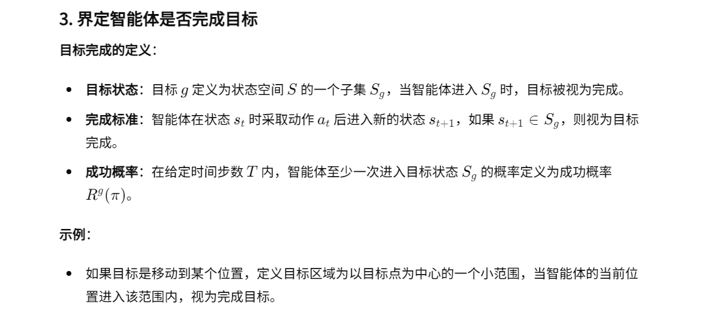

04-Automatic goal generation for reinforcement learning agents

总结：这篇论文为智能体额外多提供一个目标(通常是一个坐标)，如果智能体完成目标就能够获得额外奖励。对于任务有一个评分，我们希望任务得难易程度应该适中。评分的标准是看这个任务在以往智能体训练中被完成的概率/次数。然后任务是自动生成的，由GAN网络的G通过随机分布的输入生成，D网络根据以经过训练的任务g的得分进行训练。然后D网络又再去训练G。

代码仓库：https://github.com/florensacc/rllab-curriculum

##### 核心方法：
- 首先，初始化策略、生成器网络和判别器网络，并创建重放缓冲区来存储先前生成的目标。然后，通过初始策略在环境中采样，记录访问的状态集合，并训练生成器生成初始目标。接着进入训练循环：从生成器生成新目标，并从重放缓冲区选取部分旧目标，混合形成当前目标集合；使用当前策略在目标集合上进行训练，计算每个目标的成功概率并更新策略；根据成功概率为目标打标签，训练判别器区分适中难度目标，利用判别器反馈更新生成器。最后，将新生成的目标加入重放缓冲区，防止遗忘，保持目标多样性。通过不断生成和调整目标难度，代理逐步提升其能力，实现高效学习。

- 算法流程：

##### 如何确保难度是适中的、智能体完成目标是否会获得额外奖励、如何界定智能体是否完成目标
- 如何确保难度是适中的

- 智能体完成目标是否会获得额外奖励

- 如何界定智能体是否完成目标
