总结：这篇文章实现在高维数据中的计数内在奖励。将计数的形式转换为密度函数的形式。

##### 核心方法：
- 文章提出了一种从任意密度模型中衍生伪计数的方法，用于探索在非表格型强化学习环境中的应用。
- 算法流程：
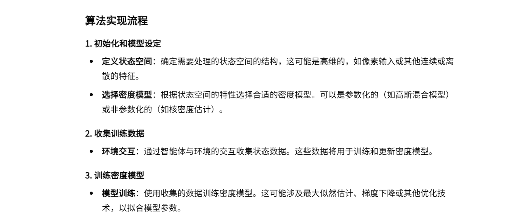
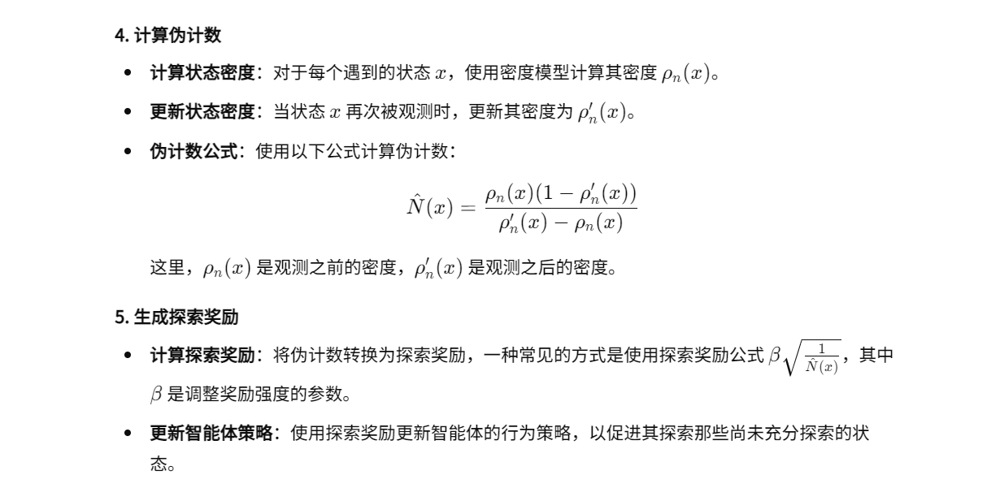
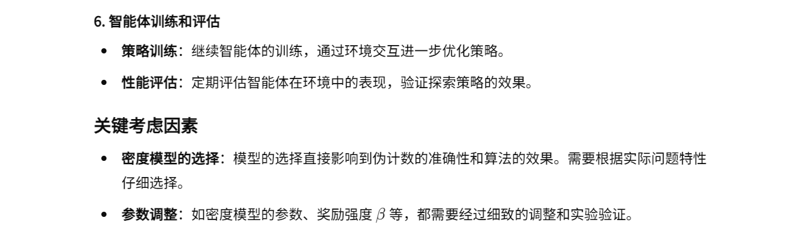

##### 伪计数公式解答：
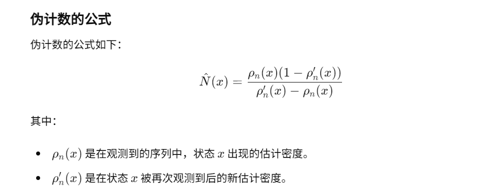
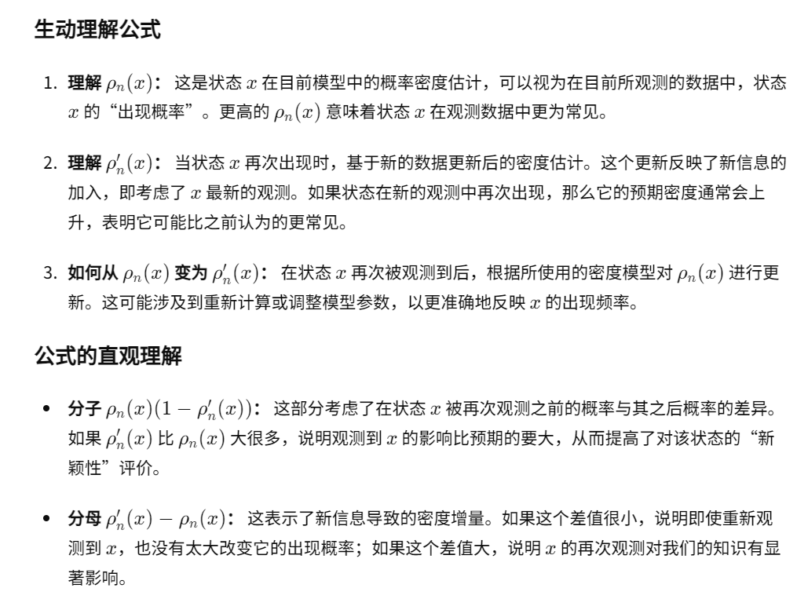
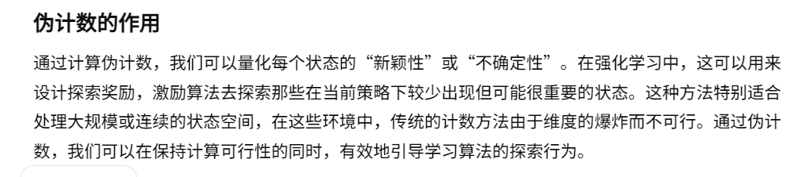
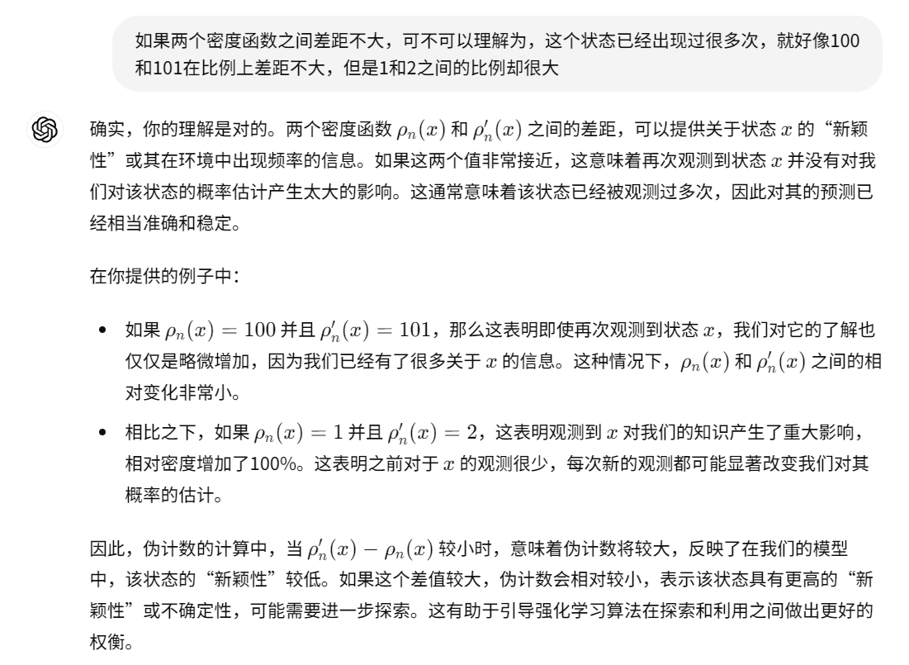

##### 密度函数种类：
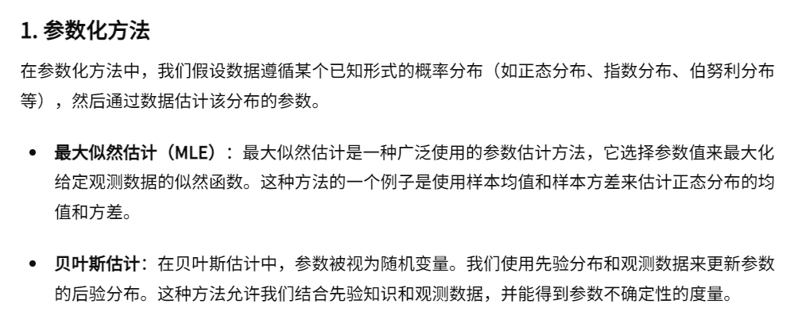
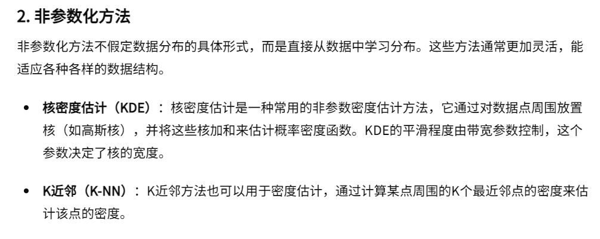
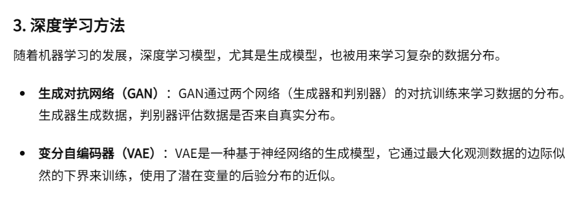

#### 采用VAE和蒙特卡洛模拟的方法：
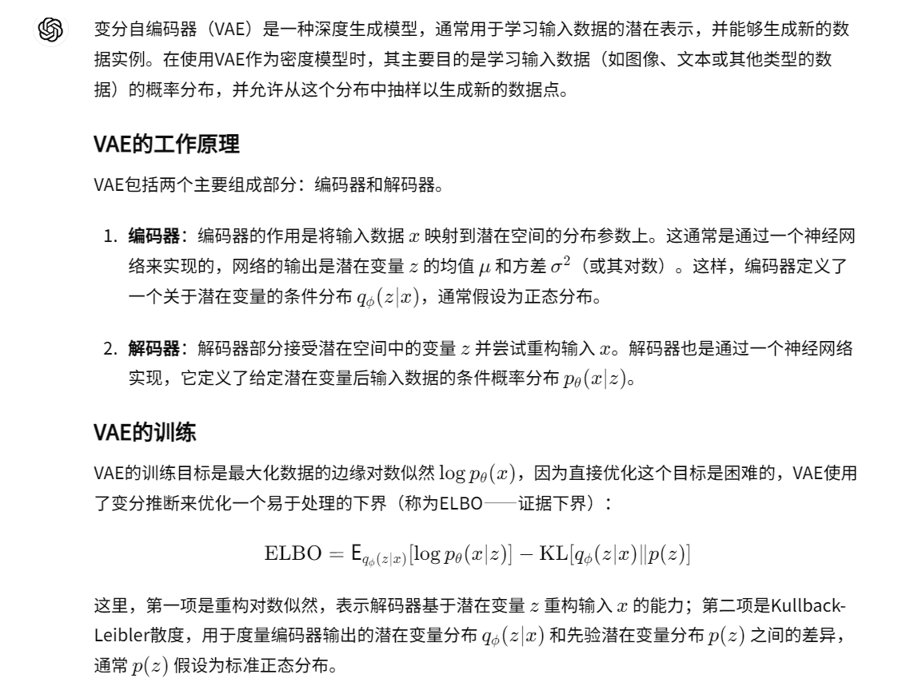
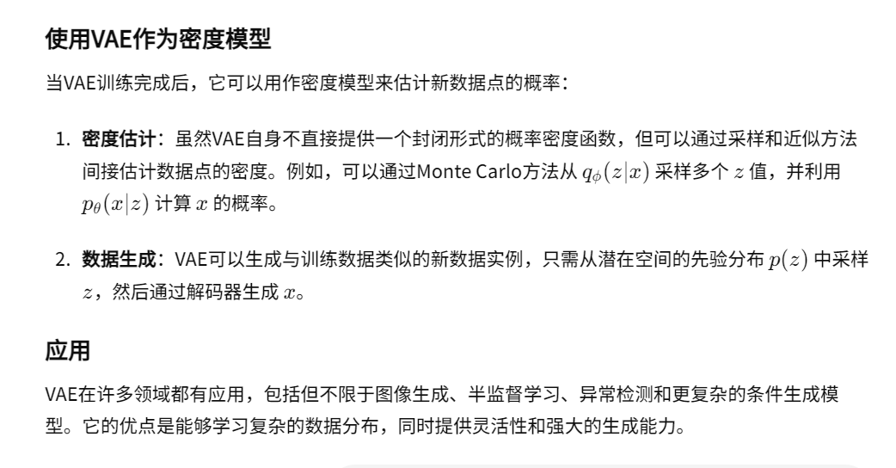
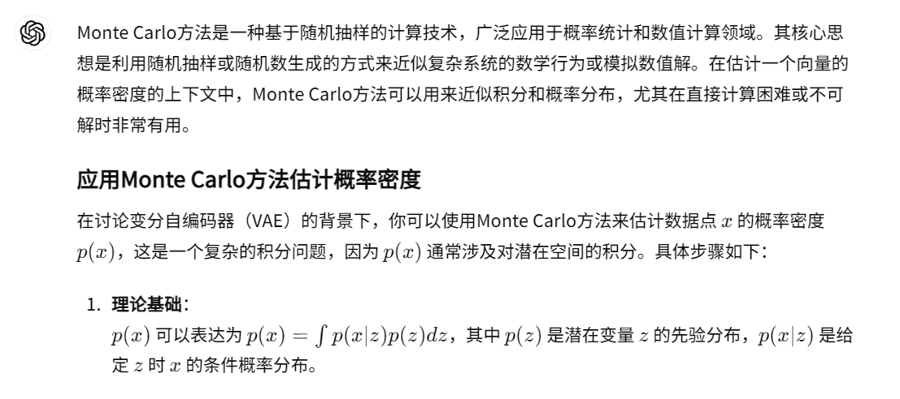
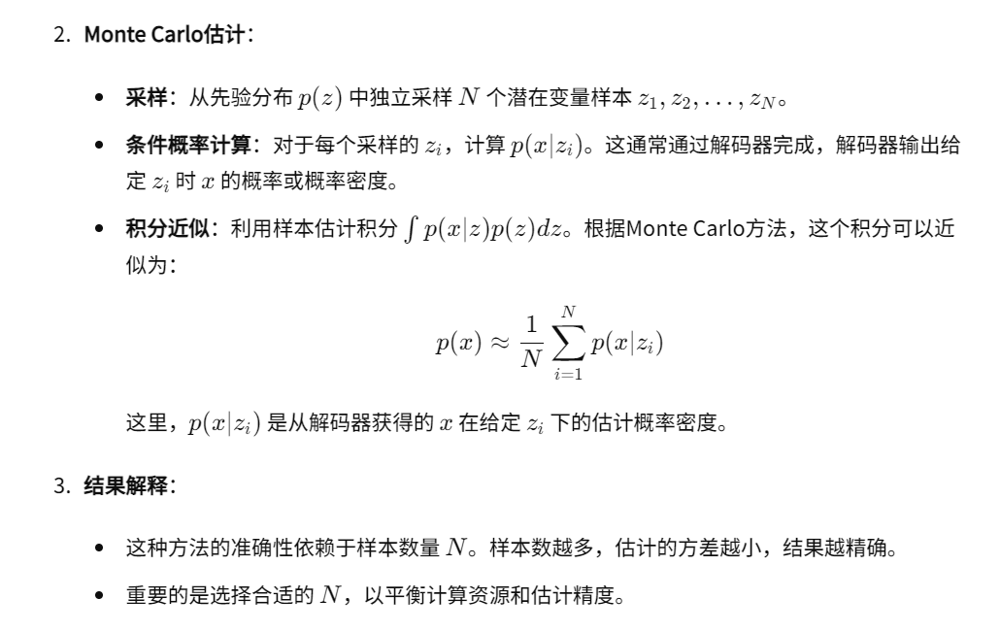

##### 可以继续研究的点：
- 密度函数的计算：
    - 生成中间向量z可以采用其他方法。
    - 如果生成p(x|z)可以考虑采用其他方法
    - 可以改变计算计数N的公式
