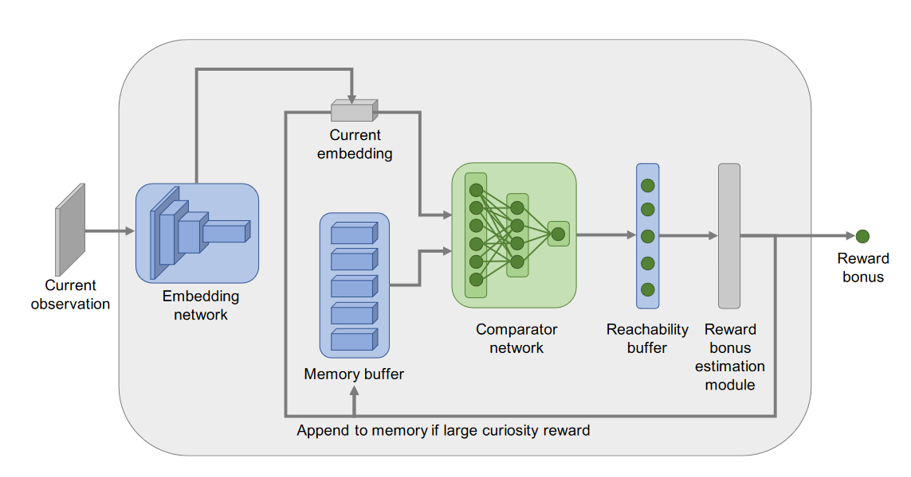
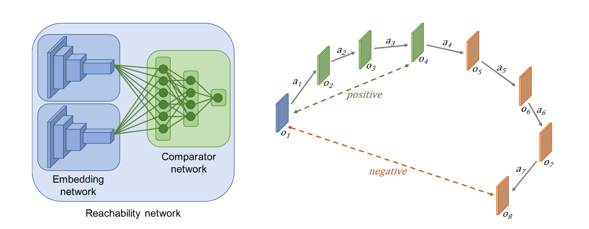
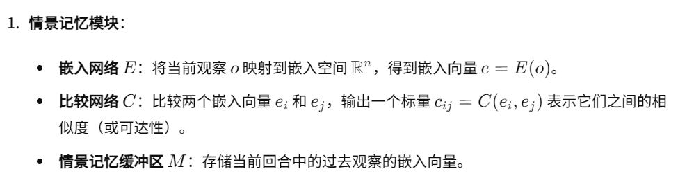
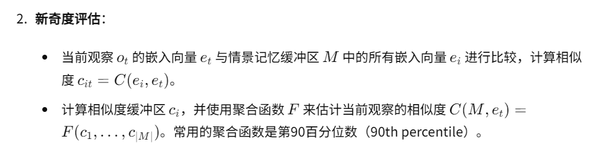
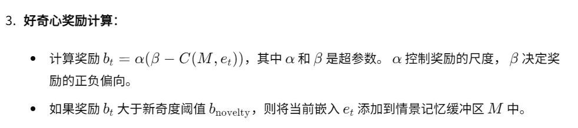
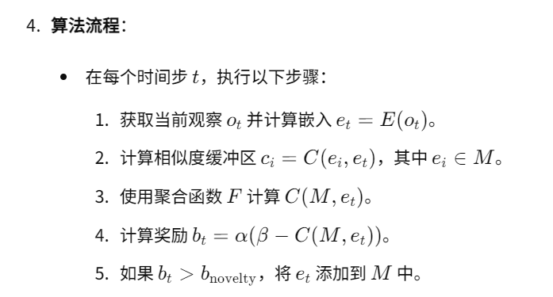
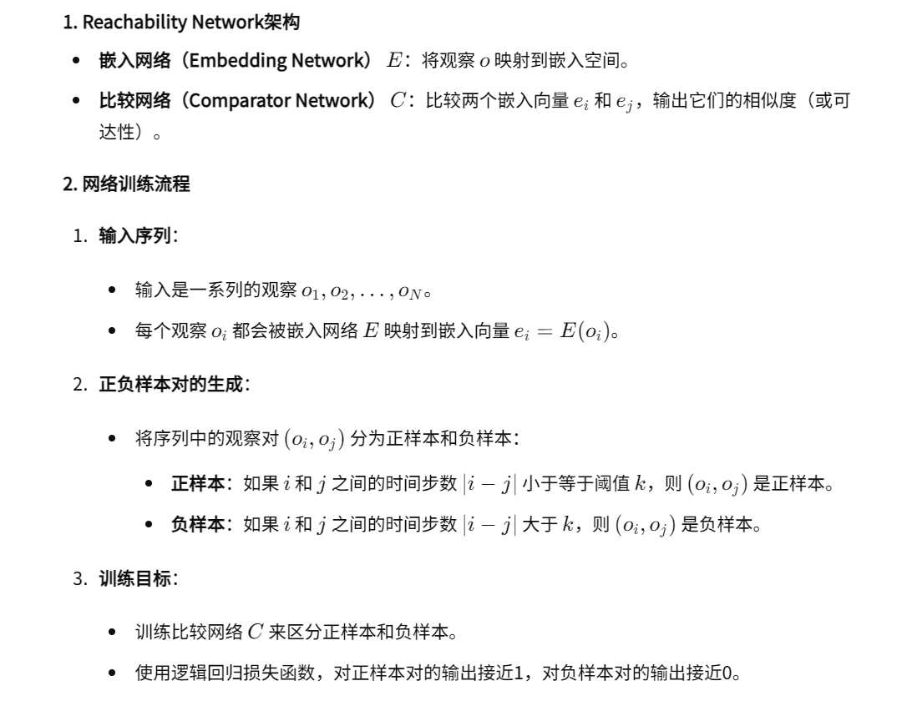
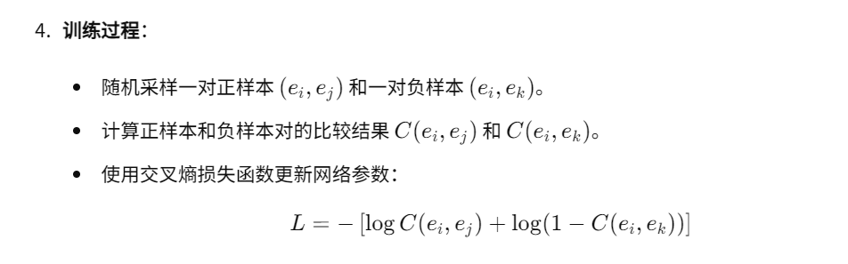
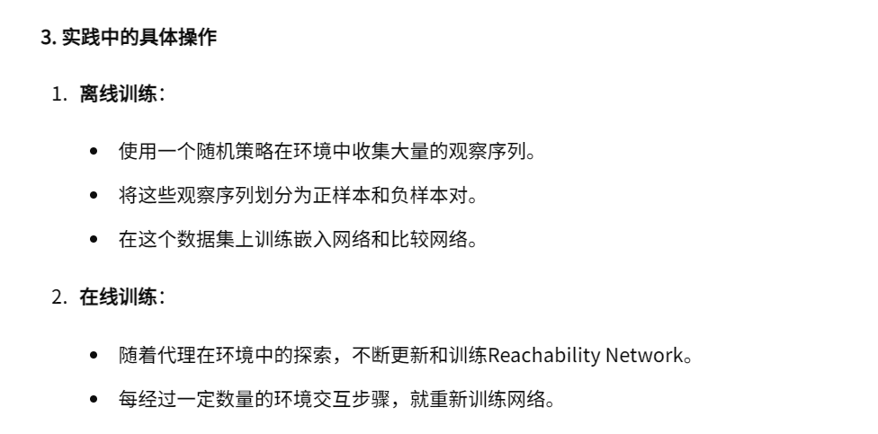

06-EPISODIC CURIOSITY THROUGH REACHABILITY

总结：这篇文章设计一种可达性的内在奖励。与ICM的新颖性判断不同，该方法首先收集一部分旧数据，称为情景记忆。然后拿当前画面和情景记忆进行对比。有一个网络结构C，给它两个状态，它能够输出这两个状态之间的步长距离(其实真实的输出是相似度)。如果当前状态和情景记忆中的状态之间的步长距离超过K，则认为这个状态是新颖的，如果小于K则认为状态不够新颖。如果这个状态新颖程度超过某个阈值，则将这个状态也加入情景记忆缓冲区。步长距离(也就是C输出的相似度)将会作为当前状态的内在奖励。

代码仓库：https://github.com/google-research/episodic-curiosity

##### 核心方法：
- 总结网络结构：如网络结构图所示，输入当前的状态，当前状态与情景记忆缓冲区中的状态逐一比较，输出的是所有相似度排序的第90%个相似度。

- 情景记忆模型设计：Reachability Network架构一共包含E和C
    - E就是一个特征提取器或者是映射器。
    - C输出(0-1)的就是两个状态之间的相似度。如果两个状态步长距离越近，则数值接近1.反之接近0。
    - 正如下图所示，步长距离近的，就是积极的，接近1.距离步长远的就是消极的，接近0.
    

- 新奇度评估：C就是上面图的绿色部分。F函数其实就是整体模型的最后两层。给它输入所有相似度。然后F输出一个合适的相似度值。论文中采用了对相似度排序后的第90%个数据。

- 好奇心奖励计算：
    - α是调节内在奖励整体大小的超参。
    - β取值通常是0.5或者1。如果当前状态比较新颖，则它的C输出将会比较低，这样b就比较大。反之比较小。
    - 如果这个b超过某个阈值超参，就把当前状态送入情景记忆缓冲区。[1]
    - 情景记忆缓冲区的上限是确定的，因此如果满了，文中推荐采用随机的方式剔除部分数据。

- 算法流程：

##### Reachability Network架构的训练
- 训练过程。正样本就是步长距离近的，负样本就是距离远的

- 数据收集：

##### [1] 为什么一定要超过一定阈值的状态才能加入情景记忆缓冲区
在奖励计算之后，如果奖励 b 大于新颖性阈值 bnovelty，则将观察嵌入添加到内存中。由于以下原因。如果每个观察嵌入都添加到内存缓冲区中，则当前步骤的观察将始终可从上一步到达。因此，奖励永远不会被授予。阈值新颖性导致嵌入空间的离散化。直观上，这是有道理的：只存储“足够独特”的记忆。另一个好处是，内存缓冲区存储的信息冗余少得多。