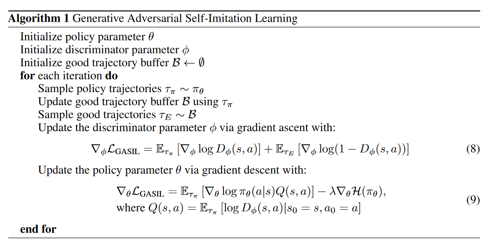

07-Generative Adversarial Self-Imitation Learning

总结：这篇文章采用GAN的训练方式，帮助智能体去学习过去好的轨迹。首先希望判别器能够给过去奖励大的轨迹高分，给当前策略的轨迹低分。策略作为生成器，希望它能够模仿好的轨迹，尽量骗过判别器。此外为了促进策略去模仿好的轨迹，会把判别器对轨迹的评分加入到策略的优势函数中。

##### 核心方法：
- 训练判别器D:
    - 使用策略生成轨迹放入缓冲区B，收集数据，对其进行分类，判别哪些是好的哪些是坏的。
    - 好的数据被认为专家数据 E
    - 梯度上升更新判别器：
    
- 训练策略(生成器)：
    - 将Q=logD，判别器对策略的分数加入到策略的更新方程中：
    
    - 最终的策略更新函数：
        - 关于A的计算在下面一节
    
- 修改的优势函数A：
    - 正常的优势函数 A = Rt(真实的累计折扣回报) - V(St)(Critic输出的预测累计回报)：
     
    
    - 该方法修正的A：
        - 首先每个步骤的奖励 r 变成：
            - 这步是核心，将logD加入到优势函数中。对应着上面训练策略中新的策略更新函数
        
        - 新的Rt：
        
        - 后续的A都一样：
        

##### 算法流程：

        
