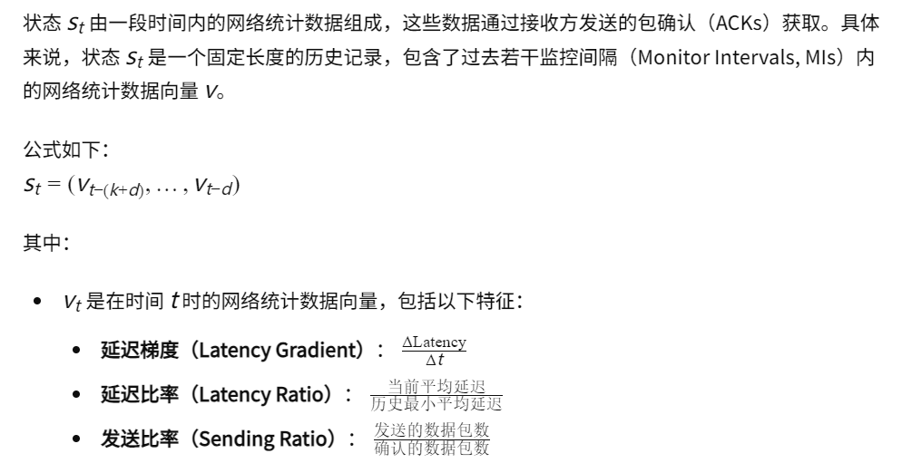
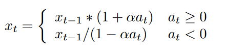
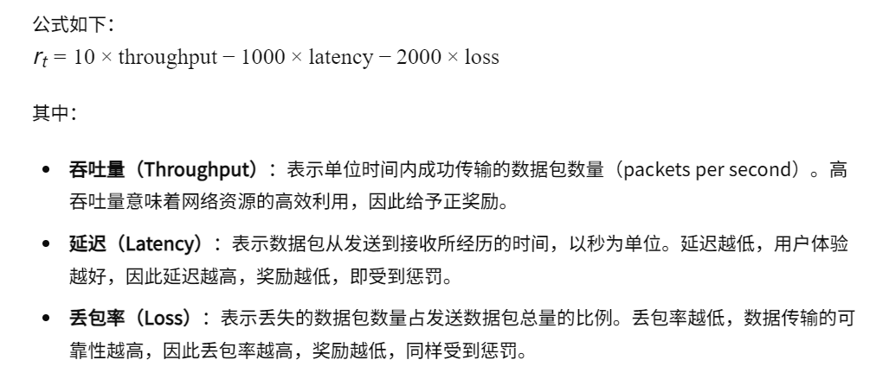

01-A Deep Reinforcement Learning Perspective on Internet Congestion Control

总结：这篇文章实现了基于深度强化学习的拥塞控制算法。并且提供了一种基于Gym的Env环境。

代码仓库：https://github.com/PCCproject/PCC-RL

##### 状态、动作、奖励
1. 状态：状态包含K个历史数据：

2. 动作：Agent输出是发送速率的变化：at

3. 奖励：

