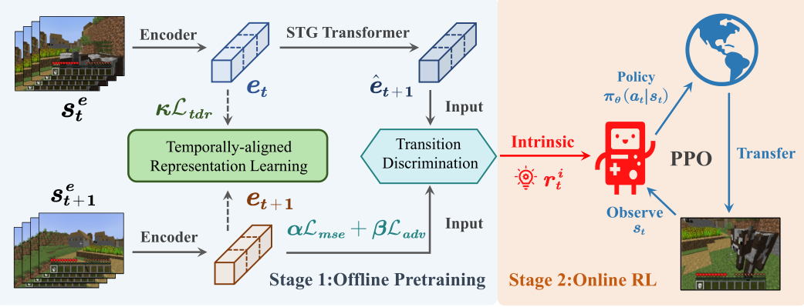
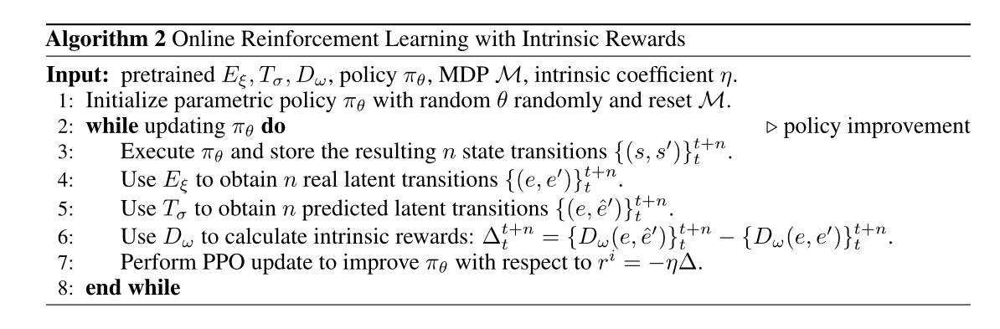

分两步进行学习：
- 第一步采用GAN的思想训练一个G和D
- 使用离线训练方式，假设已经有一些专家数据
    - St和St+1均为专家数据，Encoder即为G，生成中间变量et和et+1
    - STG也是一个G，它输入et输出et+1^
    - 在GAN中的D，会给et+1高分，et+1^低分
    - 以这种方式迫使STG能够尽量生成和专家数据相似的下一帧et+1
##### 在理想的情况下，第一步的STG能够生成和专家数据类似的下一帧et+1
- 第二步采用在线学习策略，这里用PPO算法
- 该算法不依赖于环境给的奖励，在收集到一批次数据之后，在算法第六行会给出奖励
    - 算法第四行，用Encoder生成两帧数据的et
    - 算法第五行，用STG预测在et下，et+1^是什么
    - 算法第六行生成奖励
        - D就是判别器
        - 式子的前半部分表示给et和et+1^给分，由于经过了第一步GAN的训练，STG已经能够生产比较像专家的下一步数据，因此判别器D给分应该比较好
        - 式子的后半部分表示判别器D对Online收集数据st和st+1所变成的et和et+1数据的给分。如果收集的数据et+1符合专家数据，就给分高，不符合专家数据就给分低
        - 因此奖励的含义就是用判别器判断online数据中的st+1是否比offline的专家数据好，如果好就给正分数，不好就给负分
    - 最后用PPO进行训练，注意最后的奖励加了负号，这才符合上面的分析

