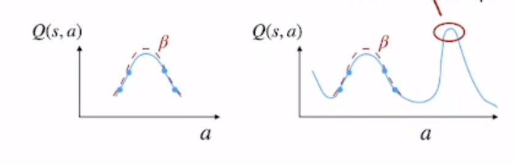
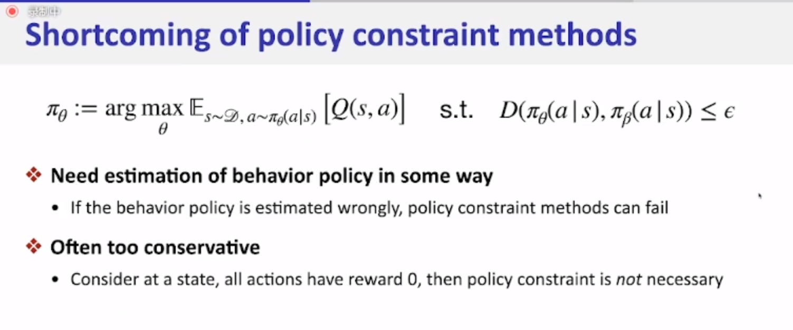
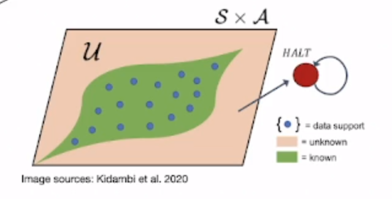
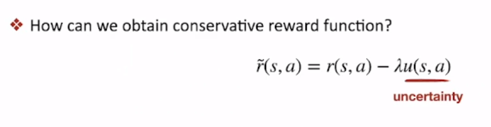
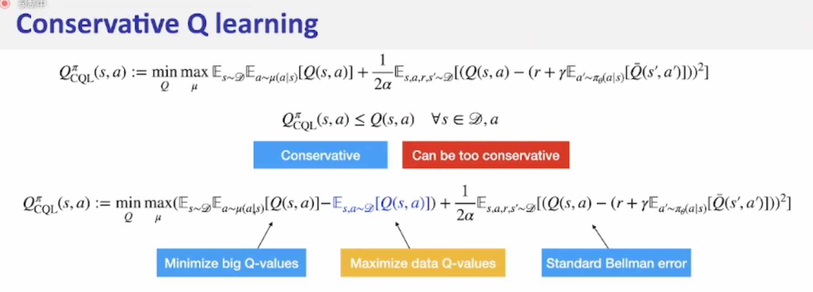
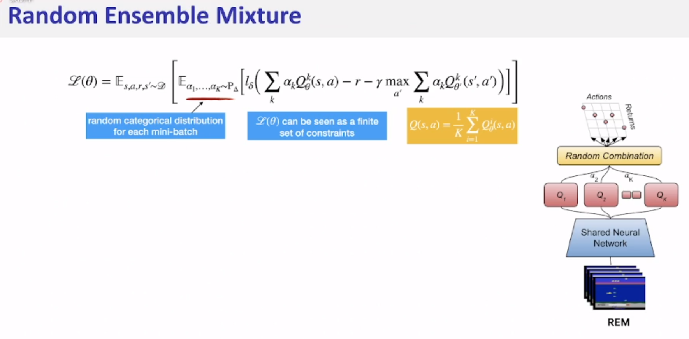
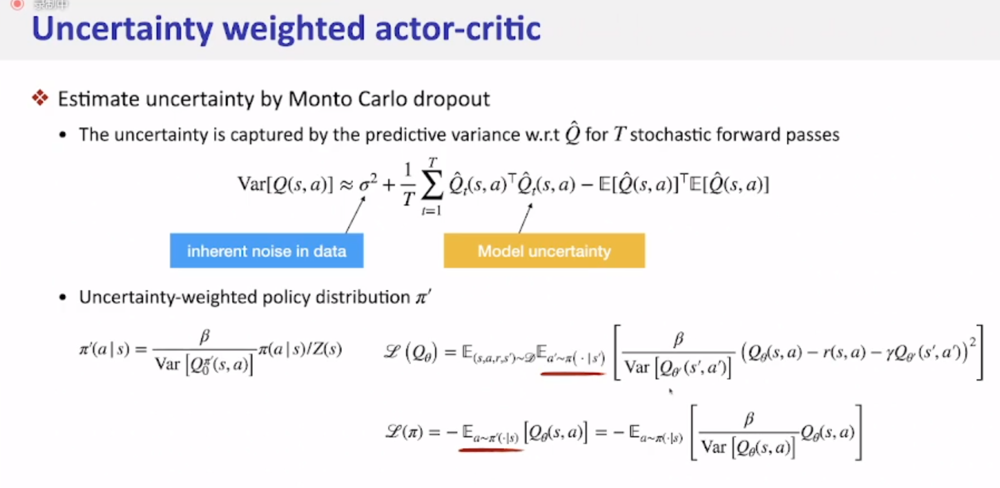
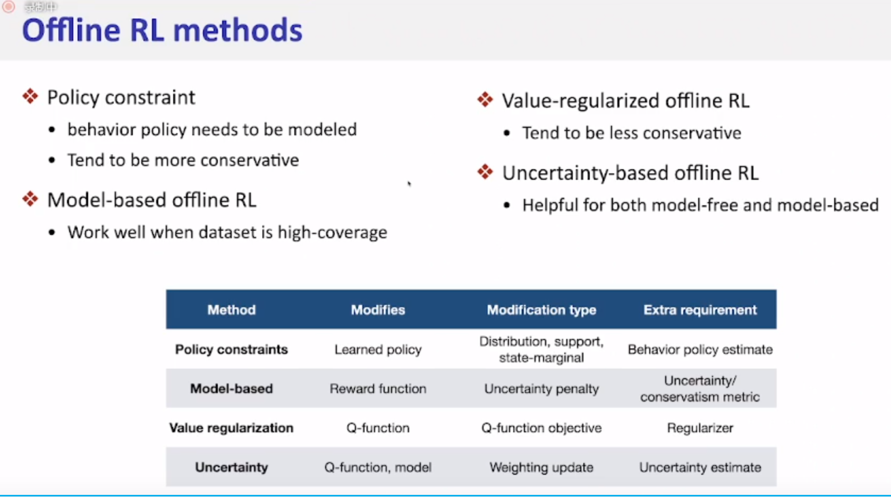
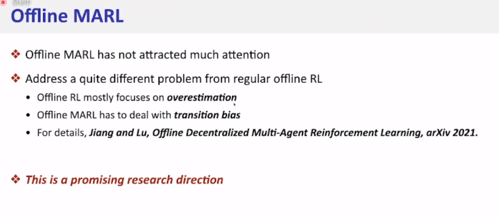

1. Offline Rl 的问题：
    - 在DQN中如果出现训练数据集中未出现的情况，此时DQN所产生的Q值通常都是过估计的
    
###
2. Policy Constraint 方法：
    - Policy Constraint 是一种离线RL方法，它主要限制策略分布（训练出的策略）和动作分布（提前收集的数据）不要差距太大。
        - 存在的问题：如果本身收集的动作就比较差，那么就无法训练出一个好的策略。并不是所有的out-of-distance的情况都是坏的，它坏主要是因为被过估计。

###
3. Conservative reward 方法：
    - 对训练数据以外的情况，增加一个惩罚项，即绿色区域以外的情况。
    
    - 如何评估不确定性：
        - 训练多个网络，如果见过当前情况的，每个输出的差距会比较小，如果之前没见过这种情况，多个输出的差距波动会比较大。以这种方式来计算不确定性。

    - CQL：
        - 第一项从μ里面提取动作，它想做的是让见过的动作Q值更高。因为第一个期望是指s冲Dataset里面拿，然后希望当前这个s在μ下产生最大化的Q。但是最终还是Min Q，因此还是一个Conservative的方法。
        
###
4. Uncertainty 方法：
    
    
###
5. 总结：
    
    - 在MARL中，Offline RL还是比较少：
    