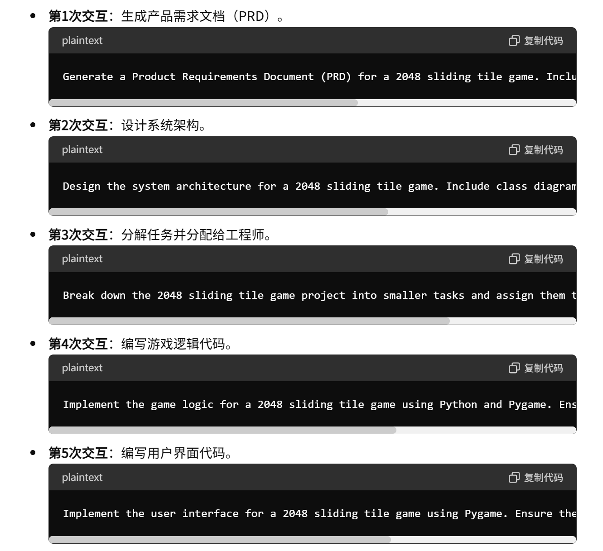
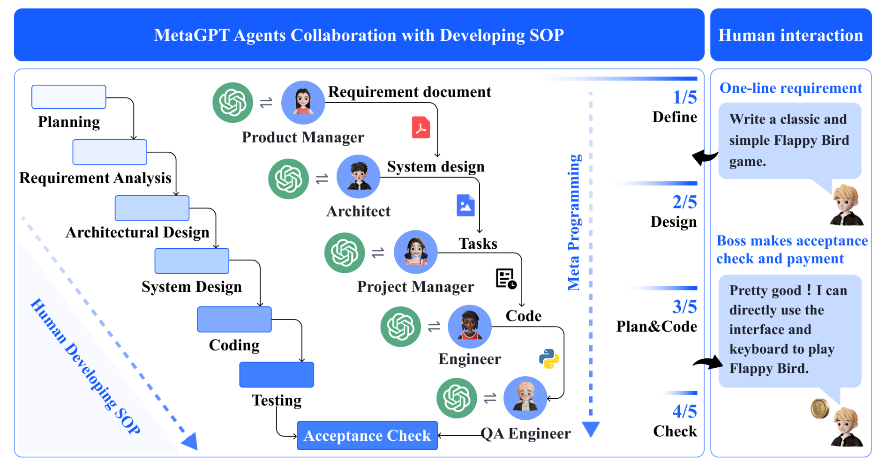
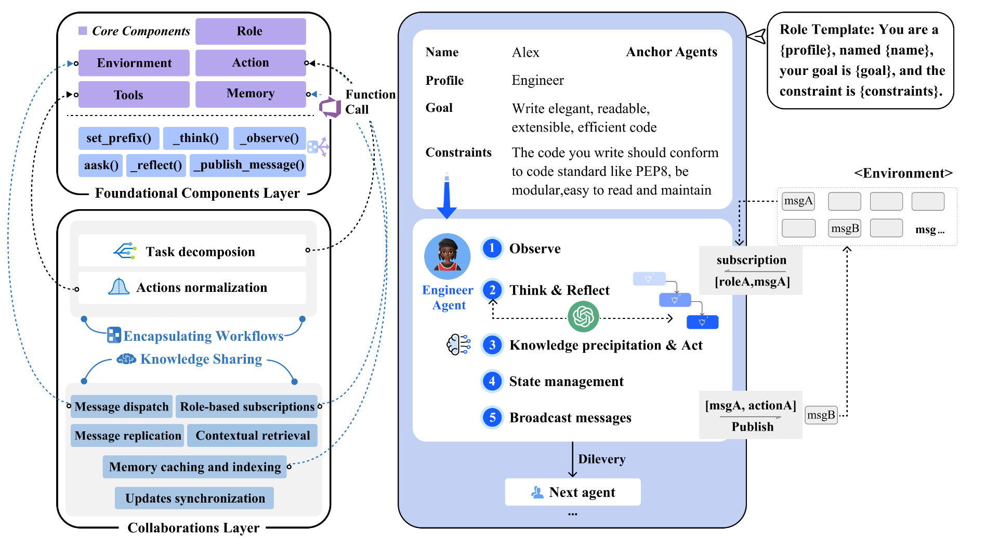

01-METAGPT: META PROGRAMMING FOR MULTI-AGENT COLLABORATIVE FRAMEWORK

总结：在LLM-Multi-Agent领域，引入了SOP(标准操作程序)。将多智能体划分为产品经理（Product Manager）、架构师（Architect）、项目经理（Project Manager）和工程师（Engineer）。每个角色承担不同的工作，有着不同的prompt。对于一个软件开发项目，依次经过每个角色的处理，并且每个角色之间可以进行通信。

代码仓库：https://github.com/geekan/MetaGPT

##### 核心方法：
- 基本构成：
    - 基础组件层：包含核心构建块，如环境、内存、角色、动作和工具。这些组件为代理操作和系统范围的信息交换提供了基础设施。
    - 协作层：建立在基础组件层之上，通过知识共享和工作流程封装机制来协调代理的合作。知识共享允许代理有效交换信息，工作流程封装通过SOPs将复杂任务分解为可管理的组件。
- 五种角色：
    - 产品经理（Product Manager）
    - 架构师（Architect）
    - 项目经理（Project Manager）
    - 工程师（Engineer）、
    - 测试员（Tester）

