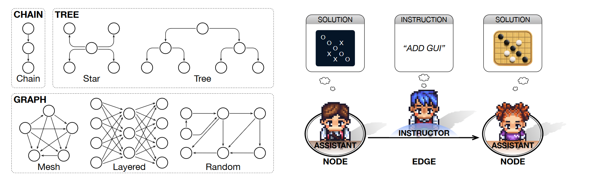

02-Scaling Large-Language-Model-based Multi-Agent Collaboration

总结：这篇文章讨论了大规模多智能体协作模型（MACNET）的设计和实验，重点研究了在大规模多智能体系统中如何通过使用有向无环图（DAG）来组织智能体，并通过拓扑排序优化其交互式推理。研究表明，MACNET在不同的网络拓扑中表现优越，能有效促进超过千个智能体的协作。文章还观察到了一个小世界协作现象，即具有小世界特性的拓扑表现出更优的性能。

代码仓库：https://github.com/OpenBMB/ChatDev

##### 核心方法：
- 两个角色：
    - Supervisory Instructor（监督指导员）
        - 角色定位：主要负责提供指导和监督。它们确保信息沿着正确的路径传递，并对连结两个节点的智能体间的交互进行指导和监督。
        - 主要功能：监督指导员负责指导下游节点的执行助理，提出改进意见或调整方向，确保解决方案的逐步优化和精细化
        - 监督指导员主要负责提供指导和建议，他们不直接执行任务，而是评估执行助理的输出，并提供改进意见或新的方向指示。
        - 就是对执行代理，基于现有的生成方案提改进意见
        - 输出：监督指导员的输出通常是改进意见或指导性建议，而不是实际的代码或设计本身。他们的工作是确保整个流程按照既定的质量标准和目标前进。
    - Executive Assistant（执行助理）：
        - 角色定位：负责具体的任务执行和问题解决。
        - 主要功能：它们接受来自上游节点或监督指导员的输入，执行具体操作，生成或优化解决方案，并将结果传递到下一个节点或智能体。
- 对于拓扑的选择：
    - 有向无环图（DAG）的优点
        - 灵活的拓扑结构：DAG可以表示更复杂和灵活的拓扑结构，允许多个智能体同时进行并行处理。它支持不同的路径和节点间的多种交互方式。
        - 并行处理能力：DAG中的节点可以在不同路径上并行处理任务，从而提高处理速度和效率，特别适合需要高并发处理的任务。 
        - 信息汇聚与分发：在DAG中，信息可以从多个源头汇聚到一个节点，或从一个节点分发到多个目标节点，便于综合多个智能体的输入和优化解决方案。
        - 避免循环：DAG的无环特性确保信息在网络中不会陷入循环，避免了死循环和无限循环的问题。
    - 链式结构的优点
        - 简单性：链式结构相对简单，易于实现和管理。每个节点只需要与前后相邻的两个节点交互，减少了复杂性。
        - 有序处理：链式结构中的信息流动是线性且有序的，确保每个任务按顺序进行处理，有助于保持逻辑上的连贯性和任务的一致性。
        - 适用于线性任务：对于那些需要顺序处理的任务，链式结构非常适用。例如，流水线式的处理过程可以受益于这种结构。
