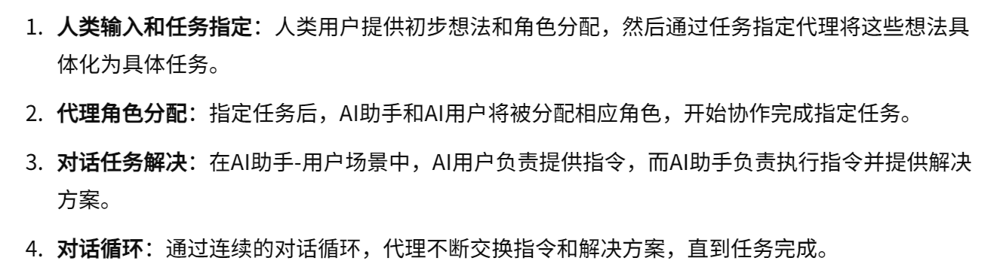
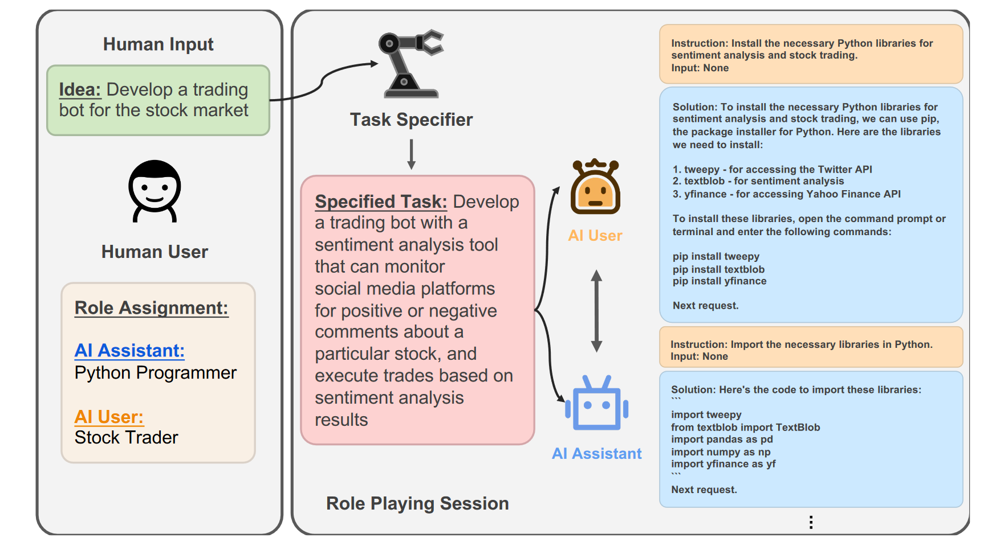

03-CAMEL: Communicative Agents for “Mind” Exploration of Large Language Model Society

总结：论文提出了一种新的“角色扮演”框架，旨在促进通信代理之间的自主合作，并深入了解它们的“认知”过程。通过引入“初始提示”技术，该框架能够在保持人类意图一致性的同时，引导聊天代理完成任务。一共有三个角色，AI用户（AI User）、AI助手（AI Assistant）和任务指定代理（Task Specifier Agent）。

代码仓库：https://github.com/camel-ai/camel

##### 核心方法：
- 三个角色：
    - 任务指定代理（Task Specifier Agent）
        - 任务具体化（Task Specification）：根据人类用户提供的初步想法，任务指定代理生成一个具体的任务描述。例如，从“开发一个股票交易机器人”具体化为“开发一个带有情感分析工具的交易机器人，该工具可以监控社交媒体平台上关于特定股票的正面或负面评论，并根据情感分析结果执行交易”。
        - 增强想象力（Imagination Enhancement）：帮助非专业用户生成具体的任务描述，使得复杂的任务能够被更好地理解和实现。
    - AI用户（AI User）
        - 提供指令（Instruction Provision）：AI用户基于任务需求，向AI助手提供具体的指令。这些指令可以带有必要的输入信息，或不带输入信息。
        - 任务引导（Task Guidance）：AI用户根据AI助手的反馈，调整和提供新的指令，逐步引导任务的完成。
        - 任务完成确认（Task Completion Confirmation）：当AI用户认为任务已经完成时，会使用特定的结束标志（例如< CAMEL_TASK_DONE>）来结束对话。
    - AI助手（AI Assistant）
        - 执行指令（Instruction Execution）：AI助手接收并执行AI用户的指令，提供详细的解决方案和实现步骤。
        - 反馈提供（Feedback Provision）：如果由于某些原因（如物理、道德或法律限制），AI助手无法执行指令，需要诚实地拒绝并解释原因。
        - 对话一致性（Conversation Consistency）：保持对话的一致性和连贯性，确保每个解决方案都能推进任务的完成。
- 实现流程：

