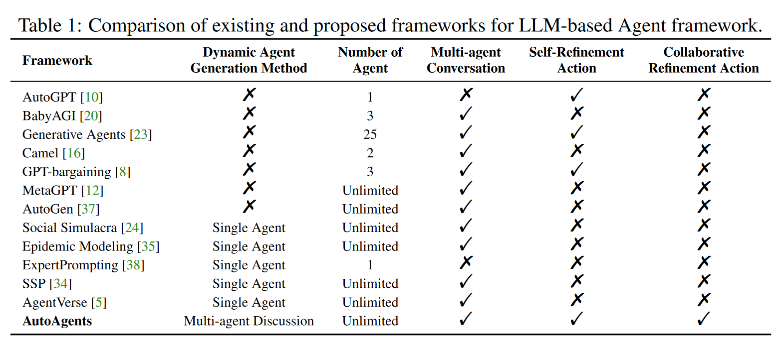

04：AutoAgents: A Framework for Automatic Agent Generation

代码仓库：https://github.com/Link-AGI/AutoAgents

论文主页(可以直接试用功能)：https://huggingface.co/spaces/LinkSoul/AutoAgents

##### [1] 核心方法：
- 起草阶段：一共三个角色：规划者（Planner）、智能体观察者（Agent Observer）、计划观察者（Plan Observer）
    - 规划者：生成执行这个任务需要的智能体以及行动计划
    - 智能体团队的生成：
    
    - 执行计划生成：
    
- 执行阶段：
    - 执行计划的实施：
    
    - 自我改进和协作改进：
    
    - 记忆机制的利用：
    

##### [2] 架构图：

##### [3] 消融实验：

- 在没有观察者的情况下：
    - 智能体规划者倾向于专门生成程序员来完成游戏开发，而忽略了游戏创建的整体过程。在观察员的投入和协调下，策划者将游戏设计专家、UI设计专家和测试专家纳入代理名单。
- Self-Refinement（自我改进）：
    - 在执行阶段，智能体会根据其执行的特定任务，通过反思其执行过程和结果来进行自我改进。这种机制被称为Self-Refinement。
    - Self-Refinement允许智能体在每个执行步骤后，通过思维轨迹（thought trace）记录其推理过程，并根据观测到的执行结果（observational feedback）进行调整和改进。
    - 自我完善有助于提高琐事创意写作任务的熟练程度。此外，通过自我完善来增强单个智能体在加强总体多智能体框架的完整性方面发挥着关键作用。
- Collaborative Refinement Action（协作改进行动）：
    - 在执行阶段，多个智能体之间通过协作和交流，共同完成任务。这种协作包括智能体之间的知识共享、相互反馈和联合决策，从而优化任务执行过程。
    - 执行流程：
    
- Dynamic Memory：
    - 在任务执行过程中，智能体会将所有执行结果、反馈和关键决策信息记录到长期记忆中。长期记忆包含了智能体执行过的所有任务的历史信息。
    - 动态记忆的生成：
        - 在当前任务执行时，行动观察者会根据任务的具体需求，从长期记忆中提取相关的信息和经验，生成动态记忆。
        - 动态记忆的提取是基于任务上下文和当前执行步骤的具体要求，确保提取的信息是最相关和最有用的。
    - 动态记忆的使用：
        - 智能体在执行任务过程中，会根据动态记忆中的信息进行分析和决策。动态记忆提供了当前任务所需的上下文和历史背景，使智能体能够更好地理解任务要求并做出相应的调整。
        - 在任务执行过程中，如果遇到新的问题或变化，行动观察者可以根据新的需求动态更新动态记忆，确保智能体能够适应任务的变化并做出快速反应。

##### [4] 各种智能体：
