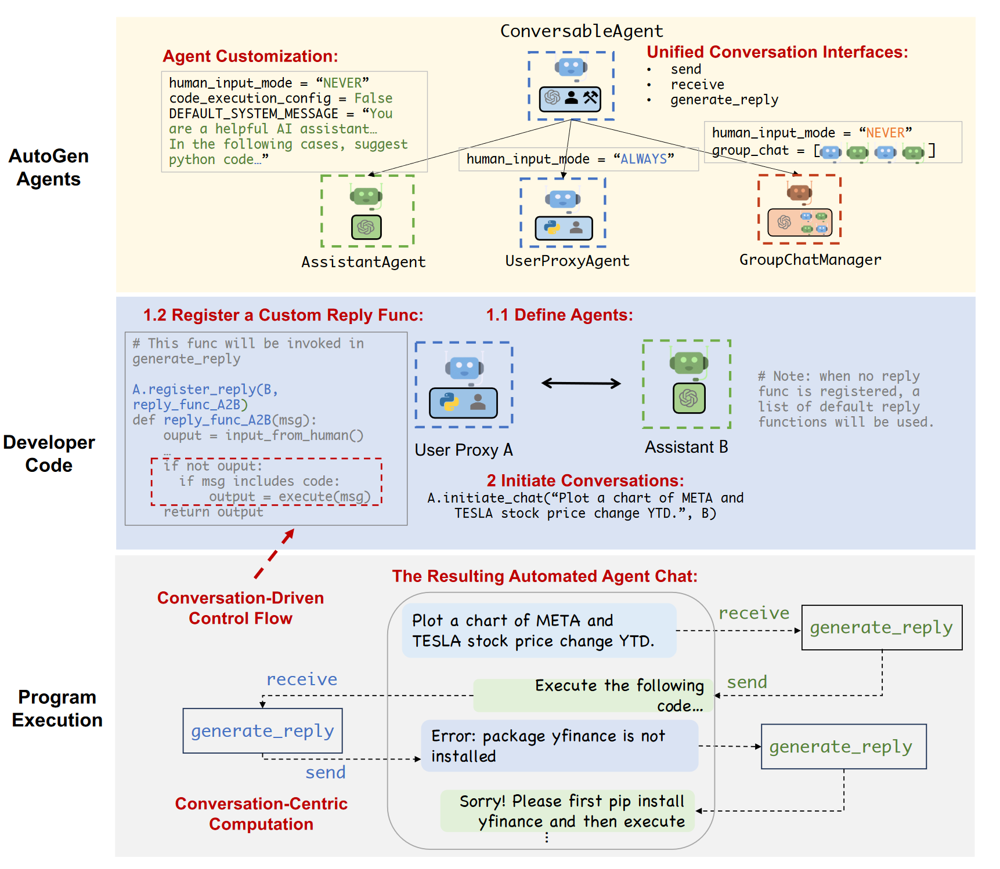

05-AutoGen: Enabling Next-Gen LLM Applications via Multi-Agent Conversation

总结：

代码仓库：https://github.com/microsoft/autogen

中文文档/官方网站：http://www.aidoczh.com/autogen/

##### 案例：
1. 数学问题解决（Math Problem Solving）
    - 利用两个内置代理，一个生成解决方案（助手代理），另一个执行并验证这些解决方案（用户代理）。这两个代理通过对话协作解决复杂的数学问题，提升解决问题的准确性和效率。

2. 检索增强的代码生成与问答（Retrieval-Augmented Code Generation and Question Answering）
    - 通过结合外部文档进行检索增强，将检索到的信息与LLM生成的答案结合起来。该系统包括一个负责检索的用户代理和一个整合并生成答案的助手代理，解决了LLM在处理最新信息和复杂查询时的局限性。

3. 文本世界环境中的决策（Decision Making in Text World Environments）
    - 引入一个基础代理，提供常识性知识，防止系统陷入重复错误。助手代理生成行动计划，执行代理执行这些计划，通过常识性知识的补充，显著提高了系统的决策能力和任务完成率。

4.  多代理编程（Multi-Agent Coding）
    - 设计一个由多个代理组成的系统，分别负责代码生成、代码安全性检查和代码执行。每个代理专注于特定任务，通过协作完成复杂的编程任务，提高代码生成的安全性和可靠性。

5. 动态群聊（Dynamic Group Chat）
    - 使用动态群聊模式，使多个代理在共享上下文中以动态方式进行对话。通过角色扮演风格的提示词选择下一个说话者，提升对话的流畅性和问题解决的效率，适用于需要灵活协作的场景。

6. 对话式国际象棋（Conversational Chess）
    - 开发一个对话式国际象棋游戏，玩家代理通过自然语言进行互动，棋盘代理验证棋步的合法性。该设计确保游戏的公平性和娱乐性，展示了AutoGen在互动游戏中的应用潜力。

##### 架构图：
