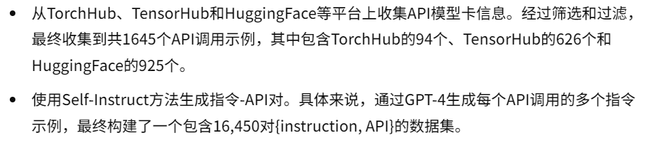
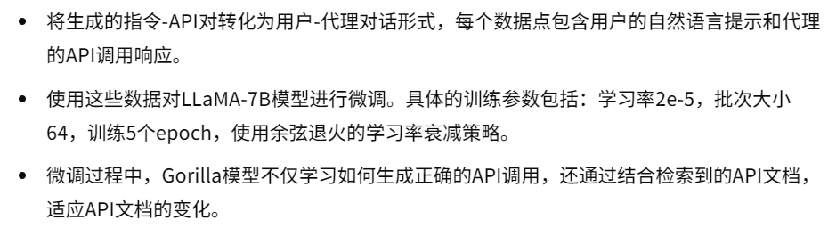
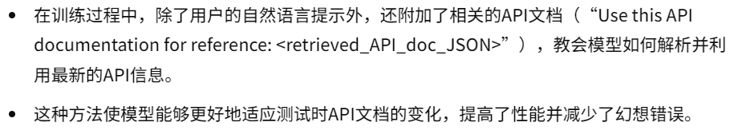
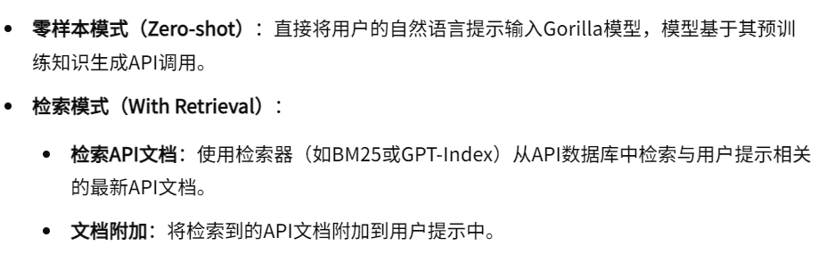
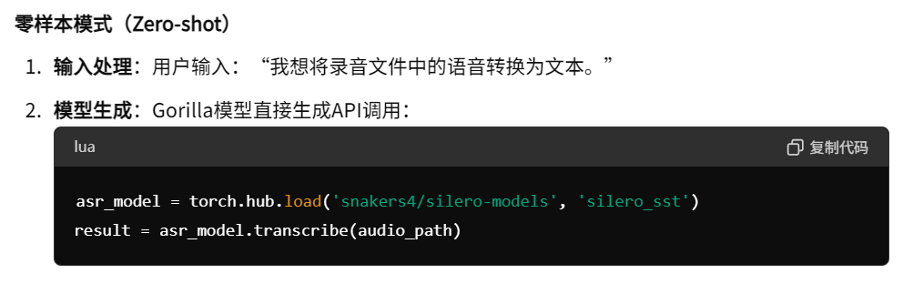
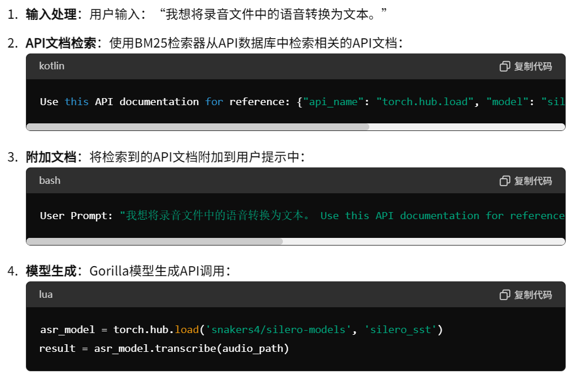

07-Gorilla: Large language model connected with massive apis.

总结：这篇文章通过微调LLM，并且加上信息检索技术，成功实现LLM在调用API能力的提升。

代码仓库：https://gorilla.cs.berkeley.edu

##### 核心方法：
- 微调LLM：
    - 数据来源：
    
    
    - 微调模型：
    
    - 检索感知训练：
    
- 模型使用：
    - 模型输入：
    
    - 两种模式：
    
    - 生成API调用程序

- 示例：
    - 零样本模式：
    
    - 检索模式：
    